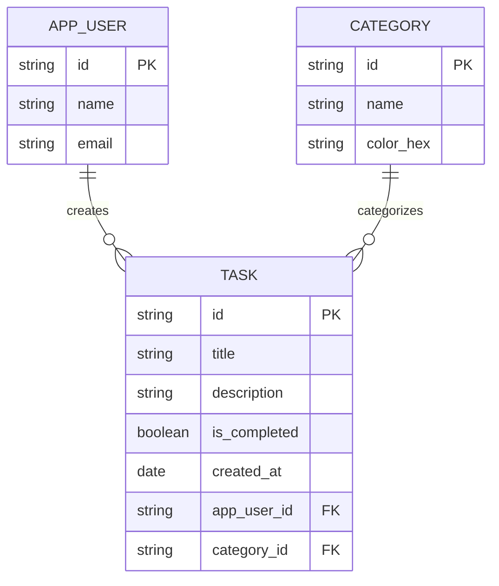

## TaskFlow: Technical Summary (Sprint 1)

### 1. Functional Requirements (Agile & UI/UX)

El proyecto se rige por metodologías ágiles, contando con un Product Goal definido y un Product Backlog basado en User Stories que cubren el ciclo completo de vida de los datos.

- **CRUD Operations:** Capacidad completa para Crear, Leer, Actualizar y Eliminar tareas.
- **Data Persistence:** Almacenamiento local persistente utilizando el paquete `shared_preferences` de Flutter.
- **UI/UX Highlights:**
  - Uso de **Modal Bottom Sheet** para los formularios de creación y edición de tareas, manteniendo al usuario en el contexto de la lista principal.
  - Implementación del widget **Dismissible** para la eliminación de tareas mediante gestos de deslizamiento (swipe).
  - Funcionalidad **"Undo" (Deshacer)** al eliminar una tarea, brindando una red de seguridad al usuario.

### 2. Product Backlog

Siguiendo las convenciones de diseño de Scrum, aquí están el Producto Goal y las User Stories con sus Acceptance Criteria.

```Markdown
# To-Do List App: Product Backlog

## Product Goal
> "To build a fast, intuitive, and reliable mobile application that empowers users to capture, organize, and track their daily tasks efficiently, ensuring no important commitment is overlooked."

---

## User Stories

### User Story #1: Create a New Task
**Description:**
*As a* user,
*I want to* add a new task to my list,
*So that* I can record what I need to do before I forget it.

**Acceptance Criteria:**
* **Scenario 1: Successful task creation**
  * **Given** the user is on the main screen,
  * **When** they tap the "Add Task" (+) button,
  * **Then** a text input field should be displayed.
* **Scenario 2: Saving the task**
  * **Given** the text input field is active,
  * **When** the user types a description and taps "Save",
  * **Then** the new task must be added to the top of the To-Do list.
* **Scenario 3: Empty task prevention**
  * **Given** the text input field is empty,
  * **When** the user attempts to tap "Save",
  * **Then** the action must be prevented and a subtle warning should indicate that a task needs text.

---

### User Story #2: Mark a Task as Completed
**Description:**
*As a* user,
*I want to* mark a task as completed,
*So that* I can track my progress, feel a sense of accomplishment, and focus only on pending items.

**Acceptance Criteria:**
* **Scenario 1: Marking as done**
  * **Given** an active task is displayed on the list,
  * **When** the user taps the checkbox (or completion icon) next to it,
  * **Then** the task's status must change to "completed" in the system.
* **Scenario 2: Visual feedback**
  * **Given** a task has been marked as completed,
  * **When** it is displayed on the screen,
  * **Then** it must have a clear visual indicator (e.g., a strikethrough text style) to differentiate it from pending tasks.
* **Scenario 3: Reverting completion (Undo)**
  * **Given** a task is currently marked as completed,
  * **When** the user taps the checkbox again,
  * **Then** the task must revert to an "active" state and the visual completion indicator must be removed.

---

### User Story #3: Delete an Existing Task
**Description:**
*As a* user,
*I want to* delete a task from my list,
*So that* I can keep my workspace clean, remove mistakes, and discard items I no longer plan to do.

**Acceptance Criteria:**
* **Scenario 1: Triggering the deletion**
  * **Given** the user is viewing their list of tasks,
  * **When** they swipe left on a specific task (or tap the trash can icon),
  * **Then** the task must be immediately removed from the visible list.
* **Scenario 2: Data removal**
  * **Given** a task has been removed from the UI,
  * **When** the system processes the deletion,
  * **Then** the task record must be permanently deleted from the local database.
* **Scenario 3: Grace period (Undo action)**
  * **Given** the user has just swiped to delete a task,
  * **When** the task disappears,
  * **Then** a temporary message (Snackbar) must appear at the bottom of the screen offering an "Undo" button.
* **Scenario 4: Recovering a deleted task**
  * **Given** the deletion Snackbar is active,
  * **When** the user taps "Undo",
  * **Then** the deletion process is canceled, and the task must reappear in its original position in the list.

---

### User Story #4: Edit an Existing Task
**Description:**
*As a* user,
*I want to* modify the text of a task I already created,
*So that* I can fix typos, add more details, or update my objective without having to delete and recreate the entire item.

**Acceptance Criteria:**
* **Scenario 1: Entering edit mode**
  * **Given** the user is viewing their task list,
  * **When** they tap on the text of a specific task,
  * **Then** the task text must transform into an active text input field, pre-filled with the current description.
* **Scenario 2: Saving the modification**
  * **Given** the user is in edit mode and has changed the text,
  * **When** they tap "Save" or the keyboard's "Done" button,
  * **Then** the task must be updated in the database and the list should reflect the new text.
* **Scenario 3: Canceling an edit**
  * **Given** the user is in edit mode modifying a task,
  * **When** they tap outside the input field or press a "Cancel" button,
  * **Then** the edit mode must close, and the task must revert to its original text.
* **Scenario 4: Preventing empty edits**
  * **Given** the user deletes all text while in edit mode,
  * **When** they attempt to save,
  * **Then** the system must prevent the save with a warning.
```

### 3. Data Structure (Entity-Relationship Diagram)

Siguiendo las convenciones de diseño de base de datos, aquí está la estructura principal de las entidades del proyecto.



### 4. Repository & Architecture Structure

Esta es la estructura actual del proyecto.

```Plaintext
lib/
├── data/
│   └── mock_data.dart
├── models/
│   ├── app_user.dart
│   ├── category.dart
│   └── task.dart
├── screens/
│   └── task_list_screen.dart
└── main.dart
```

Para mantener el código escalable y limpio, esta es la estructura de directorios propuesta para el proyecto en Flutter.

```Plaintext
lib/
├── main.dart
├── core/
│   ├── constants/
│   │   └── app_colors.dart
│   └── utils/
│       └── formatters.dart
├── data/
│   ├── models/
│   │   ├── task.dart
│   │   └── category.dart
│   └── repositories/
│       └── local_storage_repository.dart
├── logic/
│   └── providers/          %% State management (e.g., Provider or Riverpod)
│       └── task_provider.dart
└── presentation/
    ├── screens/
    │   └── home_screen.dart
    └── widgets/
        ├── task_list_item.dart
        └── task_bottom_sheet.dart
```

------

### 5. Dependencies

#### pubspec.yaml

```yaml
dependencies:
  # Other dependencies

  # --- 
  # LOCAL PERSISTENCE PACKAGE
  # --- 
  # This package allows us to save key-value data to the device's local storage.
  # We use the caret (^) to allow minor, non-breaking updates automatically.
  shared_preferences: ^2.2.3

  # This package allows us to generate app launcher icons for both Android and iOS.
  # We use the caret (^) to allow minor, non-breaking updates automatically.
  flutter_launcher_icons: ^0.14.4

```

------

### 6. Nombre de la Aplicación (Android App Name)

Antes de compilar el APK, se editó el archivo nativo de configuración, se buscó y abrió el siguiente archivo en el proyecto:

```
android / app / src / main / AndroidManifest.xml
```

Dentro de ese archivo, se buscó la etiqueta `<application>` y se cambió la propiedad `android:label`.

```XML
<manifest xmlns:android="http://schemas.android.com/apk/res/android">
    <application
        android:label="TaskFlow"
        android:name="${applicationName}"
        android:icon="@mipmap/ic_launcher">
        
        </application>
</manifest>
```

---

### 7. Source Code

#### Data

##### mock_data.dart

```Dart
// ---
// MOCK DATA FILE: mock_data.dart
// ---
// This file simulates a database response. It contains "dummy" or "mock" data
// that we can use to build and test our User Interface (UI) before connecting
// a real database.

// IMPORTANT: In a real project, we would import our model files here.
import '../models/app_user.dart';
import '../models/category.dart';
import '../models/task.dart';

class MockData {
  // 1. INSTANTIATING A USER
  // We create a single 'AppUser' object. This represents the person logged in.
  static AppUser currentUser = AppUser(
    id: 'user_001',
    name: 'Octavio Sanchez',
    email: 'octavio@example.com',
  );

  // 2. INSTANTIATING CATEGORIES
  // We create a 'List' (an array) of Category objects to organize our tasks.
  static List<Category> categories = [
    Category(id: 'cat_1', name: 'Work', colorHex: '#FF5733'),
    Category(id: 'cat_2', name: 'Personal', colorHex: '#33FF57'),
    Category(id: 'cat_3', name: 'Motorcycles', colorHex: '#3357FF'),
  ];

  // 3. INSTANTIATING TASKS
  // Here we create a List of Task objects. Notice how we use the IDs from
  // the user and categories above to establish the "Foreign Key" relationships!
  static List<Task> myTasks = [
    // Object 1: A pending work task
    Task(
      id: 'task_001',
      title: 'Prepare Flutter Class',
      description: 'Review OOP and classes for the students at CBTis 47.',
      isCompleted: false, // This task is currently pending
      createdAt: DateTime.now(), // Records the exact current time
      appUserId: 'user_001',
      categoryId: 'cat_1', // Linked to the "Work" category
    ),

    // Object 2: A completed personal task
    Task(
      id: 'task_002',
      title: 'Study Session',
      description:
          'Help my son review math for his secondary school entrance exam.',
      isCompleted: true, // This task is already done!
      createdAt: DateTime.now().subtract(
        const Duration(days: 2),
      ), // Created 2 days ago
      appUserId: 'user_001',
      categoryId: 'cat_2', // Linked to the "Personal" category
    ),

    // Object 3: A pending motorcycle task
    Task(
      id: 'task_003',
      title: 'Sell old motorcycle',
      description:
          'Take high-quality photos of the Italika Blackbird 250 and post them online.',
      isCompleted: false,
      createdAt: DateTime.now(),
      appUserId: 'user_001',
      categoryId: 'cat_3', // Linked to the "Motorcycles" category
    ),

    // Object 4: Another pending motorcycle task
    Task(
      id: 'task_004',
      title: 'Motorcycle maintenance',
      description:
          'Check the tire pressure and brakes on the Pulsar N250 UG before commuting to Orizaba.',
      isCompleted: false,
      createdAt: DateTime.now(),
      appUserId: 'user_001',
      categoryId: 'cat_3',
    ),
  ];
}
```

#### Models

##### app_user.dart

```dart
// ---
// CORE ENTITY: APP_USER
// ---
// OOP CONCEPT: CLASS
// Think of a 'class' as a blueprint or a cookie cutter. 
// It doesn't hold actual user data yet, it just defines the STRUCTURE of a user.
// When we create a specific user using this blueprint, we call it an 'Object'.

class AppUser {
  // OOP CONCEPT: PROPERTIES (or Attributes)
  // These variables define what an AppUser "has".
  // Note: We simply use 'id', 'name', etc., instead of repeating 'userId'.
  
  String id;    // This acts as our Primary Key (PK).
  String name;  // The full name of the user.
  String email; // The email address for the account.

  // OOP CONCEPT: CONSTRUCTOR
  // The constructor is a special function that runs exactly once when we create 
  // a new Object. It forces the programmer to provide the required data 
  // to build the object successfully.
  AppUser({
    required this.id,
    required this.name,
    required this.email,
  });
}

```

##### category.dart

```dart
// ---
// CORE ENTITY: CATEGORY
// ---
// RELATIONSHIP: 1:N (One-to-Many) with TASK
// A single category can be assigned to multiple tasks.

class Category {
  // Properties defining the Category blueprint.
  String id;
  String name;
  String colorHex; // We use camelCase in Dart for variables (e.g., colorHex).

  // Constructor to initialize the Category object.
  Category({
    required this.id,
    required this.name,
    required this.colorHex,
  });
}

```

##### task.dart

```dart
// ---
// CORE ENTITY: TASK
// ---
// RELATIONSHIP: Belongs to one APP_USER and one CATEGORY.

class Task {
  // Basic properties of a task.
  String id;
  String title;
  String description;

  // OOP CONCEPT: DATA TYPES
  // 'bool' stands for boolean, meaning it can only be 'true' or 'false'.
  // Perfect for checking if a task is done or pending.
  bool isCompleted;

  // 'DateTime' is a special class built into Dart to handle dates and times.
  DateTime createdAt;

  // OOP CONCEPT: FOREIGN KEYS IN CODE
  // To connect this task to a specific user and category,
  // we store their unique IDs here, just like in our E-R diagram.
  String appUserId; // Foreign Key pointing to AppUser.id
  String categoryId; // Foreign Key pointing to Category.id

  // Constructor
  // Notice that 'isCompleted' has a default value of 'false'.
  // When a user creates a new task, it is pending by default!
  Task({
    required this.id,
    required this.title,
    required this.description,
    this.isCompleted = false, // Default value assigned here
    required this.createdAt,
    required this.appUserId,
    required this.categoryId,
  });

  // ---
  // SERIALIZATION (Object to JSON)
  // ---
  // OOP CONCEPT: Method
  // This function takes our complex Task object and flattens it into a 'Map'.
  // A Map is a collection of Key-Value pairs (like a dictionary), which
  // is the exact structure required to convert data into JSON format.
  Map<String, dynamic> toJson() {
    return {
      'id': id,
      'title': title,
      'description': description,
      'isCompleted': isCompleted,
      // DATA TYPE HANDLING:
      // JSON doesn't understand what a 'DateTime' object is.
      // It only understands Strings, Numbers, and Booleans.
      // So, we convert our Date into a standard ISO-8601 String format.
      'createdAt': createdAt.toIso8601String(),
      'appUserId': appUserId,
      'categoryId': categoryId,
    };
  }

  // ---
  // DESERIALIZATION (JSON to Object)
  // ---
  // OOP CONCEPT: Factory Constructor
  // A 'factory' is a special type of constructor in Dart. It doesn't just blindly
  // create a blank object. It takes the raw map (the flattened JSON data), reads
  // the values, and builds a fully functional Task object out of them.
  factory Task.fromJson(Map<String, dynamic> json) {
    return Task(
      // We extract the values using their corresponding String keys
      id: json['id'],
      title: json['title'],
      description: json['description'],
      isCompleted: json['isCompleted'],

      // DATA TYPE HANDLING:
      // We must reverse the process here. We take the String from the JSON
      // and parse it back into a real Dart DateTime object.
      createdAt: DateTime.parse(json['createdAt']),
      appUserId: json['appUserId'],
      categoryId: json['categoryId'],
    );
  }
}

```

#### Screens

##### task_list_screen.dart

```dart
import 'dart:convert';
import 'package:flutter/material.dart';
import 'package:shared_preferences/shared_preferences.dart';
// IMPORTANT: Make sure these import paths match your actual project structure!
import '../models/task.dart';
// import '../data/mock_data.dart'; // Only needed if you want to load mock data initially

class TaskListScreen extends StatefulWidget {
  const TaskListScreen({super.key});

  @override
  State<TaskListScreen> createState() => _TaskListScreenState();
}

class _TaskListScreenState extends State<TaskListScreen> {
  // We start with an empty list. It will be populated from the device's storage.
  List<Task> tasks = [];

  final TextEditingController _titleController = TextEditingController();
  final TextEditingController _descriptionController = TextEditingController();

  // ---
  // LIFECYCLE: initState
  // ---
  @override
  void initState() {
    super.initState();
    _loadTasksFromDevice();
  }

  // ---
  // DATA PERSISTENCE: LOAD (READ)
  // ---
  Future<void> _loadTasksFromDevice() async {
    final prefs = await SharedPreferences.getInstance();
    final String? tasksJsonString = prefs.getString('cbtis47_tasks_key');

    if (tasksJsonString != null) {
      List<dynamic> decodedJsonList = jsonDecode(tasksJsonString);
      setState(() {
        tasks = decodedJsonList
            .map((jsonItem) => Task.fromJson(jsonItem))
            .toList();
      });
    }
  }

  // ---
  // DATA PERSISTENCE: SAVE (WRITE)
  // ---
  Future<void> _saveTasksToDevice() async {
    final prefs = await SharedPreferences.getInstance();
    List<Map<String, dynamic>> jsonList = tasks
        .map((task) => task.toJson())
        .toList();
    String tasksString = jsonEncode(jsonList);
    await prefs.setString('cbtis47_tasks_key', tasksString);
  }

  // ---
  // MODAL BOTTOM SHEET (ANDROID KEYBOARD FIX)
  // ---
  void _showTaskModal(BuildContext context, [Task? existingTask]) {
    if (existingTask != null) {
      _titleController.text = existingTask.title;
      _descriptionController.text = existingTask.description;
    } else {
      _titleController.clear();
      _descriptionController.clear();
    }

    showModalBottomSheet(
      context: context,
      isScrollControlled:
          true, // 1. Allows the modal to take up full screen height if needed
      builder: (BuildContext ctx) {
        // 2. NOTICE 'ctx' HERE! This is the modal's specific context.

        // FLUTTER BUG FIX: Context Scope & Widget Hierarchy
        // To fix the Android keyboard overlap, the structure MUST be:
        // Padding (Keyboard) -> SingleChildScrollView -> Padding (Visual) -> Column
        return Padding(
          // 3. We use 'ctx' instead of 'context' to listen to the keyboard correctly
          padding: EdgeInsets.only(
            bottom: MediaQuery.of(ctx).viewInsets.bottom,
          ),
          child: SingleChildScrollView(
            child: Padding(
              // 4. This is just the visual spacing for the UI elements
              padding: const EdgeInsets.all(16.0),
              child: Column(
                mainAxisSize: MainAxisSize.min,
                crossAxisAlignment: CrossAxisAlignment.start,
                children: [
                  Text(
                    existingTask != null ? 'Edit Task' : 'Add New Task',
                    style: const TextStyle(
                      fontSize: 20,
                      fontWeight: FontWeight.bold,
                    ),
                  ),
                  TextField(
                    controller: _titleController,
                    decoration: const InputDecoration(labelText: 'Task Title'),
                    autofocus: true,
                  ),
                  TextField(
                    controller: _descriptionController,
                    decoration: const InputDecoration(
                      labelText: 'Description (Optional)',
                    ),
                  ),
                  const SizedBox(height: 16),

                  SizedBox(
                    width: double.infinity,
                    child: ElevatedButton(
                      style: ElevatedButton.styleFrom(
                        backgroundColor: Colors.blueAccent,
                        foregroundColor: Colors.white,
                      ),
                      onPressed: () {
                        if (_titleController.text.trim().isEmpty) {
                          ScaffoldMessenger.of(context).showSnackBar(
                            // Here 'context' is fine for the SnackBar
                            const SnackBar(
                              content: Text('Task title cannot be empty!'),
                            ),
                          );
                          return;
                        }

                        setState(() {
                          if (existingTask != null) {
                            existingTask.title = _titleController.text.trim();
                            existingTask.description = _descriptionController
                                .text
                                .trim();
                          } else {
                            final newTask = Task(
                              id: DateTime.now().millisecondsSinceEpoch
                                  .toString(),
                              title: _titleController.text.trim(),
                              description: _descriptionController.text.trim(),
                              createdAt: DateTime.now(),
                              appUserId: 'user_001',
                              categoryId: 'cat_1',
                            );
                            tasks.insert(0, newTask);
                          }
                        });

                        _saveTasksToDevice();
                        Navigator.pop(
                          ctx,
                        ); // Close the modal using its specific context
                      },
                      child: Text(
                        existingTask != null ? 'Update Task' : 'Save Task',
                      ),
                    ),
                  ),
                  const SizedBox(height: 16),
                ],
              ),
            ),
          ),
        );
      },
    );
  }

  // ---
  // REUSABLE UI COMPONENT (DRY PRINCIPLE)
  // ---
  // OOP CONCEPT: Method Extraction
  // Instead of writing the ListView code three times for our three tabs,
  // we create a function that takes a specific list of tasks and builds the UI.
  Widget _buildTaskList(List<Task> filteredTasks) {
    if (filteredTasks.isEmpty) {
      return const Center(
        child: Text(
          'No tasks found in this section.',
          style: TextStyle(fontSize: 18, color: Colors.grey),
        ),
      );
    }

    return ListView.builder(
      itemCount: filteredTasks.length,
      itemBuilder: (context, index) {
        final task = filteredTasks[index];

        return Dismissible(
          key: ValueKey(task.id),
          direction: DismissDirection.endToStart,
          background: Container(
            color: Colors.red,
            alignment: Alignment.centerRight,
            padding: const EdgeInsets.only(right: 20.0),
            child: const Icon(Icons.delete, color: Colors.white),
          ),
          onDismissed: (direction) {
            final deletedTask = task;

            // To undo safely across filtered lists, we find the original index
            final originalIndex = tasks.indexWhere(
              (t) => t.id == deletedTask.id,
            );

            setState(() {
              tasks.removeWhere((t) => t.id == deletedTask.id);
            });

            _saveTasksToDevice();

            ScaffoldMessenger.of(context).clearSnackBars();
            ScaffoldMessenger.of(context).showSnackBar(
              SnackBar(
                content: Text('Task "${deletedTask.title}" deleted.'),
                duration: const Duration(seconds: 4),
                action: SnackBarAction(
                  label: 'Undo',
                  onPressed: () {
                    setState(() {
                      tasks.insert(originalIndex, deletedTask);
                    });
                    _saveTasksToDevice();
                  },
                ),
              ),
            );
          },
          child: ListTile(
            onLongPress: () => _showTaskModal(context, task),
            leading: Checkbox(
              value: task.isCompleted,
              onChanged: (bool? newValue) {
                setState(() {
                  task.isCompleted = newValue ?? false;
                });
                _saveTasksToDevice();
              },
            ),
            title: Text(
              task.title,
              style: TextStyle(
                fontWeight: FontWeight.bold,
                decoration: task.isCompleted
                    ? TextDecoration.lineThrough
                    : TextDecoration.none,
                color: task.isCompleted ? Colors.grey : Colors.black87,
              ),
            ),
            subtitle: task.description.isNotEmpty
                ? Text(task.description)
                : null,
          ),
        );
      },
    );
  }

  // ---
  // MAIN UI BUILDER WITH TABS
  // ---
  @override
  Widget build(BuildContext context) {
    // FLUTTER CONCEPT: DefaultTabController
    // Wraps our Scaffold and automatically syncs the TabBar with the TabBarView.
    return DefaultTabController(
      length: 3, // We will have 3 tabs: All, Pending, Completed
      child: Scaffold(
        appBar: AppBar(
          title: const Text('My To-Do List'),
          backgroundColor: Colors.blueAccent,
          foregroundColor: Colors.white,
          // FLUTTER CONCEPT: TabBar
          // The visual buttons at the bottom of the AppBar
          bottom: const TabBar(
            labelColor: Colors.white,
            unselectedLabelColor: Colors.white70,
            indicatorColor: Colors.white,
            tabs: [
              Tab(text: 'All'),
              Tab(text: 'Pending'),
              Tab(text: 'Completed'),
            ],
          ),
        ),

        // FLUTTER CONCEPT: TabBarView
        // The content that changes when you swipe or tap a tab.
        // The order of children MUST match the order of the tabs above.
        body: TabBarView(
          children: [
            // TAB 1: ALL TASKS
            _buildTaskList(tasks),

            // TAB 2: PENDING TASKS ONLY
            // We use .where() to filter the list dynamically
            _buildTaskList(tasks.where((task) => !task.isCompleted).toList()),

            // TAB 3: COMPLETED TASKS ONLY
            _buildTaskList(tasks.where((task) => task.isCompleted).toList()),
          ],
        ),

        floatingActionButton: FloatingActionButton(
          onPressed: () => _showTaskModal(context),
          backgroundColor: Colors.blueAccent,
          child: const Icon(Icons.add, color: Colors.white),
        ),
      ),
    );
  }
}

```

#### Main Entry

##### main.dart

```dart
// ---
// MAIN ENTRY POINT
// ---
import 'package:flutter/material.dart';

// IMPORTANT: Import the screen we just built!
// Make sure the path matches your folder structure.
import 'screens/task_list_screen.dart';

// FLUTTER CONCEPT: The main() function
// This is the very first function that Dart runs when the app starts.
void main() {
  // runApp() takes our root widget and inflates it onto the screen.
  runApp(const TodoApp());
}

// OOP & FLUTTER CONCEPT: StatelessWidget
// The root of our app doesn't change its state directly. It just configures
// global settings like the theme, the title, and the first screen to load.
class TodoApp extends StatelessWidget {
  const TodoApp({super.key});

  @override
  Widget build(BuildContext context) {
    // FLUTTER CONCEPT: MaterialApp
    // This widget wraps a number of widgets that are commonly required for
    // Material Design applications. It handles routing and themes globally.
    return MaterialApp(
      // The title of the app (used by the device's task switcher)
      title: 'My To-Do App',

      // UI DETAIL: Hides the little "DEBUG" banner in the top right corner
      debugShowCheckedModeBanner: false,

      // FLUTTER CONCEPT: ThemeData
      // Defines the default colors and typography for the entire app.
      // We base it on the blueAccent color we used in our buttons.
      theme: ThemeData(
        colorScheme: ColorScheme.fromSeed(seedColor: Colors.blueAccent),
        useMaterial3: true, // Uses the latest Material Design guidelines
      ),

      // FLUTTER CONCEPT: Home
      // This is the first screen the user will see when they open the app.
      // We point it to the TaskListScreen we created in the previous steps.
      home: const TaskListScreen(),
    );
  }
}
```

### 8. Current Objective / Next Steps

**Status:** El código actual funciona y cumple con el MVP básico usando `shared_preferences` en un solo archivo de pantalla (`task_list_screen.dart`). 

**Immediate Goal:** Iniciar la refactorización del código para migrar de la estructura actual a la "Estructura Propuesta" definida en la sección 4.

* **Tarea específica para esta sesión:** Extraer la lógica de persistencia de datos (shared_preferences) y moverla a su propio archivo en `lib/data/repositories/local_storage_repository.dart`, aplicando el principio de Responsabilidad Única (SRP).
