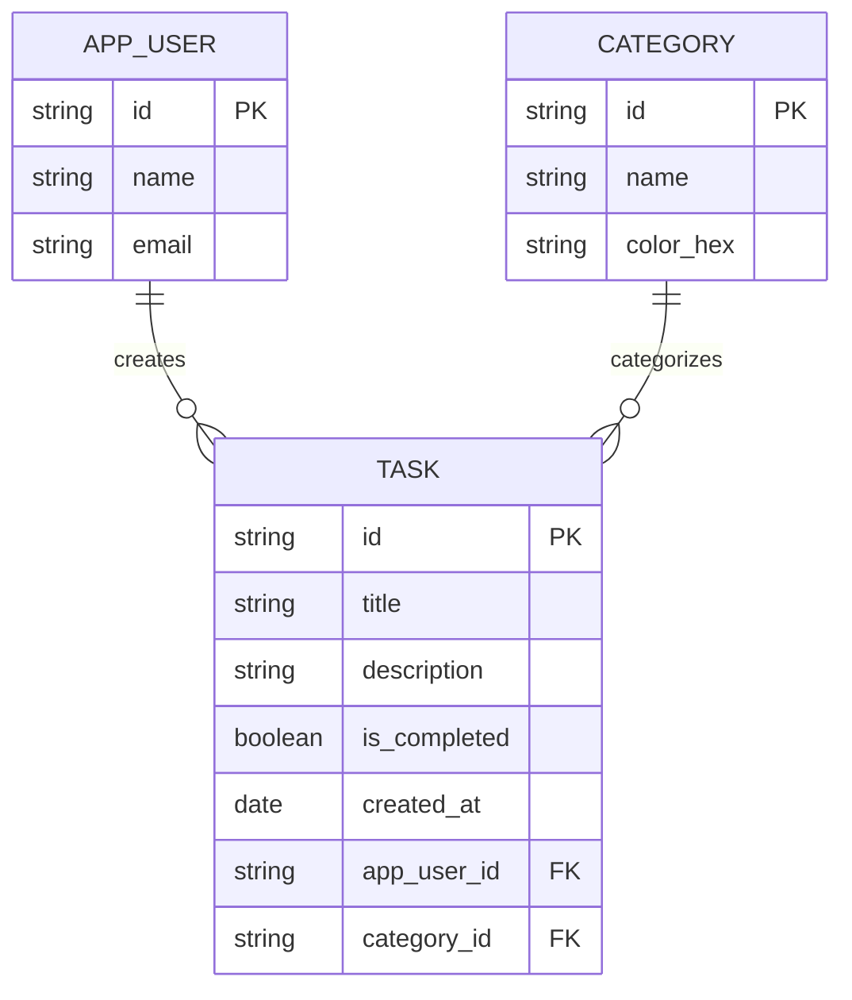

## You said
Quiero continuar con el desarrollo del siguiente proyecto: "## Resumen técnico estructurado del proyecto TaskFlow

### 1. Functional Requirements (Agile & UI/UX)

El proyecto se rige por metodologías ágiles, contando con un Product Goal definido y un Product Backlog basado en User Stories que cubren el ciclo completo de vida de los datos.

- **CRUD Operations:** Capacidad completa para Crear, Leer, Actualizar y Eliminar tareas.
- **Data Persistence:** Almacenamiento local persistente utilizando el paquete `shared_preferences` de Flutter.
- **UI/UX Highlights:**
  - Uso de **Modal Bottom Sheet** para los formularios de creación y edición de tareas, manteniendo al usuario en el contexto de la lista principal.
  - Implementación del widget **Dismissible** para la eliminación de tareas mediante gestos de deslizamiento (swipe).
  - Funcionalidad **"Undo" (Deshacer)** al eliminar una tarea, brindando una red de seguridad al usuario.

### 2. Product Backlog

Siguiendo las convenciones de diseño de Scrum, aquí están el Producto Goal y las User Stories con sus Acceptance Criteria.

```Markdown
# To-Do List App: Product Backlog

## Product Goal
> "To build a fast, intuitive, and reliable mobile application that empowers users to capture, organize, and track their daily tasks efficiently, ensuring no important commitment is overlooked."

---

## User Stories

### User Story #1: Create a New Task
**Description:**
*As a* user,
*I want to* add a new task to my list,
*So that* I can record what I need to do before I forget it.

**Acceptance Criteria:**
* **Scenario 1: Successful task creation**
  * **Given** the user is on the main screen,
  * **When** they tap the "Add Task" (+) button,
  * **Then** a text input field should be displayed.
* **Scenario 2: Saving the task**
  * **Given** the text input field is active,
  * **When** the user types a description and taps "Save",
  * **Then** the new task must be added to the top of the To-Do list.
* **Scenario 3: Empty task prevention**
  * **Given** the text input field is empty,
  * **When** the user attempts to tap "Save",
  * **Then** the action must be prevented and a subtle warning should indicate that a task needs text.

---

### User Story #2: Mark a Task as Completed
**Description:**
*As a* user,
*I want to* mark a task as completed,
*So that* I can track my progress, feel a sense of accomplishment, and focus only on pending items.

**Acceptance Criteria:**
* **Scenario 1: Marking as done**
  * **Given** an active task is displayed on the list,
  * **When** the user taps the checkbox (or completion icon) next to it,
  * **Then** the task's status must change to "completed" in the system.
* **Scenario 2: Visual feedback**
  * **Given** a task has been marked as completed,
  * **When** it is displayed on the screen,
  * **Then** it must have a clear visual indicator (e.g., a strikethrough text style) to differentiate it from pending tasks.
* **Scenario 3: Reverting completion (Undo)**
  * **Given** a task is currently marked as completed,
  * **When** the user taps the checkbox again,
  * **Then** the task must revert to an "active" state and the visual completion indicator must be removed.

---

### User Story #3: Delete an Existing Task
**Description:**
*As a* user,
*I want to* delete a task from my list,
*So that* I can keep my workspace clean, remove mistakes, and discard items I no longer plan to do.

**Acceptance Criteria:**
* **Scenario 1: Triggering the deletion**
  * **Given** the user is viewing their list of tasks,
  * **When** they swipe left on a specific task (or tap the trash can icon),
  * **Then** the task must be immediately removed from the visible list.
* **Scenario 2: Data removal**
  * **Given** a task has been removed from the UI,
  * **When** the system processes the deletion,
  * **Then** the task record must be permanently deleted from the local database.
* **Scenario 3: Grace period (Undo action)**
  * **Given** the user has just swiped to delete a task,
  * **When** the task disappears,
  * **Then** a temporary message (Snackbar) must appear at the bottom of the screen offering an "Undo" button.
* **Scenario 4: Recovering a deleted task**
  * **Given** the deletion Snackbar is active,
  * **When** the user taps "Undo",
  * **Then** the deletion process is canceled, and the task must reappear in its original position in the list.

---

### User Story #4: Edit an Existing Task
**Description:**
*As a* user,
*I want to* modify the text of a task I already created,
*So that* I can fix typos, add more details, or update my objective without having to delete and recreate the entire item.

**Acceptance Criteria:**
* **Scenario 1: Entering edit mode**
  * **Given** the user is viewing their task list,
  * **When** they tap on the text of a specific task,
  * **Then** the task text must transform into an active text input field, pre-filled with the current description.
* **Scenario 2: Saving the modification**
  * **Given** the user is in edit mode and has changed the text,
  * **When** they tap "Save" or the keyboard's "Done" button,
  * **Then** the task must be updated in the database and the list should reflect the new text.
* **Scenario 3: Canceling an edit**
  * **Given** the user is in edit mode modifying a task,
  * **When** they tap outside the input field or press a "Cancel" button,
  * **Then** the edit mode must close, and the task must revert to its original text.
* **Scenario 4: Preventing empty edits**
  * **Given** the user deletes all text while in edit mode,
  * **When** they attempt to save,
  * **Then** the system must prevent the save with a warning.
```

### 3. Data Structure (Entity-Relationship Diagram)

Siguiendo las convenciones de diseño de base de datos, aquí está la estructura principal de las entidades del proyecto.



### 4. Repository & Architecture Structure

Esta es la estructura actual del proyecto.

```Plaintext
lib/
├── data/
│   └── mock_data.dart
├── models/
│   ├── app_user.dart
│   ├── category.dart
│   └── task.dart
├── screens/
│   └── task_list_screen.dart
└── main.dart
```

Para mantener el código escalable y limpio, esta es la estructura de directorios propuesta para el proyecto en Flutter.

```Plaintext
lib/
├── main.dart
├── core/
│   ├── constants/
│   │   └── app_colors.dart
│   └── utils/
│       └── formatters.dart
├── data/
│   ├── models/
│   │   ├── task.dart
│   │   └── category.dart
│   └── repositories/
│       └── local_storage_repository.dart
├── logic/
│   └── providers/          %% State management (e.g., Provider or Riverpod)
│       └── task_provider.dart
└── presentation/
    ├── screens/
    │   └── home_screen.dart
    └── widgets/
        ├── task_list_item.dart
        └── task_bottom_sheet.dart
```

------

### 5. Dependencies

#### pubspec.yaml

```yaml
dependencies:
  # Other dependencies

  # --- 
  # LOCAL PERSISTENCE PACKAGE
  # --- 
  # This package allows us to save key-value data to the device's local storage.
  # We use the caret (^) to allow minor, non-breaking updates automatically.
  shared_preferences: ^2.2.3

  # This package allows us to generate app launcher icons for both Android and iOS.
  # We use the caret (^) to allow minor, non-breaking updates automatically.
  flutter_launcher_icons: ^0.14.4

```

------

### 6. Nombre de la Aplicación (Android App Name)

Antes de compilar el APK, se editó el archivo nativo de configuración, se buscó y abrió el siguiente archivo en el proyecto:

```
android / app / src / main / AndroidManifest.xml
```

Dentro de ese archivo, se buscó la etiqueta `<application>` y se cambió la propiedad `android:label`.

```XML
<manifest xmlns:android="http://schemas.android.com/apk/res/android">
    <application
        android:label="TaskFlow"
        android:name="${applicationName}"
        android:icon="@mipmap/ic_launcher">
        
        </application>
</manifest>
```

---

### 7. Source Code

#### Data

##### mock_data.dart

```Dart
// ---
// MOCK DATA FILE: mock_data.dart
// ---
// This file simulates a database response. It contains "dummy" or "mock" data
// that we can use to build and test our User Interface (UI) before connecting
// a real database.

// IMPORTANT: In a real project, we would import our model files here.
import '../models/app_user.dart';
import '../models/category.dart';
import '../models/task.dart';

class MockData {
  // 1. INSTANTIATING A USER
  // We create a single 'AppUser' object. This represents the person logged in.
  static AppUser currentUser = AppUser(
    id: 'user_001',
    name: 'Octavio Sanchez',
    email: 'octavio@example.com',
  );

  // 2. INSTANTIATING CATEGORIES
  // We create a 'List' (an array) of Category objects to organize our tasks.
  static List<Category> categories = [
    Category(id: 'cat_1', name: 'Work', colorHex: '#FF5733'),
    Category(id: 'cat_2', name: 'Personal', colorHex: '#33FF57'),
    Category(id: 'cat_3', name: 'Motorcycles', colorHex: '#3357FF'),
  ];

  // 3. INSTANTIATING TASKS
  // Here we create a List of Task objects. Notice how we use the IDs from
  // the user and categories above to establish the "Foreign Key" relationships!
  static List<Task> myTasks = [
    // Object 1: A pending work task
    Task(
      id: 'task_001',
      title: 'Prepare Flutter Class',
      description: 'Review OOP and classes for the students at CBTis 47.',
      isCompleted: false, // This task is currently pending
      createdAt: DateTime.now(), // Records the exact current time
      appUserId: 'user_001',
      categoryId: 'cat_1', // Linked to the "Work" category
    ),

    // Object 2: A completed personal task
    Task(
      id: 'task_002',
      title: 'Study Session',
      description:
          'Help my son review math for his secondary school entrance exam.',
      isCompleted: true, // This task is already done!
      createdAt: DateTime.now().subtract(
        const Duration(days: 2),
      ), // Created 2 days ago
      appUserId: 'user_001',
      categoryId: 'cat_2', // Linked to the "Personal" category
    ),

    // Object 3: A pending motorcycle task
    Task(
      id: 'task_003',
      title: 'Sell old motorcycle',
      description:
          'Take high-quality photos of the Italika Blackbird 250 and post them online.',
      isCompleted: false,
      createdAt: DateTime.now(),
      appUserId: 'user_001',
      categoryId: 'cat_3', // Linked to the "Motorcycles" category
    ),

    // Object 4: Another pending motorcycle task
    Task(
      id: 'task_004',
      title: 'Motorcycle maintenance',
      description:
          'Check the tire pressure and brakes on the Pulsar N250 UG before commuting to Orizaba.',
      isCompleted: false,
      createdAt: DateTime.now(),
      appUserId: 'user_001',
      categoryId: 'cat_3',
    ),
  ];
}
```

#### Models

##### app_user.dart

```dart
// ---
// CORE ENTITY: APP_USER
// ---
// OOP CONCEPT: CLASS
// Think of a 'class' as a blueprint or a cookie cutter. 
// It doesn't hold actual user data yet, it just defines the STRUCTURE of a user.
// When we create a specific user using this blueprint, we call it an 'Object'.

class AppUser {
  // OOP CONCEPT: PROPERTIES (or Attributes)
  // These variables define what an AppUser "has".
  // Note: We simply use 'id', 'name', etc., instead of repeating 'userId'.
  
  String id;    // This acts as our Primary Key (PK).
  String name;  // The full name of the user.
  String email; // The email address for the account.

  // OOP CONCEPT: CONSTRUCTOR
  // The constructor is a special function that runs exactly once when we create 
  // a new Object. It forces the programmer to provide the required data 
  // to build the object successfully.
  AppUser({
    required this.id,
    required this.name,
    required this.email,
  });
}

```

##### category.dart

```dart
// ---
// CORE ENTITY: CATEGORY
// ---
// RELATIONSHIP: 1:N (One-to-Many) with TASK
// A single category can be assigned to multiple tasks.

class Category {
  // Properties defining the Category blueprint.
  String id;
  String name;
  String colorHex; // We use camelCase in Dart for variables (e.g., colorHex).

  // Constructor to initialize the Category object.
  Category({
    required this.id,
    required this.name,
    required this.colorHex,
  });
}

```

##### task.dart

```dart
// ---
// CORE ENTITY: TASK
// ---
// RELATIONSHIP: Belongs to one APP_USER and one CATEGORY.

class Task {
  // Basic properties of a task.
  String id;
  String title;
  String description;

  // OOP CONCEPT: DATA TYPES
  // 'bool' stands for boolean, meaning it can only be 'true' or 'false'.
  // Perfect for checking if a task is done or pending.
  bool isCompleted;

  // 'DateTime' is a special class built into Dart to handle dates and times.
  DateTime createdAt;

  // OOP CONCEPT: FOREIGN KEYS IN CODE
  // To connect this task to a specific user and category,
  // we store their unique IDs here, just like in our E-R diagram.
  String appUserId; // Foreign Key pointing to AppUser.id
  String categoryId; // Foreign Key pointing to Category.id

  // Constructor
  // Notice that 'isCompleted' has a default value of 'false'.
  // When a user creates a new task, it is pending by default!
  Task({
    required this.id,
    required this.title,
    required this.description,
    this.isCompleted = false, // Default value assigned here
    required this.createdAt,
    required this.appUserId,
    required this.categoryId,
  });

  // ---
  // SERIALIZATION (Object to JSON)
  // ---
  // OOP CONCEPT: Method
  // This function takes our complex Task object and flattens it into a 'Map'.
  // A Map is a collection of Key-Value pairs (like a dictionary), which
  // is the exact structure required to convert data into JSON format.
  Map<String, dynamic> toJson() {
    return {
      'id': id,
      'title': title,
      'description': description,
      'isCompleted': isCompleted,
      // DATA TYPE HANDLING:
      // JSON doesn't understand what a 'DateTime' object is.
      // It only understands Strings, Numbers, and Booleans.
      // So, we convert our Date into a standard ISO-8601 String format.
      'createdAt': createdAt.toIso8601String(),
      'appUserId': appUserId,
      'categoryId': categoryId,
    };
  }

  // ---
  // DESERIALIZATION (JSON to Object)
  // ---
  // OOP CONCEPT: Factory Constructor
  // A 'factory' is a special type of constructor in Dart. It doesn't just blindly
  // create a blank object. It takes the raw map (the flattened JSON data), reads
  // the values, and builds a fully functional Task object out of them.
  factory Task.fromJson(Map<String, dynamic> json) {
    return Task(
      // We extract the values using their corresponding String keys
      id: json['id'],
      title: json['title'],
      description: json['description'],
      isCompleted: json['isCompleted'],

      // DATA TYPE HANDLING:
      // We must reverse the process here. We take the String from the JSON
      // and parse it back into a real Dart DateTime object.
      createdAt: DateTime.parse(json['createdAt']),
      appUserId: json['appUserId'],
      categoryId: json['categoryId'],
    );
  }
}

```

#### Screens

##### task_list_screen.dart

```dart
import 'dart:convert';
import 'package:flutter/material.dart';
import 'package:shared_preferences/shared_preferences.dart';
// IMPORTANT: Make sure these import paths match your actual project structure!
import '../models/task.dart';
// import '../data/mock_data.dart'; // Only needed if you want to load mock data initially

class TaskListScreen extends StatefulWidget {
  const TaskListScreen({super.key});

  @override
  State<TaskListScreen> createState() => _TaskListScreenState();
}

class _TaskListScreenState extends State<TaskListScreen> {
  // We start with an empty list. It will be populated from the device's storage.
  List<Task> tasks = [];

  final TextEditingController _titleController = TextEditingController();
  final TextEditingController _descriptionController = TextEditingController();

  // ---
  // LIFECYCLE: initState
  // ---
  @override
  void initState() {
    super.initState();
    _loadTasksFromDevice();
  }

  // ---
  // DATA PERSISTENCE: LOAD (READ)
  // ---
  Future<void> _loadTasksFromDevice() async {
    final prefs = await SharedPreferences.getInstance();
    final String? tasksJsonString = prefs.getString('cbtis47_tasks_key');

    if (tasksJsonString != null) {
      List<dynamic> decodedJsonList = jsonDecode(tasksJsonString);
      setState(() {
        tasks = decodedJsonList
            .map((jsonItem) => Task.fromJson(jsonItem))
            .toList();
      });
    }
  }

  // ---
  // DATA PERSISTENCE: SAVE (WRITE)
  // ---
  Future<void> _saveTasksToDevice() async {
    final prefs = await SharedPreferences.getInstance();
    List<Map<String, dynamic>> jsonList = tasks
        .map((task) => task.toJson())
        .toList();
    String tasksString = jsonEncode(jsonList);
    await prefs.setString('cbtis47_tasks_key', tasksString);
  }

  // ---
  // MODAL BOTTOM SHEET (ANDROID KEYBOARD FIX)
  // ---
  void _showTaskModal(BuildContext context, [Task? existingTask]) {
    if (existingTask != null) {
      _titleController.text = existingTask.title;
      _descriptionController.text = existingTask.description;
    } else {
      _titleController.clear();
      _descriptionController.clear();
    }

    showModalBottomSheet(
      context: context,
      isScrollControlled:
          true, // 1. Allows the modal to take up full screen height if needed
      builder: (BuildContext ctx) {
        // 2. NOTICE 'ctx' HERE! This is the modal's specific context.

        // FLUTTER BUG FIX: Context Scope & Widget Hierarchy
        // To fix the Android keyboard overlap, the structure MUST be:
        // Padding (Keyboard) -> SingleChildScrollView -> Padding (Visual) -> Column
        return Padding(
          // 3. We use 'ctx' instead of 'context' to listen to the keyboard correctly
          padding: EdgeInsets.only(
            bottom: MediaQuery.of(ctx).viewInsets.bottom,
          ),
          child: SingleChildScrollView(
            child: Padding(
              // 4. This is just the visual spacing for the UI elements
              padding: const EdgeInsets.all(16.0),
              child: Column(
                mainAxisSize: MainAxisSize.min,
                crossAxisAlignment: CrossAxisAlignment.start,
                children: [
                  Text(
                    existingTask != null ? 'Edit Task' : 'Add New Task',
                    style: const TextStyle(
                      fontSize: 20,
                      fontWeight: FontWeight.bold,
                    ),
                  ),
                  TextField(
                    controller: _titleController,
                    decoration: const InputDecoration(labelText: 'Task Title'),
                    autofocus: true,
                  ),
                  TextField(
                    controller: _descriptionController,
                    decoration: const InputDecoration(
                      labelText: 'Description (Optional)',
                    ),
                  ),
                  const SizedBox(height: 16),

                  SizedBox(
                    width: double.infinity,
                    child: ElevatedButton(
                      style: ElevatedButton.styleFrom(
                        backgroundColor: Colors.blueAccent,
                        foregroundColor: Colors.white,
                      ),
                      onPressed: () {
                        if (_titleController.text.trim().isEmpty) {
                          ScaffoldMessenger.of(context).showSnackBar(
                            // Here 'context' is fine for the SnackBar
                            const SnackBar(
                              content: Text('Task title cannot be empty!'),
                            ),
                          );
                          return;
                        }

                        setState(() {
                          if (existingTask != null) {
                            existingTask.title = _titleController.text.trim();
                            existingTask.description = _descriptionController
                                .text
                                .trim();
                          } else {
                            final newTask = Task(
                              id: DateTime.now().millisecondsSinceEpoch
                                  .toString(),
                              title: _titleController.text.trim(),
                              description: _descriptionController.text.trim(),
                              createdAt: DateTime.now(),
                              appUserId: 'user_001',
                              categoryId: 'cat_1',
                            );
                            tasks.insert(0, newTask);
                          }
                        });

                        _saveTasksToDevice();
                        Navigator.pop(
                          ctx,
                        ); // Close the modal using its specific context
                      },
                      child: Text(
                        existingTask != null ? 'Update Task' : 'Save Task',
                      ),
                    ),
                  ),
                  const SizedBox(height: 16),
                ],
              ),
            ),
          ),
        );
      },
    );
  }

  // ---
  // REUSABLE UI COMPONENT (DRY PRINCIPLE)
  // ---
  // OOP CONCEPT: Method Extraction
  // Instead of writing the ListView code three times for our three tabs,
  // we create a function that takes a specific list of tasks and builds the UI.
  Widget _buildTaskList(List<Task> filteredTasks) {
    if (filteredTasks.isEmpty) {
      return const Center(
        child: Text(
          'No tasks found in this section.',
          style: TextStyle(fontSize: 18, color: Colors.grey),
        ),
      );
    }

    return ListView.builder(
      itemCount: filteredTasks.length,
      itemBuilder: (context, index) {
        final task = filteredTasks[index];

        return Dismissible(
          key: ValueKey(task.id),
          direction: DismissDirection.endToStart,
          background: Container(
            color: Colors.red,
            alignment: Alignment.centerRight,
            padding: const EdgeInsets.only(right: 20.0),
            child: const Icon(Icons.delete, color: Colors.white),
          ),
          onDismissed: (direction) {
            final deletedTask = task;

            // To undo safely across filtered lists, we find the original index
            final originalIndex = tasks.indexWhere(
              (t) => t.id == deletedTask.id,
            );

            setState(() {
              tasks.removeWhere((t) => t.id == deletedTask.id);
            });

            _saveTasksToDevice();

            ScaffoldMessenger.of(context).clearSnackBars();
            ScaffoldMessenger.of(context).showSnackBar(
              SnackBar(
                content: Text('Task "${deletedTask.title}" deleted.'),
                duration: const Duration(seconds: 4),
                action: SnackBarAction(
                  label: 'Undo',
                  onPressed: () {
                    setState(() {
                      tasks.insert(originalIndex, deletedTask);
                    });
                    _saveTasksToDevice();
                  },
                ),
              ),
            );
          },
          child: ListTile(
            onLongPress: () => _showTaskModal(context, task),
            leading: Checkbox(
              value: task.isCompleted,
              onChanged: (bool? newValue) {
                setState(() {
                  task.isCompleted = newValue ?? false;
                });
                _saveTasksToDevice();
              },
            ),
            title: Text(
              task.title,
              style: TextStyle(
                fontWeight: FontWeight.bold,
                decoration: task.isCompleted
                    ? TextDecoration.lineThrough
                    : TextDecoration.none,
                color: task.isCompleted ? Colors.grey : Colors.black87,
              ),
            ),
            subtitle: task.description.isNotEmpty
                ? Text(task.description)
                : null,
          ),
        );
      },
    );
  }

  // ---
  // MAIN UI BUILDER WITH TABS
  // ---
  @override
  Widget build(BuildContext context) {
    // FLUTTER CONCEPT: DefaultTabController
    // Wraps our Scaffold and automatically syncs the TabBar with the TabBarView.
    return DefaultTabController(
      length: 3, // We will have 3 tabs: All, Pending, Completed
      child: Scaffold(
        appBar: AppBar(
          title: const Text('My To-Do List'),
          backgroundColor: Colors.blueAccent,
          foregroundColor: Colors.white,
          // FLUTTER CONCEPT: TabBar
          // The visual buttons at the bottom of the AppBar
          bottom: const TabBar(
            labelColor: Colors.white,
            unselectedLabelColor: Colors.white70,
            indicatorColor: Colors.white,
            tabs: [
              Tab(text: 'All'),
              Tab(text: 'Pending'),
              Tab(text: 'Completed'),
            ],
          ),
        ),

        // FLUTTER CONCEPT: TabBarView
        // The content that changes when you swipe or tap a tab.
        // The order of children MUST match the order of the tabs above.
        body: TabBarView(
          children: [
            // TAB 1: ALL TASKS
            _buildTaskList(tasks),

            // TAB 2: PENDING TASKS ONLY
            // We use .where() to filter the list dynamically
            _buildTaskList(tasks.where((task) => !task.isCompleted).toList()),

            // TAB 3: COMPLETED TASKS ONLY
            _buildTaskList(tasks.where((task) => task.isCompleted).toList()),
          ],
        ),

        floatingActionButton: FloatingActionButton(
          onPressed: () => _showTaskModal(context),
          backgroundColor: Colors.blueAccent,
          child: const Icon(Icons.add, color: Colors.white),
        ),
      ),
    );
  }
}

```

#### Main Entry

##### main.dart

```dart
// ---
// MAIN ENTRY POINT
// ---
import 'package:flutter/material.dart';

// IMPORTANT: Import the screen we just built!
// Make sure the path matches your folder structure.
import 'screens/task_list_screen.dart';

// FLUTTER CONCEPT: The main() function
// This is the very first function that Dart runs when the app starts.
void main() {
  // runApp() takes our root widget and inflates it onto the screen.
  runApp(const TodoApp());
}

// OOP & FLUTTER CONCEPT: StatelessWidget
// The root of our app doesn't change its state directly. It just configures
// global settings like the theme, the title, and the first screen to load.
class TodoApp extends StatelessWidget {
  const TodoApp({super.key});

  @override
  Widget build(BuildContext context) {
    // FLUTTER CONCEPT: MaterialApp
    // This widget wraps a number of widgets that are commonly required for
    // Material Design applications. It handles routing and themes globally.
    return MaterialApp(
      // The title of the app (used by the device's task switcher)
      title: 'My To-Do App',

      // UI DETAIL: Hides the little "DEBUG" banner in the top right corner
      debugShowCheckedModeBanner: false,

      // FLUTTER CONCEPT: ThemeData
      // Defines the default colors and typography for the entire app.
      // We base it on the blueAccent color we used in our buttons.
      theme: ThemeData(
        colorScheme: ColorScheme.fromSeed(seedColor: Colors.blueAccent),
        useMaterial3: true, // Uses the latest Material Design guidelines
      ),

      // FLUTTER CONCEPT: Home
      // This is the first screen the user will see when they open the app.
      // We point it to the TaskListScreen we created in the previous steps.
      home: const TaskListScreen(),
    );
  }
}
```

### 8. Current Objective / Next Steps

**Status:** El código actual funciona y cumple con el MVP básico usando `shared_preferences` en un solo archivo de pantalla (`task_list_screen.dart`). 

**Immediate Goal:** Iniciar la refactorización del código para migrar de la estructura actual a la "Estructura Propuesta" definida en la sección 4.

* **Tarea específica para esta sesión:** Extraer la lógica de persistencia de datos (shared_preferences) y moverla a su propio archivo en `lib/data/repositories/local_storage_repository.dart`, aplicando el principio de Responsabilidad Única (SRP)."

## Gemini said

¡Excelente iniciativa! Refactorizar el código para separar la interfaz de usuario (UI) de la lógica de acceso a datos es un paso fundamental para hacer que **TaskFlow** sea una aplicación verdaderamente escalable y profesional.

Al extraer la lógica de `shared_preferences` a su propio archivo, estamos aplicando el **Principio de Responsabilidad Única (SRP - Single Responsibility Principle)**. Esto significa que nuestra pantalla solo se encargará de mostrar información e interactuar con el usuario, mientras que el repositorio será el único experto en saber cómo guardar y recuperar esa información del dispositivo.

Aquí tienes los pasos exactos y el código para lograr este objetivo.

### 1. Crear el Repositorio de Almacenamiento Local

Crea un nuevo archivo en la ruta `lib/data/repositories/local_storage_repository.dart`. Este archivo contendrá toda la lógica de `shared_preferences` que antes vivía en la pantalla.

```Dart
// ---
// REPOSITORY: local_storage_repository.dart
// ---
import 'dart:convert';
import 'package:shared_preferences/shared_preferences.dart';
// IMPORTANT: Adjust the import path based on your folder structure
import '../models/task.dart';

// OOP CONCEPT: SINGLE RESPONSIBILITY PRINCIPLE (SRP)
// This class has exactly one job: managing data persistence. 
// It abstracts away the complexity of shared_preferences from the UI.
class LocalStorageRepository {
  // We define the key as a constant so we don't misspell it in different methods.
  static const String _storageKey = 'cbtis47_tasks_key';

  // ---
  // DATA PERSISTENCE: LOAD (READ)
  // ---
  // Returns a Future containing a List of Tasks.
  Future<List<Task>> loadTasks() async {
    final prefs = await SharedPreferences.getInstance();
    final String? tasksJsonString = prefs.getString(_storageKey);

    if (tasksJsonString != null) {
      List<dynamic> decodedJsonList = jsonDecode(tasksJsonString);
      return decodedJsonList
          .map((jsonItem) => Task.fromJson(jsonItem))
          .toList();
    }
    
    // If no data is found, return an empty list instead of null.
    return []; 
  }

  // ---
  // DATA PERSISTENCE: SAVE (WRITE)
  // ---
  // Takes the current list of tasks and saves it to the device.
  Future<void> saveTasks(List<Task> tasks) async {
    final prefs = await SharedPreferences.getInstance();
    List<Map<String, dynamic>> jsonList =
        tasks.map((task) => task.toJson()).toList();
        
    String tasksString = jsonEncode(jsonList);
    await prefs.setString(_storageKey, tasksString);
  }
}
```

### 2. Actualizar la Pantalla Principal (UI)

Ahora, vamos a limpiar `task_list_screen.dart` (que eventualmente moverás a `lib/presentation/screens/`). Vamos a eliminar las funciones `_loadTasksFromDevice` y `_saveTasksToDevice` de este archivo y, en su lugar, crearemos una instancia de nuestro nuevo repositorio.

Reemplaza la lógica de tu `_TaskListScreenState` con esta versión actualizada:

```Dart
import 'package:flutter/material.dart';
// IMPORTANT: Make sure these import paths match your actual project structure!
import '../models/task.dart';
import '../data/repositories/local_storage_repository.dart'; // <-- New import

class TaskListScreen extends StatefulWidget {
  const TaskListScreen({super.key});

  @override
  State<TaskListScreen> createState() => _TaskListScreenState();
}

class _TaskListScreenState extends State<TaskListScreen> {
  // 1. INSTANTIATE THE REPOSITORY
  // We create an instance of our new repository to handle all data operations.
  final LocalStorageRepository _repository = LocalStorageRepository();

  List<Task> tasks = [];
  final TextEditingController _titleController = TextEditingController();
  final TextEditingController _descriptionController = TextEditingController();

  // ---
  // LIFECYCLE: initState
  // ---
  @override
  void initState() {
    super.initState();
    _fetchTasks(); // Call the new method using the repository
  }

  // ---
  // REPOSITORY CALLS
  // ---
  // These methods now delegate the heavy lifting to LocalStorageRepository.
  
  Future<void> _fetchTasks() async {
    final loadedTasks = await _repository.loadTasks();
    setState(() {
      tasks = loadedTasks;
    });
  }

  Future<void> _syncTasksWithStorage() async {
    await _repository.saveTasks(tasks);
  }

  // ---
  // MODAL BOTTOM SHEET (ANDROID KEYBOARD FIX)
  // ---
  void _showTaskModal(BuildContext context, [Task? existingTask]) {
    if (existingTask != null) {
      _titleController.text = existingTask.title;
      _descriptionController.text = existingTask.description;
    } else {
      _titleController.clear();
      _descriptionController.clear();
    }

    showModalBottomSheet(
      context: context,
      isScrollControlled: true,
      builder: (BuildContext ctx) {
        return Padding(
          padding: EdgeInsets.only(
            bottom: MediaQuery.of(ctx).viewInsets.bottom,
          ),
          child: SingleChildScrollView(
            child: Padding(
              padding: const EdgeInsets.all(16.0),
              child: Column(
                mainAxisSize: MainAxisSize.min,
                crossAxisAlignment: CrossAxisAlignment.start,
                children: [
                  Text(
                    existingTask != null ? 'Edit Task' : 'Add New Task',
                    style: const TextStyle(
                      fontSize: 20,
                      fontWeight: FontWeight.bold,
                    ),
                  ),
                  TextField(
                    controller: _titleController,
                    decoration: const InputDecoration(labelText: 'Task Title'),
                    autofocus: true,
                  ),
                  TextField(
                    controller: _descriptionController,
                    decoration: const InputDecoration(
                      labelText: 'Description (Optional)',
                    ),
                  ),
                  const SizedBox(height: 16),
                  SizedBox(
                    width: double.infinity,
                    child: ElevatedButton(
                      style: ElevatedButton.styleFrom(
                        backgroundColor: Colors.blueAccent,
                        foregroundColor: Colors.white,
                      ),
                      onPressed: () {
                        if (_titleController.text.trim().isEmpty) {
                          ScaffoldMessenger.of(context).showSnackBar(
                            const SnackBar(
                              content: Text('Task title cannot be empty!'),
                            ),
                          );
                          return;
                        }

                        setState(() {
                          if (existingTask != null) {
                            existingTask.title = _titleController.text.trim();
                            existingTask.description =
                                _descriptionController.text.trim();
                          } else {
                            final newTask = Task(
                              id: DateTime.now().millisecondsSinceEpoch.toString(),
                              title: _titleController.text.trim(),
                              description: _descriptionController.text.trim(),
                              createdAt: DateTime.now(),
                              appUserId: 'user_001',
                              categoryId: 'cat_1',
                            );
                            tasks.insert(0, newTask);
                          }
                        });

                        // Use the new repository sync method
                        _syncTasksWithStorage(); 
                        Navigator.pop(ctx);
                      },
                      child: Text(
                        existingTask != null ? 'Update Task' : 'Save Task',
                      ),
                    ),
                  ),
                  const SizedBox(height: 16),
                ],
              ),
            ),
          ),
        );
      },
    );
  }

  // ---
  // REUSABLE UI COMPONENT
  // ---
  Widget _buildTaskList(List<Task> filteredTasks) {
    if (filteredTasks.isEmpty) {
      return const Center(
        child: Text(
          'No tasks found in this section.',
          style: TextStyle(fontSize: 18, color: Colors.grey),
        ),
      );
    }

    return ListView.builder(
      itemCount: filteredTasks.length,
      itemBuilder: (context, index) {
        final task = filteredTasks[index];

        return Dismissible(
          key: ValueKey(task.id),
          direction: DismissDirection.endToStart,
          background: Container(
            color: Colors.red,
            alignment: Alignment.centerRight,
            padding: const EdgeInsets.only(right: 20.0),
            child: const Icon(Icons.delete, color: Colors.white),
          ),
          onDismissed: (direction) {
            final deletedTask = task;
            final originalIndex = tasks.indexWhere((t) => t.id == deletedTask.id);

            setState(() {
              tasks.removeWhere((t) => t.id == deletedTask.id);
            });

            // Sync deletion via repository
            _syncTasksWithStorage();

            ScaffoldMessenger.of(context).clearSnackBars();
            ScaffoldMessenger.of(context).showSnackBar(
              SnackBar(
                content: Text('Task "${deletedTask.title}" deleted.'),
                duration: const Duration(seconds: 4),
                action: SnackBarAction(
                  label: 'Undo',
                  onPressed: () {
                    setState(() {
                      tasks.insert(originalIndex, deletedTask);
                    });
                    // Sync restoration via repository
                    _syncTasksWithStorage();
                  },
                ),
              ),
            );
          },
          child: ListTile(
            onLongPress: () => _showTaskModal(context, task),
            leading: Checkbox(
              value: task.isCompleted,
              onChanged: (bool? newValue) {
                setState(() {
                  task.isCompleted = newValue ?? false;
                });
                // Sync status update via repository
                _syncTasksWithStorage();
              },
            ),
            title: Text(
              task.title,
              style: TextStyle(
                fontWeight: FontWeight.bold,
                decoration: task.isCompleted
                    ? TextDecoration.lineThrough
                    : TextDecoration.none,
                color: task.isCompleted ? Colors.grey : Colors.black87,
              ),
            ),
            subtitle: task.description.isNotEmpty
                ? Text(task.description)
                : null,
          ),
        );
      },
    );
  }

  // ---
  // MAIN UI BUILDER WITH TABS
  // ---
  @override
  Widget build(BuildContext context) {
    // (The build method remains exactly the same as your previous version)
    return DefaultTabController(
      length: 3,
      child: Scaffold(
        appBar: AppBar(
          title: const Text('My To-Do List'),
          backgroundColor: Colors.blueAccent,
          foregroundColor: Colors.white,
          bottom: const TabBar(
            labelColor: Colors.white,
            unselectedLabelColor: Colors.white70,
            indicatorColor: Colors.white,
            tabs: [
              Tab(text: 'All'),
              Tab(text: 'Pending'),
              Tab(text: 'Completed'),
            ],
          ),
        ),
        body: TabBarView(
          children: [
            _buildTaskList(tasks),
            _buildTaskList(tasks.where((task) => !task.isCompleted).toList()),
            _buildTaskList(tasks.where((task) => task.isCompleted).toList()),
          ],
        ),
        floatingActionButton: FloatingActionButton(
          onPressed: () => _showTaskModal(context),
          backgroundColor: Colors.blueAccent,
          child: const Icon(Icons.add, color: Colors.white),
        ),
      ),
    );
  }
}
```

------

### Resumen de los cambios realizados

1. **Aislamiento de código sucio (Clean Architecture):** `dart:convert` y `shared_preferences` ya no están importados en la UI. La pantalla ya no necesita saber si los datos vienen de la memoria local, de una base de datos SQLite, o de una API en la nube. Solo le pide los datos al `LocalStorageRepository`.
2. **Manejo de estados centralizado:** Agregamos `_fetchTasks` y `_syncTasksWithStorage` para estandarizar la forma en que la UI se comunica con el repositorio en cada acción (crear, completar, borrar, deshacer).

¿Te gustaría que en el siguiente paso ataquemos la separación de la lógica de estado implementando un **Provider** (`lib/logic/providers/task_provider.dart`), o prefieres mover los Widgets (`task_list_item.dart` / `task_bottom_sheet.dart`) a sus respectivos archivos primero?

---

## You said

Sí, me gustaría que en el siguiente paso ataquemos la separación de la lógica de estado implementando un Provider (lib/logic/providers/task_provider.dart) por favor.

## Gemini said

¡Excelente elección! Implementar **Provider** es el paso definitivo para separar por completo la lógica de negocio de la interfaz gráfica. Este tipo de arquitectura limpia es un concepto fantástico para mostrar a los alumnos en el CBTis 47 cuando les expliques sobre la gestión de estados y cómo evitar el "Prop Drilling" (pasar datos de widget en widget).

Al usar `ChangeNotifier`, nuestra UI simplemente se va a "suscribir" a los cambios, y la pantalla se reconstruirá automáticamente solo cuando sea necesario, eliminando por completo el uso de `setState`.

Aquí tienes los pasos para implementar esta refactorización.

### 1. Actualizar Dependencias (`pubspec.yaml`)

Primero, necesitamos agregar el paquete oficial de `provider`. Abre tu archivo `pubspec.yaml` y añádelo bajo tus dependencias:

```yaml
dependencies:
  flutter:
    sdk: flutter
  shared_preferences: ^2.2.3
  
  # ---
  # STATE MANAGEMENT PACKAGE
  # ---
  # Provider is a wrapper around InheritedWidget to make state management
  # easier, more reusable, and scalable.
  provider: ^6.1.2 

```

*(Recuerda ejecutar `flutter pub get` después de guardar).*

---

### 2. Crear el Task Provider

Crea el archivo en `lib/logic/providers/task_provider.dart`. Aquí es donde vivirá la lista de tareas y toda la lógica para manipularlas.

```dart
// ---
// STATE MANAGEMENT: task_provider.dart
// ---
import 'package:flutter/material.dart';
import '../../data/models/task.dart';
import '../../data/repositories/local_storage_repository.dart';

// OOP CONCEPT: INHERITANCE
// By extending 'ChangeNotifier', this class gains the ability to broadcast
// messages (notifications) to any Widget that is listening to it.
class TaskProvider extends ChangeNotifier {
  // 1. REPOSITORY INSTANCE
  // The provider handles the business logic, so it needs to talk to the data layer.
  final LocalStorageRepository _repository = LocalStorageRepository();

  // 2. INTERNAL STATE (Encapsulation)
  // We make the list private (using the underscore '_') so external files 
  // cannot modify it directly without using our specific methods.
  List<Task> _tasks = [];

  // 3. GETTERS
  // Expose the state to the UI in a read-only manner.
  List<Task> get allTasks => _tasks;
  List<Task> get pendingTasks => _tasks.where((task) => !task.isCompleted).toList();
  List<Task> get completedTasks => _tasks.where((task) => task.isCompleted).toList();

  // ---
  // INITIALIZATION
  // ---
  TaskProvider() {
    _loadTasks();
  }

  Future<void> _loadTasks() async {
    _tasks = await _repository.loadTasks();
    // CRITICAL: Tells all listening UI components to rebuild!
    notifyListeners(); 
  }

  // ---
  // CRUD OPERATIONS & BUSINESS LOGIC
  // ---

  void addTask(Task task) {
    _tasks.insert(0, task);
    _syncWithStorage();
  }

  void updateTask(Task updatedTask) {
    final index = _tasks.indexWhere((t) => t.id == updatedTask.id);
    if (index != -1) {
      _tasks[index] = updatedTask;
      _syncWithStorage();
    }
  }

  void toggleTaskCompletion(Task task) {
    task.isCompleted = !task.isCompleted;
    _syncWithStorage();
  }

  // Returns the original index so the UI can offer an "Undo" feature.
  int deleteTask(Task task) {
    final index = _tasks.indexOf(task);
    if (index != -1) {
      _tasks.removeAt(index);
      _syncWithStorage();
    }
    return index;
  }

  void undoDelete(int index, Task task) {
    // Safety check to ensure we don't insert out of bounds
    if (index >= 0 && index <= _tasks.length) {
      _tasks.insert(index, task);
      _syncWithStorage();
    }
  }

  // Centralized method to save changes and notify the UI
  void _syncWithStorage() {
    _repository.saveTasks(_tasks);
    notifyListeners();
  }
}

```

---

### 3. Inyectar el Provider en la Aplicación (`main.dart`)

Para que cualquier pantalla de la app pueda acceder a `TaskProvider`, debemos inyectarlo en lo más alto del árbol de widgets. Edita tu `lib/main.dart`:

```dart
// ---
// MAIN ENTRY POINT
// ---
import 'package:flutter/material.dart';
import 'package:provider/provider.dart'; // <-- Import Provider

import 'logic/providers/task_provider.dart'; // <-- Import our new Provider
import 'presentation/screens/task_list_screen.dart'; // Assume we moved the screen here

void main() {
  // FLUTTER CONCEPT: App Initialization with Provider
  // We wrap our entire app in a ChangeNotifierProvider so the state 
  // is globally available to any widget that requests it.
  runApp(
    ChangeNotifierProvider(
      create: (context) => TaskProvider(),
      child: const TodoApp(),
    ),
  );
}

class TodoApp extends StatelessWidget {
  const TodoApp({super.key});

  @override
  Widget build(BuildContext context) {
    return MaterialApp(
      title: 'TaskFlow',
      debugShowCheckedModeBanner: false,
      theme: ThemeData(
        colorScheme: ColorScheme.fromSeed(seedColor: Colors.blueAccent),
        useMaterial3: true,
      ),
      home: const TaskListScreen(),
    );
  }
}

```

---

### 4. Limpiar la Interfaz Gráfica (`task_list_screen.dart`)

Ahora viene la mejor parte: borrar código. Quitaremos la instancia del repositorio, eliminaremos la lista local `tasks`, y borraremos todos los `setState`.

*(Nota: Asumiré que moviste este archivo a `lib/presentation/screens/task_list_screen.dart`)*.

```dart
import 'package:flutter/material.dart';
import 'package:provider/provider.dart'; // <-- Import Provider package
import '../../data/models/task.dart';
import '../../logic/providers/task_provider.dart'; // <-- Import our Provider

class TaskListScreen extends StatefulWidget {
  const TaskListScreen({super.key});

  @override
  State<TaskListScreen> createState() => _TaskListScreenState();
}

class _TaskListScreenState extends State<TaskListScreen> {
  final TextEditingController _titleController = TextEditingController();
  final TextEditingController _descriptionController = TextEditingController();

  // Notice: No more initState, no more local List<Task>, no more Repository!

  // ---
  // MODAL BOTTOM SHEET
  // ---
  void _showTaskModal(BuildContext context, [Task? existingTask]) {
    if (existingTask != null) {
      _titleController.text = existingTask.title;
      _descriptionController.text = existingTask.description;
    } else {
      _titleController.clear();
      _descriptionController.clear();
    }

    showModalBottomSheet(
      context: context,
      isScrollControlled: true,
      builder: (BuildContext ctx) {
        return Padding(
          padding: EdgeInsets.only(
            bottom: MediaQuery.of(ctx).viewInsets.bottom,
          ),
          child: SingleChildScrollView(
            child: Padding(
              padding: const EdgeInsets.all(16.0),
              child: Column(
                mainAxisSize: MainAxisSize.min,
                crossAxisAlignment: CrossAxisAlignment.start,
                children: [
                  Text(
                    existingTask != null ? 'Edit Task' : 'Add New Task',
                    style: const TextStyle(
                      fontSize: 20,
                      fontWeight: FontWeight.bold,
                    ),
                  ),
                  TextField(
                    controller: _titleController,
                    decoration: const InputDecoration(labelText: 'Task Title'),
                    autofocus: true,
                  ),
                  TextField(
                    controller: _descriptionController,
                    decoration: const InputDecoration(
                      labelText: 'Description (Optional)',
                    ),
                  ),
                  const SizedBox(height: 16),
                  SizedBox(
                    width: double.infinity,
                    child: ElevatedButton(
                      style: ElevatedButton.styleFrom(
                        backgroundColor: Colors.blueAccent,
                        foregroundColor: Colors.white,
                      ),
                      onPressed: () {
                        if (_titleController.text.trim().isEmpty) {
                          ScaffoldMessenger.of(context).showSnackBar(
                            const SnackBar(
                              content: Text('Task title cannot be empty!'),
                            ),
                          );
                          return;
                        }

                        // FLUTTER CONCEPT: context.read()
                        // We use .read() here instead of .watch() because we are inside a callback (onPressed).
                        // We just want to trigger an action, not listen for UI changes.
                        final provider = context.read<TaskProvider>();

                        if (existingTask != null) {
                          existingTask.title = _titleController.text.trim();
                          existingTask.description = _descriptionController.text.trim();
                          provider.updateTask(existingTask);
                        } else {
                          final newTask = Task(
                            id: DateTime.now().millisecondsSinceEpoch.toString(),
                            title: _titleController.text.trim(),
                            description: _descriptionController.text.trim(),
                            createdAt: DateTime.now(),
                            appUserId: 'user_001',
                            categoryId: 'cat_1',
                          );
                          provider.addTask(newTask);
                        }

                        Navigator.pop(ctx);
                      },
                      child: Text(
                        existingTask != null ? 'Update Task' : 'Save Task',
                      ),
                    ),
                  ),
                  const SizedBox(height: 16),
                ],
              ),
            ),
          ),
        );
      },
    );
  }

  // ---
  // REUSABLE UI COMPONENT
  // ---
  Widget _buildTaskList(List<Task> filteredTasks) {
    if (filteredTasks.isEmpty) {
      return const Center(
        child: Text(
          'No tasks found in this section.',
          style: TextStyle(fontSize: 18, color: Colors.grey),
        ),
      );
    }

    return ListView.builder(
      itemCount: filteredTasks.length,
      itemBuilder: (context, index) {
        final task = filteredTasks[index];

        return Dismissible(
          key: ValueKey(task.id),
          direction: DismissDirection.endToStart,
          background: Container(
            color: Colors.red,
            alignment: Alignment.centerRight,
            padding: const EdgeInsets.only(right: 20.0),
            child: const Icon(Icons.delete, color: Colors.white),
          ),
          onDismissed: (direction) {
            // Use Provider to delete and get the original index
            final provider = context.read<TaskProvider>();
            final originalIndex = provider.deleteTask(task);

            ScaffoldMessenger.of(context).clearSnackBars();
            ScaffoldMessenger.of(context).showSnackBar(
              SnackBar(
                content: Text('Task "${task.title}" deleted.'),
                duration: const Duration(seconds: 4),
                action: SnackBarAction(
                  label: 'Undo',
                  onPressed: () {
                    // Use Provider to undo the deletion
                    provider.undoDelete(originalIndex, task);
                  },
                ),
              ),
            );
          },
          child: ListTile(
            onLongPress: () => _showTaskModal(context, task),
            leading: Checkbox(
              value: task.isCompleted,
              onChanged: (_) {
                // Provider handles the toggle and persistence automatically
                context.read<TaskProvider>().toggleTaskCompletion(task);
              },
            ),
            title: Text(
              task.title,
              style: TextStyle(
                fontWeight: FontWeight.bold,
                decoration: task.isCompleted
                    ? TextDecoration.lineThrough
                    : TextDecoration.none,
                color: task.isCompleted ? Colors.grey : Colors.black87,
              ),
            ),
            subtitle: task.description.isNotEmpty
                ? Text(task.description)
                : null,
          ),
        );
      },
    );
  }

  @override
  Widget build(BuildContext context) {
    // FLUTTER CONCEPT: context.watch()
    // This makes the entire build method reactive. Whenever notifyListeners()
    // is called inside TaskProvider, this screen will rebuild with fresh data.
    final taskProvider = context.watch<TaskProvider>();

    return DefaultTabController(
      length: 3,
      child: Scaffold(
        appBar: AppBar(
          title: const Text('TaskFlow'),
          backgroundColor: Colors.blueAccent,
          foregroundColor: Colors.white,
          bottom: const TabBar(
            labelColor: Colors.white,
            unselectedLabelColor: Colors.white70,
            indicatorColor: Colors.white,
            tabs: [
              Tab(text: 'All'),
              Tab(text: 'Pending'),
              Tab(text: 'Completed'),
            ],
          ),
        ),
        body: TabBarView(
          children: [
            // We directly pass the filtered getters from the provider
            _buildTaskList(taskProvider.allTasks),
            _buildTaskList(taskProvider.pendingTasks),
            _buildTaskList(taskProvider.completedTasks),
          ],
        ),
        floatingActionButton: FloatingActionButton(
          onPressed: () => _showTaskModal(context),
          backgroundColor: Colors.blueAccent,
          child: const Icon(Icons.add, color: Colors.white),
        ),
      ),
    );
  }
}

```

---

Con esto, nuestra pantalla principal quedó súper limpia. Hemos pasado de tener una maraña de funciones de guardado local y `setState`, a simplemente observar el `taskProvider`.

El último paso para alcanzar la arquitectura propuesta (sección 4) sería extraer el código visual. ¿Te gustaría que extraigamos el `ListTile` y el `ModalBottomSheet` en sus propios archivos (`task_list_item.dart` y `task_bottom_sheet.dart`) para terminar de pulir la capa de presentación?

---

## You said

Sí, me gustaría que extraigamos el ListTile y el ModalBottomSheet en sus propios archivos (task_list_item.dart y task_bottom_sheet.dart) para terminar de pulir la capa de presentación.

## Gemini said

¡Perfecto! Este es el paso final para alcanzar la arquitectura propuesta. Separar los widgets visuales complejos en sus propios archivos no solo hace que el código sea más legible, sino que fomenta la **reusabilidad** (Principio DRY - *Don't Repeat Yourself*). Es una práctica excelente que mostrará a tus alumnos cómo mantener una base de código limpia en proyectos del mundo real.

Vamos a crear dos nuevos archivos dentro de la carpeta `lib/presentation/widgets/` y luego simplificaremos drásticamente nuestra pantalla principal.

### 1. Extraer el Modal a su propio archivo

Crearemos `task_bottom_sheet.dart`. Al convertir el modal en un `StatefulWidget` independiente, encapsulamos los `TextEditingController`. La pantalla principal ya no necesitará saber nada sobre los controladores de texto.

```dart
// ---
// WIDGET: task_bottom_sheet.dart
// ---
import 'package:flutter/material.dart';
import 'package:provider/provider.dart';
// IMPORTANT: Adjust import paths as needed
import '../../data/models/task.dart';
import '../../logic/providers/task_provider.dart';

// FLUTTER CONCEPT: StatefulWidget for Local UI State
// We use a StatefulWidget here because this specific UI component needs to 
// manage its own text inputs (Controllers) while it's open.
class TaskBottomSheet extends StatefulWidget {
  final Task? existingTask;

  const TaskBottomSheet({super.key, this.existingTask});

  @override
  State<TaskBottomSheet> createState() => _TaskBottomSheetState();
}

class _TaskBottomSheetState extends State<TaskBottomSheet> {
  late final TextEditingController _titleController;
  late final TextEditingController _descriptionController;

  // ---
  // LIFECYCLE: initState
  // ---
  @override
  void initState() {
    super.initState();
    // We initialize the controllers with existing data if we are editing.
    // 'widget.existingTask' allows the State class to access properties from the Widget class.
    _titleController = TextEditingController(
      text: widget.existingTask?.title ?? '',
    );
    _descriptionController = TextEditingController(
      text: widget.existingTask?.description ?? '',
    );
  }

  // ---
  // LIFECYCLE: dispose
  // ---
  // IMPORTANT: Always dispose of controllers when the widget is destroyed
  // to prevent memory leaks in the application.
  @override
  void dispose() {
    _titleController.dispose();
    _descriptionController.dispose();
    super.dispose();
  }

  void _saveTask() {
    if (_titleController.text.trim().isEmpty) {
      ScaffoldMessenger.of(context).showSnackBar(
        const SnackBar(content: Text('Task title cannot be empty!')),
      );
      return;
    }

    final provider = context.read<TaskProvider>();

    if (widget.existingTask != null) {
      // UPDATE EXISTING TASK
      widget.existingTask!.title = _titleController.text.trim();
      widget.existingTask!.description = _descriptionController.text.trim();
      provider.updateTask(widget.existingTask!);
    } else {
      // CREATE NEW TASK
      final newTask = Task(
        id: DateTime.now().millisecondsSinceEpoch.toString(),
        title: _titleController.text.trim(),
        description: _descriptionController.text.trim(),
        createdAt: DateTime.now(),
        appUserId: 'user_001',
        categoryId: 'cat_1', // Hardcoded for now until we implement categories
      );
      provider.addTask(newTask);
    }

    // Close the bottom sheet
    Navigator.pop(context);
  }

  @override
  Widget build(BuildContext context) {
    // FLUTTER BUG FIX: Keyboard Overlap
    // Padding + viewInsets.bottom ensures the bottom sheet moves up when the keyboard appears.
    return Padding(
      padding: EdgeInsets.only(
        bottom: MediaQuery.of(context).viewInsets.bottom,
      ),
      child: SingleChildScrollView(
        child: Padding(
          padding: const EdgeInsets.all(16.0),
          child: Column(
            mainAxisSize: MainAxisSize.min,
            crossAxisAlignment: CrossAxisAlignment.start,
            children: [
              Text(
                widget.existingTask != null ? 'Edit Task' : 'Add New Task',
                style: const TextStyle(
                  fontSize: 20,
                  fontWeight: FontWeight.bold,
                ),
              ),
              TextField(
                controller: _titleController,
                decoration: const InputDecoration(labelText: 'Task Title'),
                autofocus: true,
              ),
              TextField(
                controller: _descriptionController,
                decoration: const InputDecoration(
                  labelText: 'Description (Optional)',
                ),
              ),
              const SizedBox(height: 16),
              SizedBox(
                width: double.infinity,
                child: ElevatedButton(
                  style: ElevatedButton.styleFrom(
                    backgroundColor: Colors.blueAccent,
                    foregroundColor: Colors.white,
                  ),
                  onPressed: _saveTask,
                  child: Text(
                    widget.existingTask != null ? 'Update Task' : 'Save Task',
                  ),
                ),
              ),
              const SizedBox(height: 16),
            ],
          ),
        ),
      ),
    );
  }
}

```

### 2. Extraer el Elemento de la Lista

Ahora crearemos `task_list_item.dart`. Este widget representará un solo renglón (tarea) en nuestra lista. Recibirá el objeto `Task` y una función (`onEdit`) para saber qué hacer cuando el usuario mantenga presionado el elemento.

```dart
// ---
// WIDGET: task_list_item.dart
// ---
import 'package:flutter/material.dart';
import 'package:provider/provider.dart';
import '../../data/models/task.dart';
import '../../logic/providers/task_provider.dart';

class TaskListItem extends StatelessWidget {
  // OOP CONCEPT: Dependency Injection via Constructor
  // This widget needs a Task to display, and a function to call when edited.
  final Task task;
  final VoidCallback onEdit;

  const TaskListItem({
    super.key,
    required this.task,
    required this.onEdit,
  });

  @override
  Widget build(BuildContext context) {
    return Dismissible(
      // The key must be completely unique for Dismissible to work correctly
      key: ValueKey(task.id),
      direction: DismissDirection.endToStart,
      background: Container(
        color: Colors.red,
        alignment: Alignment.centerRight,
        padding: const EdgeInsets.only(right: 20.0),
        child: const Icon(Icons.delete, color: Colors.white),
      ),
      onDismissed: (direction) {
        // 1. Perform the deletion via Provider
        final provider = context.read<TaskProvider>();
        final originalIndex = provider.deleteTask(task);

        // 2. Clear any existing SnackBars to prevent queuing delays
        ScaffoldMessenger.of(context).clearSnackBars();
        
        // 3. Show the Undo SnackBar
        ScaffoldMessenger.of(context).showSnackBar(
          SnackBar(
            content: Text('Task "${task.title}" deleted.'),
            duration: const Duration(seconds: 4),
            action: SnackBarAction(
              label: 'Undo',
              onPressed: () {
                // Call the provider to restore the task at its original position
                provider.undoDelete(originalIndex, task);
              },
            ),
          ),
        );
      },
      child: ListTile(
        onLongPress: onEdit, // Triggers the callback passed from the parent screen
        leading: Checkbox(
          value: task.isCompleted,
          onChanged: (_) {
            context.read<TaskProvider>().toggleTaskCompletion(task);
          },
        ),
        title: Text(
          task.title,
          style: TextStyle(
            fontWeight: FontWeight.bold,
            decoration: task.isCompleted
                ? TextDecoration.lineThrough
                : TextDecoration.none,
            color: task.isCompleted ? Colors.grey : Colors.black87,
          ),
        ),
        subtitle: task.description.isNotEmpty 
            ? Text(task.description) 
            : null,
      ),
    );
  }
}

```

### 3. La Pantalla Principal Refactorizada

¡Mira la diferencia! Tu archivo `lib/presentation/screens/task_list_screen.dart` ahora es increíblemente corto, limpio y fácil de leer. Ya no gestiona controladores de texto ni dibuja modales directamente.

```dart
// ---
// SCREEN: task_list_screen.dart
// ---
import 'package:flutter/material.dart';
import 'package:provider/provider.dart';
// IMPORTANT: Import the new widgets
import '../../data/models/task.dart';
import '../../logic/providers/task_provider.dart';
import '../widgets/task_list_item.dart';
import '../widgets/task_bottom_sheet.dart';

class TaskListScreen extends StatelessWidget {
  const TaskListScreen({super.key});

  // ---
  // BOTTOM SHEET TRIGGER
  // ---
  void _openTaskModal(BuildContext context, [Task? task]) {
    showModalBottomSheet(
      context: context,
      isScrollControlled: true,
      builder: (context) => TaskBottomSheet(existingTask: task),
    );
  }

  // ---
  // REUSABLE LIST BUILDER
  // ---
  Widget _buildTaskList(List<Task> tasks) {
    if (tasks.isEmpty) {
      return const Center(
        child: Text(
          'No tasks found in this section.',
          style: TextStyle(fontSize: 18, color: Colors.grey),
        ),
      );
    }

    return ListView.builder(
      itemCount: tasks.length,
      itemBuilder: (context, index) {
        final task = tasks[index];
        // Use our custom, encapsulated widget
        return TaskListItem(
          task: task,
          onEdit: () => _openTaskModal(context, task),
        );
      },
    );
  }

  @override
  Widget build(BuildContext context) {
    // Watch the state from the provider
    final taskProvider = context.watch<TaskProvider>();

    return DefaultTabController(
      length: 3,
      child: Scaffold(
        appBar: AppBar(
          title: const Text('TaskFlow'),
          backgroundColor: Colors.blueAccent,
          foregroundColor: Colors.white,
          bottom: const TabBar(
            labelColor: Colors.white,
            unselectedLabelColor: Colors.white70,
            indicatorColor: Colors.white,
            tabs: [
              Tab(text: 'All'),
              Tab(text: 'Pending'),
              Tab(text: 'Completed'),
            ],
          ),
        ),
        body: TabBarView(
          children: [
            _buildTaskList(taskProvider.allTasks),
            _buildTaskList(taskProvider.pendingTasks),
            _buildTaskList(taskProvider.completedTasks),
          ],
        ),
        floatingActionButton: FloatingActionButton(
          onPressed: () => _openTaskModal(context),
          backgroundColor: Colors.blueAccent,
          child: const Icon(Icons.add, color: Colors.white),
        ),
      ),
    );
  }
}

```

---

Con esto hemos completado al 100% la estructura de la sección 4 de tu documento. Tienes una arquitectura robusta, modular y lista para escalar.

¿Te gustaría que nuestro siguiente paso sea implementar la funcionalidad de **Categorías** (que actualmente tenemos fija (hardcoded) como `'cat_1'`), o prefieres configurar el archivo de estilos globales (`app_colors.dart`)?

---

## You said

Sí, me gustaría que nuestro siguiente paso sea implementar la funcionalidad de **Categorías** (que actualmente tenemos fija (hardcoded) como `'cat_1'`) por favor.

## Gemini said

¡Manos a la obra! Implementar las categorías es un excelente ejercicio porque nos permite ver cómo se comportan las "Llaves Foráneas" (Foreign Keys) en la interfaz gráfica. Es un concepto genial para demostrar en clase cómo dos entidades (`TASK` y `CATEGORY`) interactúan en el código.

Para lograr esto, usaremos la información de tus categorías originales ("Work", "Personal" y "Motorcycles") y crearemos un menú desplegable (Dropdown) en nuestro formulario. Además, agregaremos un pequeño indicador de color en la lista de tareas para que sea visualmente atractivo.

Aquí tienes los pasos para implementarlo.

### 1. Crear una utilidad para los colores (Color Utils)

En tu modelo `Category`, los colores están guardados como texto (ej. `"#FF5733"`). Flutter usa objetos `Color`, por lo que necesitamos un traductor. Vamos a aprovechar la estructura de carpetas que propusiste en la sección 4 y crearemos este archivo.

Crea el archivo `lib/core/utils/color_utils.dart`:

```dart
// ---
// UTILITY: color_utils.dart
// ---
import 'package:flutter/material.dart';

// OOP CONCEPT: Utility Class
// A class containing static methods that act as generic helpers across the app.
class ColorUtils {
  // Converts a standard Hexadecimal color string (like '#FF5733') 
  // into a Flutter-readable Color object.
  static Color fromHex(String hexString) {
    final buffer = StringBuffer();
    // Flutter expects an 8-digit hex value where the first 2 digits represent 
    // the Alpha (opacity) channel. 'ff' means 100% opaque.
    if (hexString.length == 6 || hexString.length == 7) {
      buffer.write('ff');
    }
    buffer.write(hexString.replaceFirst('#', ''));
    return Color(int.parse(buffer.toString(), radix: 16));
  }
}

```

### 2. Actualizar el Proveedor de Tareas (`task_provider.dart`)

Vamos a inyectar nuestra lista estática de categorías en el `TaskProvider`. En un futuro, esto podría venir de una base de datos, pero por ahora, servirá perfectamente para poblar nuestro menú desplegable.

Abre `lib/logic/providers/task_provider.dart` y agrega el manejo de categorías:

```dart
// ---
// STATE MANAGEMENT: task_provider.dart
// ---
import 'package:flutter/material.dart';
import '../../data/models/task.dart';
import '../../data/models/category.dart'; // <-- Add Category import
import '../../data/repositories/local_storage_repository.dart';

class TaskProvider extends ChangeNotifier {
  final LocalStorageRepository _repository = LocalStorageRepository();
  List<Task> _tasks = [];

  // ---
  // CATEGORIES DATA (MOCK)
  // ---
  // A static list of categories representing our relational 'CATEGORY' table.
  final List<Category> _categories = [
    Category(id: 'cat_1', name: 'Work', colorHex: '#FF5733'),
    Category(id: 'cat_2', name: 'Personal', colorHex: '#33FF57'),
    Category(id: 'cat_3', name: 'Motorcycles', colorHex: '#3357FF'),
  ];

  // Expose categories to the UI
  List<Category> get categories => _categories;

  // Helper method to retrieve a full Category object using its Foreign Key (ID).
  // This is heavily used by the UI to draw the correct color dots.
  Category getCategoryById(String categoryId) {
    return _categories.firstWhere(
      (cat) => cat.id == categoryId,
      orElse: () => _categories.first, // Fallback if ID is not found
    );
  }

  // ... (Keep all your existing getters and CRUD methods below exactly the same)
  List<Task> get allTasks => _tasks;
  List<Task> get pendingTasks => _tasks.where((task) => !task.isCompleted).toList();
  List<Task> get completedTasks => _tasks.where((task) => task.isCompleted).toList();

  TaskProvider() {
    _loadTasks();
  }

  Future<void> _loadTasks() async {
    _tasks = await _repository.loadTasks();
    notifyListeners();
  }

  void addTask(Task task) {
    _tasks.insert(0, task);
    _syncWithStorage();
  }

  void updateTask(Task updatedTask) {
    final index = _tasks.indexWhere((t) => t.id == updatedTask.id);
    if (index != -1) {
      _tasks[index] = updatedTask;
      _syncWithStorage();
    }
  }

  void toggleTaskCompletion(Task task) {
    task.isCompleted = !task.isCompleted;
    _syncWithStorage();
  }

  int deleteTask(Task task) {
    final index = _tasks.indexOf(task);
    if (index != -1) {
      _tasks.removeAt(index);
      _syncWithStorage();
    }
    return index;
  }

  void undoDelete(int index, Task task) {
    if (index >= 0 && index <= _tasks.length) {
      _tasks.insert(index, task);
      _syncWithStorage();
    }
  }

  void _syncWithStorage() {
    _repository.saveTasks(_tasks);
    notifyListeners();
  }
}

```

### 3. Agregar el Dropdown al Formulario (`task_bottom_sheet.dart`)

Ahora modificaremos el modal para que el usuario pueda seleccionar a qué categoría pertenece la tarea. Reemplazaremos el valor `cat_1` fijo (hardcoded) con la selección real.

Abre `lib/presentation/widgets/task_bottom_sheet.dart` y actualízalo:

```dart
// ---
// WIDGET: task_bottom_sheet.dart
// ---
import 'package:flutter/material.dart';
import 'package:provider/provider.dart';
import '../../data/models/task.dart';
import '../../logic/providers/task_provider.dart';

class TaskBottomSheet extends StatefulWidget {
  final Task? existingTask;

  const TaskBottomSheet({super.key, this.existingTask});

  @override
  State<TaskBottomSheet> createState() => _TaskBottomSheetState();
}

class _TaskBottomSheetState extends State<TaskBottomSheet> {
  late final TextEditingController _titleController;
  late final TextEditingController _descriptionController;
  
  // STATE VARIABLE: Holds the currently selected Foreign Key
  late String _selectedCategoryId;

  @override
  void initState() {
    super.initState();
    _titleController = TextEditingController(
      text: widget.existingTask?.title ?? '',
    );
    _descriptionController = TextEditingController(
      text: widget.existingTask?.description ?? '',
    );

    // Initialize with the existing task's category, or default to the first one available
    final provider = context.read<TaskProvider>();
    _selectedCategoryId = widget.existingTask?.categoryId ?? provider.categories.first.id;
  }

  @override
  void dispose() {
    _titleController.dispose();
    _descriptionController.dispose();
    super.dispose();
  }

  void _saveTask() {
    if (_titleController.text.trim().isEmpty) {
      ScaffoldMessenger.of(context).showSnackBar(
        const SnackBar(content: Text('Task title cannot be empty!')),
      );
      return;
    }

    final provider = context.read<TaskProvider>();

    if (widget.existingTask != null) {
      // UPDATE EXISTING TASK
      widget.existingTask!.title = _titleController.text.trim();
      widget.existingTask!.description = _descriptionController.text.trim();
      // Assign the new selected category
      widget.existingTask!.categoryId = _selectedCategoryId; 
      provider.updateTask(widget.existingTask!);
    } else {
      // CREATE NEW TASK
      final newTask = Task(
        id: DateTime.now().millisecondsSinceEpoch.toString(),
        title: _titleController.text.trim(),
        description: _descriptionController.text.trim(),
        createdAt: DateTime.now(),
        appUserId: 'user_001',
        // Dynamically assign the selected category ID!
        categoryId: _selectedCategoryId, 
      );
      provider.addTask(newTask);
    }

    Navigator.pop(context);
  }

  @override
  Widget build(BuildContext context) {
    // Read the available categories from the provider to build our dropdown
    final availableCategories = context.read<TaskProvider>().categories;

    return Padding(
      padding: EdgeInsets.only(
        bottom: MediaQuery.of(context).viewInsets.bottom,
      ),
      child: SingleChildScrollView(
        child: Padding(
          padding: const EdgeInsets.all(16.0),
          child: Column(
            mainAxisSize: MainAxisSize.min,
            crossAxisAlignment: CrossAxisAlignment.start,
            children: [
              Text(
                widget.existingTask != null ? 'Edit Task' : 'Add New Task',
                style: const TextStyle(
                  fontSize: 20,
                  fontWeight: FontWeight.bold,
                ),
              ),
              TextField(
                controller: _titleController,
                decoration: const InputDecoration(labelText: 'Task Title'),
                autofocus: true,
              ),
              TextField(
                controller: _descriptionController,
                decoration: const InputDecoration(
                  labelText: 'Description (Optional)',
                ),
              ),
              const SizedBox(height: 16),
              
              // ---
              // CATEGORY DROPDOWN SELECTOR
              // ---
              DropdownButtonFormField<String>(
                value: _selectedCategoryId,
                decoration: const InputDecoration(
                  labelText: 'Category',
                  border: OutlineInputBorder(),
                  contentPadding: EdgeInsets.symmetric(horizontal: 12, vertical: 8),
                ),
                items: availableCategories.map((category) {
                  return DropdownMenuItem<String>(
                    value: category.id,
                    child: Text(category.name),
                  );
                }).toList(),
                onChanged: (String? newValue) {
                  if (newValue != null) {
                    setState(() {
                      _selectedCategoryId = newValue;
                    });
                  }
                },
              ),
              
              const SizedBox(height: 24),
              SizedBox(
                width: double.infinity,
                child: ElevatedButton(
                  style: ElevatedButton.styleFrom(
                    backgroundColor: Colors.blueAccent,
                    foregroundColor: Colors.white,
                  ),
                  onPressed: _saveTask,
                  child: Text(
                    widget.existingTask != null ? 'Update Task' : 'Save Task',
                  ),
                ),
              ),
              const SizedBox(height: 16),
            ],
          ),
        ),
      ),
    );
  }
}

```

### 4. Mostrar el Color de la Categoría en la Lista (`task_list_item.dart`)

Finalmente, vamos a hacer que la categoría seleccionada sea visible para el usuario. Aprovecharemos el traductor de colores que creamos en el paso 1.

Abre `lib/presentation/widgets/task_list_item.dart`:

```dart
// ---
// WIDGET: task_list_item.dart
// ---
import 'package:flutter/material.dart';
import 'package:provider/provider.dart';
import '../../data/models/task.dart';
import '../../logic/providers/task_provider.dart';
import '../../core/utils/color_utils.dart'; // <-- Import our new utility

class TaskListItem extends StatelessWidget {
  final Task task;
  final VoidCallback onEdit;

  const TaskListItem({
    super.key,
    required this.task,
    required this.onEdit,
  });

  @override
  Widget build(BuildContext context) {
    // Retrieve the full Category object based on the task's categoryId (Foreign Key)
    final provider = context.read<TaskProvider>();
    final taskCategory = provider.getCategoryById(task.categoryId);

    return Dismissible(
      key: ValueKey(task.id),
      direction: DismissDirection.endToStart,
      background: Container(
        color: Colors.red,
        alignment: Alignment.centerRight,
        padding: const EdgeInsets.only(right: 20.0),
        child: const Icon(Icons.delete, color: Colors.white),
      ),
      onDismissed: (direction) {
        final originalIndex = provider.deleteTask(task);
        ScaffoldMessenger.of(context).clearSnackBars();
        ScaffoldMessenger.of(context).showSnackBar(
          SnackBar(
            content: Text('Task "${task.title}" deleted.'),
            duration: const Duration(seconds: 4),
            action: SnackBarAction(
              label: 'Undo',
              onPressed: () => provider.undoDelete(originalIndex, task),
            ),
          ),
        );
      },
      child: ListTile(
        onLongPress: onEdit,
        leading: Checkbox(
          value: task.isCompleted,
          onChanged: (_) {
            provider.toggleTaskCompletion(task);
          },
        ),
        title: Text(
          task.title,
          style: TextStyle(
            fontWeight: FontWeight.bold,
            decoration: task.isCompleted
                ? TextDecoration.lineThrough
                : TextDecoration.none,
            color: task.isCompleted ? Colors.grey : Colors.black87,
          ),
        ),
        subtitle: task.description.isNotEmpty 
            ? Text(task.description) 
            : null,
        // ---
        // VISUAL CATEGORY INDICATOR
        // ---
        // A small circular dot at the end of the row displaying the category color
        trailing: Container(
          width: 16,
          height: 16,
          decoration: BoxDecoration(
            shape: BoxShape.circle,
            color: ColorUtils.fromHex(taskCategory.colorHex),
            // Added a subtle border just in case the color is very light
            border: Border.all(color: Colors.black26, width: 1), 
          ),
        ),
      ),
    );
  }
}

```

---

¡Listo! Con estos cambios, la aplicación ya no depende de datos duros al guardar. Cada vez que crees o edites una tarea, podrás asignarla a tu clase, a tu moto o a temas personales, y se reflejará con su color correspondiente en la lista.

¿Te gustaría que en el siguiente paso configuremos el archivo de constantes visuales (`app_colors.dart`) para unificar la paleta de colores de toda la aplicación, o prefieres enfocarte en implementar una funcionalidad para filtrar la lista principal por categorías?

---

## You said

Sí, me gustaría que en el siguiente paso configuremos el archivo de constantes visuales (app_colors.dart) para unificar la paleta de colores de toda la aplicación.

## Gemini said

¡Excelente decisión! Centralizar la paleta de colores en un solo archivo es una de las mejores prácticas en el desarrollo frontend. No solo mantiene la interfaz visualmente consistente, sino que te ahorra horas de trabajo si en el futuro decides cambiar el tema o hacer un "rebranding" de la aplicación.

Al agrupar estos valores en una clase constante, evitamos los "números mágicos" y colores dispersos por todo el código, lo cual es un concepto de diseño de software fundamental.

A continuación, implementaremos el archivo de colores y actualizaremos los widgets principales para que los utilicen.

### 1. Crear el archivo de Constantes de Color

Siguiendo la estructura propuesta en la sección 4, crea el archivo `lib/core/constants/app_colors.dart`. Aquí definiremos toda nuestra paleta.

```dart
// ---
// CONSTANTS: app_colors.dart
// ---
import 'package:flutter/material.dart';

// OOP CONCEPT: Static Configuration Class
// By using static constant variables, we create a single source of truth for
// the app's visual identity. The private constructor `AppColors._()` prevents
// developers from accidentally instantiating this class as an object.
class AppColors {
  // Private constructor
  AppColors._();

  // ---
  // BRAND COLORS
  // ---
  // The main identity colors of the application.
  static const Color primary = Colors.blueAccent;
  static const Color primaryDark = Color(0xFF1E3A8A); // A deeper blue for contrast

  // ---
  // BACKGROUNDS
  // ---
  static const Color background = Color(0xFFF3F4F6); // Very light gray/blue
  static const Color surface = Colors.white; // Used for cards, modals, and sheets

  // ---
  // TYPOGRAPHY (TEXT COLORS)
  // ---
  static const Color textPrimary = Color(0xFF1F2937); // Dark gray, softer than pure black
  static const Color textSecondary = Color(0xFF6B7280); // Medium gray for subtitles
  static const Color textLight = Colors.white; // Text over dark backgrounds

  // ---
  // SYSTEM & STATUS
  // ---
  static const Color error = Color(0xFFEF4444); // Red for destructive actions (Delete)
  static const Color success = Color(0xFF10B981); // Green for completions
  static const Color divider = Color(0xFFE5E7EB); // Subtle line separators
}

```

### 2. Actualizar el Tema Global (`main.dart`)

Ahora, vamos a indicarle a toda la aplicación que utilice esta paleta de colores desde la raíz.

Abre tu `lib/main.dart` y actualiza la sección de `ThemeData`:

```dart
// ---
// MAIN ENTRY POINT
// ---
import 'package:flutter/material.dart';
import 'package:provider/provider.dart';

import 'logic/providers/task_provider.dart';
import 'presentation/screens/task_list_screen.dart';
import 'core/constants/app_colors.dart'; // <-- Import the new constants

void main() {
  runApp(
    ChangeNotifierProvider(
      create: (context) => TaskProvider(),
      child: const TodoApp(),
    ),
  );
}

class TodoApp extends StatelessWidget {
  const TodoApp({super.key});

  @override
  Widget build(BuildContext context) {
    return MaterialApp(
      title: 'TaskFlow',
      debugShowCheckedModeBanner: false,
      
      // ---
      // GLOBAL THEME CONFIGURATION
      // ---
      theme: ThemeData(
        // Generates a cohesive palette based on our primary color
        colorScheme: ColorScheme.fromSeed(seedColor: AppColors.primary),
        // Sets the default background color for all screens
        scaffoldBackgroundColor: AppColors.background,
        
        // Globally configures all AppBars in the application
        appBarTheme: const AppBarTheme(
          backgroundColor: AppColors.primary,
          foregroundColor: AppColors.textLight,
          centerTitle: true,
          elevation: 0,
        ),
        
        useMaterial3: true,
      ),
      home: const TaskListScreen(),
    );
  }
}

```

### 3. Actualizar la Pantalla Principal (`task_list_screen.dart`)

Como ya configuramos el `appBarTheme` de manera global en `main.dart`, podemos limpiar el código de la pantalla principal. Además, aplicaremos los nuevos colores al botón flotante (FAB) y al `TabBar`.

Abre `lib/presentation/screens/task_list_screen.dart` y realiza los siguientes ajustes:

```dart
// ... (imports remain the same)
import '../../core/constants/app_colors.dart'; // <-- Add this import

// ... (class structure remains the same)

  @override
  Widget build(BuildContext context) {
    final taskProvider = context.watch<TaskProvider>();

    return DefaultTabController(
      length: 3,
      child: Scaffold(
        appBar: AppBar(
          title: const Text('TaskFlow'),
          // NOTE: backgroundColor and foregroundColor were removed here 
          // because they are now controlled globally in main.dart!
          
          bottom: const TabBar(
            labelColor: AppColors.textLight,
            unselectedLabelColor: Colors.white70,
            indicatorColor: AppColors.textLight,
            tabs: [
              Tab(text: 'All'),
              Tab(text: 'Pending'),
              Tab(text: 'Completed'),
            ],
          ),
        ),
        body: TabBarView(
          children: [
            _buildTaskList(taskProvider.allTasks),
            _buildTaskList(taskProvider.pendingTasks),
            _buildTaskList(taskProvider.completedTasks),
          ],
        ),
        floatingActionButton: FloatingActionButton(
          onPressed: () => _openTaskModal(context),
          backgroundColor: AppColors.primary, // <-- Using the constant
          child: const Icon(Icons.add, color: AppColors.textLight),
        ),
      ),
    );
  }
}
```

### 4. Actualizar los Widgets Hijos

Finalmente, aplicaremos la paleta a los componentes visuales interactivos.

**A. En `lib/presentation/widgets/task_list_item.dart`:**

```dart
// ... (imports)
import '../../core/constants/app_colors.dart'; // <-- Import constants

// ... inside the build method:

    return Dismissible(
      key: ValueKey(task.id),
      direction: DismissDirection.endToStart,
      background: Container(
        color: AppColors.error, // <-- Replaced Colors.red with AppColors.error
        alignment: Alignment.centerRight,
        padding: const EdgeInsets.only(right: 20.0),
        child: const Icon(Icons.delete, color: AppColors.surface),
      ),
      // ...
      child: ListTile(
        // ...
        title: Text(
          task.title,
          style: TextStyle(
            fontWeight: FontWeight.bold,
            decoration: task.isCompleted
                ? TextDecoration.lineThrough
                : TextDecoration.none,
            // Use semantic text colors
            color: task.isCompleted ? AppColors.textSecondary : AppColors.textPrimary,
          ),
        ),
        subtitle: task.description.isNotEmpty 
            ? Text(
                task.description,
                style: const TextStyle(color: AppColors.textSecondary), // Subtitle color
              ) 
            : null,
// ...

```

**B. En `lib/presentation/widgets/task_bottom_sheet.dart`:**

```dart
// ... (imports)
import '../../core/constants/app_colors.dart'; // <-- Import constants

// ... inside the _TaskBottomSheetState build method, specifically the ElevatedButton:

              SizedBox(
                width: double.infinity,
                child: ElevatedButton(
                  style: ElevatedButton.styleFrom(
                    backgroundColor: AppColors.primary, // <-- Replaced hardcoded blue
                    foregroundColor: AppColors.textLight,
                  ),
                  onPressed: _saveTask,
                  child: Text(
                    widget.existingTask != null ? 'Update Task' : 'Save Task',
                  ),
                ),
              ),
// ...

```

---

¡Terminamos con la configuración visual base! Ahora, si quieres cambiar el azul por un tono oscuro, solo cambias la línea 17 de `app_colors.dart` y toda la aplicación se actualizará al instante.

¿Te gustaría que en el siguiente paso completemos la carpeta `core/utils/` creando el archivo `formatters.dart` para mostrar las fechas de las tareas de una forma amigable para el usuario (por ejemplo: "Mar 8, 2026"), o prefieres enfocarte en alguna otra funcionalidad del `Product Backlog`?

---

## You said

En algún punto se agregó un error, no aparece el checkbox a la izquierda de la tarea como antes. Ayúdame a arreglarlo por favor.

## Gemini said

¡Una disculpa! Ese fue mi error. Al intentar ahorrar espacio en la respuesta anterior, usé el comentario `// ...` para abreviar el código del `ListTile`, y al copiar y pegar, es muy fácil que la propiedad `leading: Checkbox(...)` se haya borrado accidentalmente.

Para solucionarlo de raíz y asegurarnos de que todo esté en su lugar, aquí tienes el archivo **completo y actualizado** de `task_list_item.dart`.

Además, aproveché para agregarle `activeColor: AppColors.primary` al `Checkbox` para que, cuando la tarea esté terminada, la palomita se pinte con nuestro nuevo color de marca en lugar del color por defecto.

Por favor, reemplaza todo el contenido de `lib/presentation/widgets/task_list_item.dart` con este código:

```dart
// ---
// WIDGET: task_list_item.dart
// ---
import 'package:flutter/material.dart';
import 'package:provider/provider.dart';
import '../../data/models/task.dart';
import '../../logic/providers/task_provider.dart';
import '../../core/utils/color_utils.dart';
import '../../core/constants/app_colors.dart'; // <-- Using our new colors

class TaskListItem extends StatelessWidget {
  final Task task;
  final VoidCallback onEdit;

  const TaskListItem({
    super.key,
    required this.task,
    required this.onEdit,
  });

  @override
  Widget build(BuildContext context) {
    // Retrieve the full Category object based on the task's categoryId (Foreign Key)
    final provider = context.read<TaskProvider>();
    final taskCategory = provider.getCategoryById(task.categoryId);

    return Dismissible(
      key: ValueKey(task.id),
      direction: DismissDirection.endToStart,
      background: Container(
        color: AppColors.error, // Semantic color for deletion
        alignment: Alignment.centerRight,
        padding: const EdgeInsets.only(right: 20.0),
        child: const Icon(Icons.delete, color: AppColors.surface),
      ),
      onDismissed: (direction) {
        final originalIndex = provider.deleteTask(task);
        ScaffoldMessenger.of(context).clearSnackBars();
        ScaffoldMessenger.of(context).showSnackBar(
          SnackBar(
            content: Text('Task "${task.title}" deleted.'),
            duration: const Duration(seconds: 4),
            action: SnackBarAction(
              label: 'Undo',
              onPressed: () => provider.undoDelete(originalIndex, task),
            ),
          ),
        );
      },
      child: ListTile(
        onLongPress: onEdit,
        
        // ---
        // THE MISSING CHECKBOX IS BACK!
        // ---
        leading: Checkbox(
          value: task.isCompleted,
          activeColor: AppColors.primary, // Matches our app theme!
          onChanged: (bool? newValue) {
            provider.toggleTaskCompletion(task);
          },
        ),
        
        title: Text(
          task.title,
          style: TextStyle(
            fontWeight: FontWeight.bold,
            decoration: task.isCompleted
                ? TextDecoration.lineThrough
                : TextDecoration.none,
            // Semantic text colors based on completion status
            color: task.isCompleted ? AppColors.textSecondary : AppColors.textPrimary,
          ),
        ),
        
        subtitle: task.description.isNotEmpty 
            ? Text(
                task.description,
                style: const TextStyle(color: AppColors.textSecondary),
              ) 
            : null,
            
        // VISUAL CATEGORY INDICATOR
        trailing: Container(
          width: 16,
          height: 16,
          decoration: BoxDecoration(
            shape: BoxShape.circle,
            color: ColorUtils.fromHex(taskCategory.colorHex),
            border: Border.all(color: Colors.black26, width: 1), 
          ),
        ),
      ),
    );
  }
}

```

Guarda los cambios, y si tienes el simulador corriendo, un *Hot Reload* debería hacer que los checkboxes aparezcan inmediatamente a la izquierda de cada tarea.

¿Te gustaría que ahora sí pasemos a crear el archivo `formatters.dart` en la carpeta `core/utils/` para darle un formato amigable a la fecha de creación de las tareas (ej. "Mar 8, 2026") y mostrarla debajo de la descripción?

---

## You said

Sí, me gustaría que ahora sí pasemos a crear el archivo formatters.dart en la carpeta core/utils/ para darle un formato amigable a la fecha de creación de las tareas (ej. "Mar 8, 2026") y mostrarla debajo de la descripción.

## Gemini said

¡Perfecto! Este es un detalle excelente para la experiencia de usuario (UX) y un gran pretexto para enseñarles a los alumnos sobre la manipulación de cadenas (strings) y arreglos (arrays/lists) en Dart sin tener que instalar librerías externas complejas.

Vamos a crear nuestra clase utilitaria y luego actualizaremos el diseño del elemento de la lista para acomodar la descripción y la fecha juntas.

### 1. Crear la clase `Formatters`

Crea el archivo `lib/core/utils/formatters.dart`. Aquí utilizaremos un enfoque clásico y muy didáctico: un arreglo con los nombres de los meses para mapear el número del mes que nos da `DateTime`.

```dart
// ---
// UTILITY: formatters.dart
// ---
// OOP CONCEPT: Utility Class
// A collection of static methods dedicated to transforming data into 
// human-readable formats.

class Formatters {
  // Formats a DateTime object into a friendly string (e.g., "Mar 8, 2026")
  static String formatDate(DateTime date) {
    // We use a constant list to map the month integer (1-12) to its short name.
    const List<String> months = [
      'Jan', 'Feb', 'Mar', 'Apr', 'May', 'Jun',
      'Jul', 'Aug', 'Sep', 'Oct', 'Nov', 'Dec'
    ];

    // Arrays in Dart are zero-indexed, so we subtract 1 from the month number.
    final String monthName = months[date.month - 1];
    final String day = date.day.toString();
    final String year = date.year.toString();

    // String interpolation allows us to inject variables directly into the text
    return '$monthName $day, $year';
  }
}

```

### 2. Actualizar el diseño del `TaskListItem`

Ahora necesitamos hacer espacio en nuestro `ListTile` para mostrar dos cosas en el subtítulo: la descripción (si existe) y la fecha de creación. Para lograr esto, cambiaremos la propiedad `subtitle` que actualmente tiene un solo `Text`, por un `Column` que agrupe múltiples elementos.

Reemplaza todo el contenido de `lib/presentation/widgets/task_list_item.dart` con este código actualizado:

```dart
// ---
// WIDGET: task_list_item.dart
// ---
import 'package:flutter/material.dart';
import 'package:provider/provider.dart';
import '../../data/models/task.dart';
import '../../logic/providers/task_provider.dart';
import '../../core/utils/color_utils.dart';
import '../../core/constants/app_colors.dart';
import '../../core/utils/formatters.dart'; // <-- 1. Import our new formatter

class TaskListItem extends StatelessWidget {
  final Task task;
  final VoidCallback onEdit;

  const TaskListItem({
    super.key,
    required this.task,
    required this.onEdit,
  });

  @override
  Widget build(BuildContext context) {
    final provider = context.read<TaskProvider>();
    final taskCategory = provider.getCategoryById(task.categoryId);

    return Dismissible(
      key: ValueKey(task.id),
      direction: DismissDirection.endToStart,
      background: Container(
        color: AppColors.error,
        alignment: Alignment.centerRight,
        padding: const EdgeInsets.only(right: 20.0),
        child: const Icon(Icons.delete, color: AppColors.surface),
      ),
      onDismissed: (direction) {
        final originalIndex = provider.deleteTask(task);
        ScaffoldMessenger.of(context).clearSnackBars();
        ScaffoldMessenger.of(context).showSnackBar(
          SnackBar(
            content: Text('Task "${task.title}" deleted.'),
            duration: const Duration(seconds: 4),
            action: SnackBarAction(
              label: 'Undo',
              onPressed: () => provider.undoDelete(originalIndex, task),
            ),
          ),
        );
      },
      child: ListTile(
        onLongPress: onEdit,
        leading: Checkbox(
          value: task.isCompleted,
          activeColor: AppColors.primary,
          onChanged: (bool? newValue) {
            provider.toggleTaskCompletion(task);
          },
        ),
        title: Text(
          task.title,
          style: TextStyle(
            fontWeight: FontWeight.bold,
            decoration: task.isCompleted
                ? TextDecoration.lineThrough
                : TextDecoration.none,
            color: task.isCompleted ? AppColors.textSecondary : AppColors.textPrimary,
          ),
        ),
        
        // ---
        // UPDATED SUBTITLE: Column with Description and Date
        // ---
        subtitle: Column(
          crossAxisAlignment: CrossAxisAlignment.start,
          children: [
            // If the description is not empty, we show it and add a tiny space
            if (task.description.isNotEmpty) ...[
              Text(
                task.description,
                style: const TextStyle(color: AppColors.textSecondary),
              ),
              const SizedBox(height: 4), // Vertical spacing
            ],
            
            // We ALWAYS show the formatted creation date at the bottom
            Row(
              children: [
                const Icon(
                  Icons.calendar_today, 
                  size: 12, 
                  color: AppColors.textSecondary,
                ),
                const SizedBox(width: 4),
                Text(
                  Formatters.formatDate(task.createdAt),
                  style: const TextStyle(
                    fontSize: 12, 
                    color: AppColors.textSecondary,
                  ),
                ),
              ],
            ),
          ],
        ),

        trailing: Container(
          width: 16,
          height: 16,
          decoration: BoxDecoration(
            shape: BoxShape.circle,
            color: ColorUtils.fromHex(taskCategory.colorHex),
            border: Border.all(color: Colors.black26, width: 1), 
          ),
        ),
      ),
    );
  }
}

```

---

### Resumen de las mejoras visuales

* **Uso del operador `...[]` (Spread Operator):** En Dart, esto nos permite inyectar múltiples widgets dentro de una lista condicionalmente. Es una técnica avanzada y muy elegante para mostrar la descripción solo si el usuario escribió algo.
* **Icono de Calendario:** Agregamos un pequeño ícono al lado de la fecha (`Icons.calendar_today`) usando un `Row` para que se vea más pulido y profesional.

Con esto, la interfaz principal queda muy completa y estética.

¿Te gustaría que en el siguiente paso agreguemos una función para filtrar las tareas usando "Chips" (botones en forma de píldora) en la parte superior de la pantalla según su categoría, o preferirías implementar alguna otra historia de usuario que tengas pendiente?

---

## You said

Sí, me gustaría que en el siguiente paso agreguemos una función para filtrar las tareas usando "Chips" (botones en forma de píldora) en la parte superior de la pantalla según su categoría.

## Gemini said

¡Me parece una idea fantástica! Implementar filtros visuales usando `ChoiceChip` (Chips de selección) es una excelente manera de enriquecer la UI y mejorar la navegación.

Al explicar esto en el salón de clases, puedes destacar que estamos añadiendo una "capa de filtrado adicional": los Tabs ya filtran por **estado** (Pendiente/Completado), y ahora los Chips filtrarán por **categoría** (Trabajo/Personal/Motos). ¡Ambos filtros trabajarán en equipo gracias a nuestro `TaskProvider`!

Aquí tienes los pasos para implementarlo.

### 1. Actualizar el estado en el `TaskProvider`

Primero, debemos enseñarle a nuestro proveedor a recordar qué categoría está seleccionada actualmente y a aplicar ese filtro a las listas que devuelve.

Abre `lib/logic/providers/task_provider.dart` y realiza estas modificaciones:

```dart
// ---
// STATE MANAGEMENT: task_provider.dart
// ---
import 'package:flutter/material.dart';
import '../../data/models/task.dart';
import '../../data/models/category.dart';
import '../../data/repositories/local_storage_repository.dart';

class TaskProvider extends ChangeNotifier {
  final LocalStorageRepository _repository = LocalStorageRepository();
  List<Task> _tasks = [];

  // ---
  // CATEGORIES DATA (MOCK)
  // ---
  final List<Category> _categories = [
    Category(id: 'cat_1', name: 'Work', colorHex: '#FF5733'),
    Category(id: 'cat_2', name: 'Personal', colorHex: '#33FF57'),
    Category(id: 'cat_3', name: 'Motorcycles', colorHex: '#3357FF'),
  ];

  // ---
  // FILTER STATE
  // ---
  // A variable to store the ID of the currently selected category.
  // If it's null, it means "All Categories" are selected.
  String? _selectedFilterCategoryId;

  String? get selectedFilterCategoryId => _selectedFilterCategoryId;

  // Method to update the filter from the UI
  void setFilterCategory(String? categoryId) {
    _selectedFilterCategoryId = categoryId;
    notifyListeners(); // Tells the UI to rebuild with the new filter
  }

  List<Category> get categories => _categories;

  Category getCategoryById(String categoryId) {
    return _categories.firstWhere(
      (cat) => cat.id == categoryId,
      orElse: () => _categories.first,
    );
  }

  // ---
  // ADVANCED GETTERS (Combined Filtering)
  // ---
  // First, we create a private getter that filters by category (if one is selected)
  List<Task> get _filteredByCategory {
    if (_selectedFilterCategoryId == null) {
      return _tasks; // No category filter applied
    }
    return _tasks.where((task) => task.categoryId == _selectedFilterCategoryId).toList();
  }

  // Then, our public getters use the already filtered list instead of the raw _tasks list.
  // This allows the TabBar (status) and the Chips (category) to work together seamlessly!
  List<Task> get allTasks => _filteredByCategory;
  List<Task> get pendingTasks => _filteredByCategory.where((task) => !task.isCompleted).toList();
  List<Task> get completedTasks => _filteredByCategory.where((task) => task.isCompleted).toList();

  TaskProvider() {
    _loadTasks();
  }

  // ... (El resto del código se queda exactamente igual: _loadTasks, addTask, updateTask, toggleTaskCompletion, deleteTask, undoDelete, _syncWithStorage)

```

*(Nota: Asegúrate de conservar tus métodos CRUD de la parte inferior de la clase).*

### 2. Crear el Widget de los "Chips"

Para mantener nuestra pantalla principal limpia, vamos a extraer la barra de filtros a su propio archivo.

Crea un nuevo archivo en `lib/presentation/widgets/category_filter_chips.dart`:

```dart
// ---
// WIDGET: category_filter_chips.dart
// ---
import 'package:flutter/material.dart';
import 'package:provider/provider.dart';
import '../../logic/providers/task_provider.dart';
import '../../core/constants/app_colors.dart';
import '../../core/utils/color_utils.dart';

// OOP CONCEPT: Specialized UI Component
// This widget is dedicated solely to rendering the horizontal list of filter chips.
class CategoryFilterChips extends StatelessWidget {
  const CategoryFilterChips({super.key});

  @override
  Widget build(BuildContext context) {
    final provider = context.watch<TaskProvider>();
    final categories = provider.categories;
    final selectedId = provider.selectedFilterCategoryId;

    return SingleChildScrollView(
      // Allows the user to swipe left/right if there are many categories
      scrollDirection: Axis.horizontal,
      padding: const EdgeInsets.symmetric(horizontal: 16.0, vertical: 12.0),
      child: Row(
        children: [
          // 1. The "All Categories" Chip (Static)
          Padding(
            padding: const EdgeInsets.only(right: 8.0),
            child: ChoiceChip(
              label: const Text('All'),
              selected: selectedId == null,
              selectedColor: AppColors.primary.withOpacity(0.2),
              onSelected: (bool selected) {
                // If tapped, clear the category filter (set to null)
                if (selected) provider.setFilterCategory(null);
              },
            ),
          ),
          
          // 2. Dynamic Category Chips (Generated from the provider)
          // The spread operator (...) unpacks the mapped list into the Row's children
          ...categories.map((category) {
            final isSelected = selectedId == category.id;
            final catColor = ColorUtils.fromHex(category.colorHex);
            
            return Padding(
              padding: const EdgeInsets.only(right: 8.0),
              child: ChoiceChip(
                label: Text(category.name),
                selected: isSelected,
                selectedColor: catColor.withOpacity(0.3),
                // Visual detail: A tiny color dot inside the chip
                avatar: CircleAvatar(
                  backgroundColor: catColor,
                  radius: 10,
                ),
                onSelected: (bool selected) {
                  // Toggle logic: If tapping the already selected chip, deselect it (null)
                  // Otherwise, select its category ID.
                  provider.setFilterCategory(selected ? category.id : null);
                },
              ),
            );
          }).toList(), // Don't forget to convert the Iterable back to a List!
        ],
      ),
    );
  }
}

```

### 3. Integrar los Chips en la Pantalla Principal

Finalmente, vamos a colocar nuestra nueva barra de filtros justo debajo del menú superior (AppBar) y por encima de la lista de tareas.

Abre `lib/presentation/screens/task_list_screen.dart`:

```dart
// ... (Tus imports actuales)
import '../widgets/category_filter_chips.dart'; // <-- 1. Agrega este import

// ... (Dentro de tu clase TaskListScreen, baja hasta el método build)

  @override
  Widget build(BuildContext context) {
    final taskProvider = context.watch<TaskProvider>();

    return DefaultTabController(
      length: 3,
      child: Scaffold(
        appBar: AppBar(
          title: const Text('TaskFlow'),
          bottom: const TabBar(
            labelColor: AppColors.textLight,
            unselectedLabelColor: Colors.white70,
            indicatorColor: AppColors.textLight,
            tabs: [
              Tab(text: 'All'),
              Tab(text: 'Pending'),
              Tab(text: 'Completed'),
            ],
          ),
        ),
        
        // ---
        // UPDATED BODY: Column with Chips and TabBarView
        // ---
        body: Column(
          children: [
            // Our new horizontally scrollable filter chips
            const CategoryFilterChips(),
            
            // Expanded forces the TabBarView to take up all the remaining screen space
            Expanded(
              child: TabBarView(
                children: [
                  _buildTaskList(taskProvider.allTasks),
                  _buildTaskList(taskProvider.pendingTasks),
                  _buildTaskList(taskProvider.completedTasks),
                ],
              ),
            ),
          ],
        ),
        
        floatingActionButton: FloatingActionButton(
          onPressed: () => _openTaskModal(context),
          backgroundColor: AppColors.primary,
          child: const Icon(Icons.add, color: AppColors.textLight),
        ),
      ),
    );
  }
}

```

---

¡Y eso es todo! Al hacer un *Hot Reload*, verás la fila de "Chips" flotando sobre tus listas. Si tocas el chip de "Motorcycles", verás cómo el `TabBarView` se actualiza al instante, mostrando solo las tareas de las motos, ¡y lo mejor es que los filtros de "Pending" y "Completed" seguirán funcionando exclusivamente para esa categoría!

Esto cubre de manera muy robusta el aspecto visual y la gestión de estado de las categorías. ¿Te gustaría que en el siguiente paso agreguemos una confirmación de salida ("¿Estás seguro de que deseas descartar los cambios?") al intentar cerrar el `TaskBottomSheet` cuando se haya escrito texto, o prefieres abordar otra funcionalidad?

---

## You said


## Gemini said

