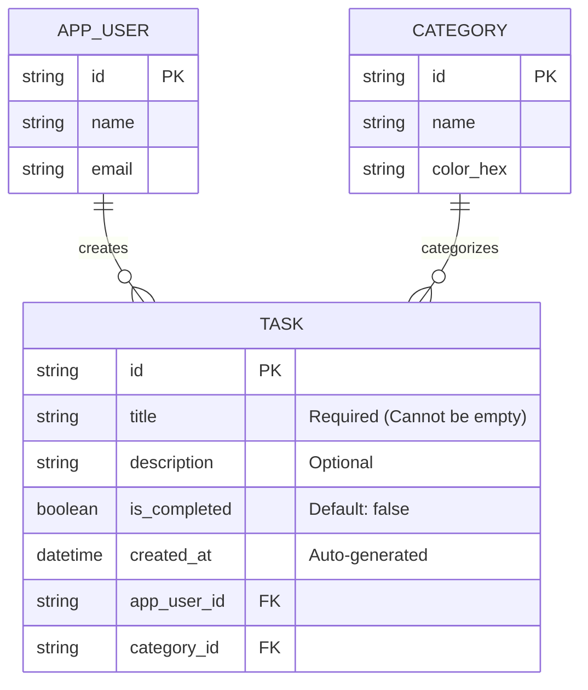

## TaskFlow: Technical Summary (Sprint 2)

### 1. Requirements Specification (Requisitos del Sistema)

El proyecto se rige por metodologías ágiles, contando con un Product Goal definido y un Product Backlog basado en User Stories que cubren el ciclo completo de vida de los datos de la aplicación.

#### 1.1 Funcional Requirements (Requisitos Funcionales)
Definen lo que el sistema **debe hacer** y las características con las que los usuarios pueden interactuar directamente.

- **Operaciones CRUD:** Capacidad completa para Crear (Create), Leer (Read), Actualizar (Update) y Eliminar (Delete) tareas.
- **Detalle de la Información:** Captura no solo del título (obligatorio), sino también de una descripción (opcional), categoría y la *fecha de creación* generada de forma automática por el sistema.
- **Gestión de Estado de Tareas:** Marcar y desmarcar tareas como "Completadas" de manera ágil y visual.
- **Sistema de Filtrado Dual:** 
  - Filtrado por Estado: Navegación por pestañas (All, Pending, Completed).
  - Filtrado por Categoría: Selección interactiva a través de botones (Chips) dinámicos.
- **Categorización Flexible:** Asignación visual de tareas a etiquetas predeterminadas (ej. Work, Personal, Motorcycles) desde el formulario de creación.
- **Recuperación de Datos (Safe-Delete):** Funcionalidad de **"Undo" (Deshacer)** para rescatar elementos recién eliminados temporalmente.
- **Persistencia Transparente:** Guardado y carga automática del estado y listado de las tareas para asegurar que ninguna información se pierda entre sesiones de la app.

#### 1.2 Non-Functional Requirements (Requisitos No Funcionales)
Definen **cómo** el sistema debe comportarse, abarcando calidad, rendimiento, usabilidad y arquitectura.

- **Persistencia y Rendimiento (Storage & Performance):**
  - Almacenamiento local persistente gestionado *offline* mediante el paquete `shared_preferences`.
  - Transformación eficiente de estructuras de datos (Serialización/Deserialización a JSON).
- **Usabilidad y Accesibilidad (UI/UX):**
  - **Contexto Visual:** Formularios sobre **Modal Bottom Sheets** para ingreso y edición (accesible vía *long-press*), manteniendo al usuario en el contexto principal.
  - **Feedback Inmediato:** Uso de `SnackBars` para confirmaciones (eliminación, errores de validación) y feedback visual condicional (ej. texto tachado en tareas completadas).
  - **Interacciones Táctiles:** Gestos de deslizamiento (*swipe-to-delete*) con animaciones en componentes `Dismissible` (fondo rojo e icono de peligro).
  - **Manejo de Teclado Nativo:** Ajuste de ventana (`viewInsets`) para prevenir obstrucciones en campos de texto.
- **Estándares de Diseño:** Implementación global de los lineamientos **Material 3**, uso de un esquema de colores dinámico (`colorScheme.fromSeed`) y tableros de control intuitivos (`DefaultTabController`).
- **Arquitectura y Mantenibilidad:**
  - Estructuración modular aplicando separación de responsabilidades (Modelos, Repositorios, Proveedores de Estado, Pantallas, y Componentes UI).
  - **Single Responsibility Principle (SRP):** Abstracción de la lógica de acceso a datos en repositorios específicos para facilitar futuras implementaciones (ej. bases de datos locales SQL o APIs en la nube).

### 2. Product Backlog

Siguiendo las convenciones de diseño de Scrum, aquí están el Producto Goal y las User Stories con sus Acceptance Criteria.

```markdown
# To-Do List App: Product Backlog

## Product Goal
> "To build a fast, intuitive, and reliable mobile application that empowers users to capture, organize, and track their daily tasks efficiently, ensuring no important commitment is overlooked."

---

## User Stories

### User Story #1: Create a New Task
**Description:**
*As a* user,
*I want to* add a new task to my list,
*So that* I can record what I need to do before I forget it.

**Acceptance Criteria:**
* **Scenario 1: Successful task creation**
  * **Given** the user is on the main screen,
  * **When** they tap the "Add Task" (+) button,
  * **Then** a text input field should be displayed within a bottom sheet.
* **Scenario 2: Saving the task**
  * **Given** the text input field is active,
  * **When** the user types a description and taps "Save",
  * **Then** the new task must be added to the top of the To-Do list.
* **Scenario 3: Empty task prevention**
  * **Given** the task title field is empty,
  * **When** the user attempts to tap "Save",
  * **Then** the action must be prevented and a warning (SnackBar) should indicate that the task title cannot be empty.
* **Scenario 4: Adding optional details**
  * **Given** the task creation modal is active,
  * **When** the user inputs a title and an optional description,
  * **Then** both fields must be saved and displayed correctly in the list.
* **Scenario 5: Assigning categories during creation**
  * **Given** the user is creating a new task,
  * **When** the modal bottom sheet is open,
  * **Then** there must be an option to assign the new task to one of the available categories.
* **Scenario 6: Automatic creation date tracking**
  * **Given** a new task is created and saved,
  * **When** it is displayed in the task list,
  * **Then** the system must automatically capture the current date and time, displaying it below the task's title and description.

---

### User Story #2: Mark a Task as Completed
**Description:**
*As a* user,
*I want to* mark a task as completed,
*So that* I can track my progress, feel a sense of accomplishment, and focus only on pending items.

**Acceptance Criteria:**
* **Scenario 1: Marking as done**
  * **Given** an active task is displayed on the list,
  * **When** the user taps the checkbox next to it,
  * **Then** the task's status must change to "completed" in the system.
* **Scenario 2: Visual feedback**
  * **Given** a task has been marked as completed,
  * **When** it is displayed on the screen,
  * **Then** it must have a clear visual indicator (a strikethrough text style and greyed out tone) to differentiate it from pending tasks.
* **Scenario 3: Reverting completion (Undo)**
  * **Given** a task is currently marked as completed,
  * **When** the user taps the checkbox again,
  * **Then** the task must revert to an "active" state and the visual completion indicator must be removed.

---

### User Story #3: Delete an Existing Task
**Description:**
*As a* user,
*I want to* delete a task from my list,
*So that* I can keep my workspace clean, remove mistakes, and discard items I no longer plan to do.

**Acceptance Criteria:**
* **Scenario 1: Triggering the deletion**
  * **Given** the user is viewing their list of tasks,
  * **When** they swipe left on a specific task,
  * **Then** the task must be immediately removed from the visible list.
* **Scenario 2: Data removal**
  * **Given** a task has been removed from the UI,
  * **When** the system processes the deletion,
  * **Then** the task record must be deleted from the local database.
* **Scenario 3: Grace period (Undo action)**
  * **Given** the user has just swiped to delete a task,
  * **When** the task disappears,
  * **Then** a temporary message (Snackbar) must appear at the bottom of the screen offering an "Undo" button.
* **Scenario 4: Recovering a deleted task**
  * **Given** the deletion Snackbar is active,
  * **When** the user taps "Undo",
  * **Then** the deletion process is canceled, and the task must reappear in its original position in the list.

---

### User Story #4: Edit an Existing Task
**Description:**
*As a* user,
*I want to* modify the text of a task I already created,
*So that* I can fix typos, add more details, or update my objective without having to delete and recreate the entire item.

**Acceptance Criteria:**
* **Scenario 1: Entering edit mode**
  * **Given** the user is viewing their task list,
  * **When** they tap and hold (long press) on a specific task,
  * **Then** the modal bottom sheet must open, pre-filled with the current title and description.
* **Scenario 2: Saving the modification**
  * **Given** the user is in edit mode and has changed the text,
  * **When** they tap "Update Task",
  * **Then** the task must be updated in the database and the list should reflect the new text.
* **Scenario 3: Canceling an edit**
  * **Given** the user is in edit mode modifying a task,
  * **When** they tap outside the input field or press a "Cancel" button,
  * **Then** the edit mode must close, and the task must revert to its original text.
* **Scenario 4: Preventing empty edits**
  * **Given** the user deletes all text in the title field while in edit mode,
  * **When** they attempt to save,
  * **Then** the system must prevent the update with a warning (SnackBar).

---

### User Story #5: Filter Tasks by Status
**Description:**
*As a* user,
*I want to* filter my tasks to see all, only pending, or only completed tasks,
*So that* I can easily focus on what needs to be done right now or review what I have already accomplished.

**Acceptance Criteria:**
* **Scenario 1: Viewing all tasks**
  * **Given** the user is on the main screen,
  * **When** the "All" tab is selected,
  * **Then** the list must display every task, regardless of its completion status.
* **Scenario 2: Viewing pending tasks**
  * **Given** the user is on the main screen,
  * **When** they tap the "Pending" tab,
  * **Then** the list must filter out completed tasks and display only those that are not done.
* **Scenario 3: Viewing completed tasks**
  * **Given** the user is on the main screen,
  * **When** they tap the "Completed" tab,
  * **Then** the list must filter out pending tasks and display only those that are done.
* **Scenario 4: Empty state handling**
  * **Given** the user applies a filter (e.g., "Pending"),
  * **When** there are no tasks matching that criteria,
  * **Then** a friendly message ("No tasks found in this section") must be displayed in the center of the screen.

---

### User Story #6: Filter Tasks by Category
**Description:**
*As a* user,
*I want to* filter my tasks by specific categories (e.g., Work, Personal, Motorcycles),
*So that* I can focus on a particular context or area of my life without distractions.

**Acceptance Criteria:**
* **Scenario 1: Viewing available categories**
  * **Given** the user is on the main task list screen,
  * **When** they look at the UI (e.g., below the app bar),
  * **Then** they must see visual indicators (like Filter Chips) representing the available categories.
* **Scenario 2: Applying a category filter**
  * **Given** the user has a list of mixed-category tasks,
  * **When** they tap on a specific category chip (e.g., "Work"),
  * **Then** the list must update dynamically to display *only* the tasks that belong to the selected category.
* **Scenario 3: Removing the category filter**
  * **Given** a current category filter is active,
  * **When** the user taps the active category chip again to deselect it,
  * **Then** the filter must be cleared and tasks from all categories should be displayed again.

---

### User Story #7: Persist Data Across Sessions
**Description:**
*As a* user,
*I want* my tasks to be saved locally on my device automatically,
*So that* I can close the app and find everything exactly as I left it the next time I open it.

**Acceptance Criteria:**
* **Scenario 1: Closing and reopening the app**
  * **Given** the user has created, edited, or deleted tasks,
  * **When** they fully close the application and reopen it,
  * **Then** the task list must be loaded perfectly displaying the latest state without any data loss.

---

### Future Backlog (Out of Current Scope)
> *The following items represent future iterations, scaling opportunities, and technical debt that will be addressed in upcoming sprints.*

**Feature Enhancements:**
* **User Authentication:** Allow logic for users to register, log in, and securely identify themselves (Preparation for Cloud Sync).
* **Notifications & Reminders:** Implement local push notifications to alert the user about upcoming deadlines or pending tasks.

**Technical Debt & Refactoring:**
* **UI Refactoring:** Break down large presentation files (like `task_bottom_sheet.dart`) into smaller, modular, and single-responsibility functional widgets to ensure maximum readability and UI reusability.
* **Automated Testing:** Configure the Flutter testing environment and implement Unit Tests focused squarely on validating the state logic (`TaskProvider`) and JSON serialization models to prevent future regressions.
```

### 3. Data Structure (Entity-Relationship Diagram)

Siguiendo las convenciones de diseño de bases de datos y respetando las reglas de negocio definidas en los requerimientos (ej. campos obligatorios vs. opcionales), aquí está la estructura principal de las entidades del proyecto.



### 4. Repository & Architecture Structure

Para mantener el código escalable, mantenible y aplicar el **Principio de Responsabilidad Única (SRP)**, el proyecto organiza sus archivos por capas lógicas y visuales.

```Plaintext
lib/
├── main.dart
├── core/
│   ├── constants/
│   │   └── app_colors.dart
│   └── utils/
│       ├── color_utils.dart
│       └── formatters.dart
├── data/
│   ├── models/
│   │   ├── app_user.dart
│   │   ├── task.dart
│   │   └── category.dart
│   └── repositories/
│       └── local_storage_repository.dart
├── logic/
│   └── providers/
│       └── task_provider.dart
└── presentation/
    ├── screens/
    │   └── task_list_screen.dart
    └── widgets/
        ├── category_filter_chips.dart
        ├── task_list_item.dart
        └── task_bottom_sheet.dart

```

------

### 5. Dependencies

#### pubspec.yaml

```yaml
dependencies:
  # Other dependencies
  
  # --- 
  # APP LAUNCHER ICONS PACKAGE
  # --- 
  # This package allows us to generate app launcher icons for both Android and iOS.
  # We use the caret (^) to allow minor, non-breaking updates automatically.
  flutter_launcher_icons: ^0.14.4

  # --- 
  # STATE MANAGEMENT PACKAGE
  # --- 
  # This package allows us to manage application state in a predictable way.
  # We use the caret (^) to allow minor, non-breaking updates automatically.
  provider: ^6.1.5+1  

  # --- 
  # LOCAL PERSISTENCE PACKAGE
  # --- 
  # This package allows us to save key-value data to the device's local storage.
  # We use the caret (^) to allow minor, non-breaking updates automatically.
  shared_preferences: ^2.5.4

```

------

### 6. Nombre de la Aplicación (Android App Name)

Antes de compilar el APK, se editó el archivo nativo de configuración, se buscó y abrió el siguiente archivo en el proyecto:

```
android / app / src / main / AndroidManifest.xml
```

Dentro de ese archivo, se buscó la etiqueta `<application>` y se cambió la propiedad `android:label`.

```XML
<manifest xmlns:android="http://schemas.android.com/apk/res/android">
    <application
        android:label="TaskFlow"
        android:name="${applicationName}"
        android:icon="@mipmap/ic_launcher">
        
        </application>
</manifest>
```

---

### 7. Source Code

#### Main Entry

##### main.dart

```dart
// ---
// MAIN ENTRY POINT
// ---
import 'package:flutter/material.dart';
import 'package:provider/provider.dart';
import 'package:to_do_list_app/logic/providers/task_provider.dart';
import 'package:to_do_list_app/presentation/screens/task_list_screen.dart';
import 'package:to_do_list_app/core/constants/app_colors.dart';

void main() {
  // FLUTTER CONCEPT: App Initialization with Provider
  // We wrap our entire app in a ChangeNotifierProvider so the state
  // is globally available to any widget that requests it.
  runApp(
    ChangeNotifierProvider(
      create: (context) => TaskProvider(),
      child: const TodoApp(),
    ),
  );
}

class TodoApp extends StatelessWidget {
  const TodoApp({super.key});

  @override
  Widget build(BuildContext context) {
    return MaterialApp(
      title: 'TaskFlow',
      debugShowCheckedModeBanner: false,

      // ---
      // GLOBAL THEME CONFIGURATION
      // ---
      theme: ThemeData(
        // Generates a cohesive palette based on our primary color
        colorScheme: ColorScheme.fromSeed(seedColor: AppColors.primary),
        // Sets the default background color for all screens
        scaffoldBackgroundColor: AppColors.background,

        // Globally configures all AppBars in the application
        appBarTheme: const AppBarTheme(
          backgroundColor: AppColors.primary,
          foregroundColor: AppColors.textLight,
          centerTitle: true,
          elevation: 0,
        ),

        useMaterial3: true,
      ),
      home: const TaskListScreen(),
    );
  }
}
```

#### Core

##### constants

###### app_colors.dart

```dart
// ---
// CONSTANTS: app_colors.dart
// ---
import 'package:flutter/material.dart';

// OOP CONCEPT: Static Configuration Class
// By using static constant variables, we create a single source of truth for
// the app's visual identity. The private constructor `AppColors._()` prevents
// developers from accidentally instantiating this class as an object.
class AppColors {
  // Private constructor
  AppColors._();

  // ---
  // BRAND COLORS
  // ---
  // The main identity colors of the application.
  static const Color primary = Colors.blueAccent;
  static const Color primaryDark = Color(
    0xFF1E3A8A,
  ); // A deeper blue for contrast

  // ---
  // BACKGROUNDS
  // ---
  static const Color background = Color(0xFFF3F4F6); // Very light gray/blue
  static const Color surface =
      Colors.white; // Used for cards, modals, and sheets

  // ---
  // TYPOGRAPHY (TEXT COLORS)
  // ---
  static const Color textPrimary = Color(
    0xFF1F2937,
  ); // Dark gray, softer than pure black
  static const Color textSecondary = Color(
    0xFF6B7280,
  ); // Medium gray for subtitles
  static const Color textLight = Colors.white; // Text over dark backgrounds

  // ---
  // SYSTEM & STATUS
  // ---
  static const Color error = Color(
    0xFFEF4444,
  ); // Red for destructive actions (Delete)
  static const Color success = Color(0xFF10B981); // Green for completions
  static const Color divider = Color(0xFFE5E7EB); // Subtle line separators
}

```

##### utils

###### color_utils.dart

```dart
// ---
// UTILITY: color_utils.dart
// ---
import 'package:flutter/material.dart';

// OOP CONCEPT: Utility Class
// A class containing static methods that act as generic helpers across the app.
class ColorUtils {
  // Converts a standard Hexadecimal color string (like '#FF5733')
  // into a Flutter-readable Color object.
  static Color fromHex(String hexString) {
    final buffer = StringBuffer();
    // Flutter expects an 8-digit hex value where the first 2 digits represent
    // the Alpha (opacity) channel. 'ff' means 100% opaque.
    if (hexString.length == 6 || hexString.length == 7) {
      buffer.write('ff');
    }
    buffer.write(hexString.replaceFirst('#', ''));
    return Color(int.parse(buffer.toString(), radix: 16));
  }
}

```

###### formatters.dart

```dart
// ---
// UTILITY: formatters.dart
// ---
// OOP CONCEPT: Utility Class
// A collection of static methods dedicated to transforming data into
// human-readable formats.

class Formatters {
  // Formats a DateTime object into a friendly string (e.g., "Mar 8, 2026")
  static String formatDate(DateTime date) {
    // We use a constant list to map the month integer (1-12) to its short name.
    const List<String> months = [
      'Jan',
      'Feb',
      'Mar',
      'Apr',
      'May',
      'Jun',
      'Jul',
      'Aug',
      'Sep',
      'Oct',
      'Nov',
      'Dec',
    ];

    // Arrays in Dart are zero-indexed, so we subtract 1 from the month number.
    final String monthName = months[date.month - 1];
    final String day = date.day.toString();
    final String year = date.year.toString();

    // String interpolation allows us to inject variables directly into the text
    return '$monthName $day, $year';
  }
}

```

#### Data

##### mock_data.dart
```dart
// ---
// MOCK DATA FILE: mock_data.dart
// ---
// This file simulates a database response. It contains "dummy" or "mock" data
// that we can use to build and test our User Interface (UI) before connecting
// a real database.

// IMPORTANT: In a real project, we would import our model files here.
import 'package:to_do_list_app/data/models/app_user.dart';
import 'package:to_do_list_app/data/models/category.dart';
import 'package:to_do_list_app/data/models/task.dart';

class MockData {
  // 1. INSTANTIATING A USER
  // We create a single 'AppUser' object. This represents the person logged in.
  static AppUser currentUser = AppUser(
    id: 'user_001',
    name: 'Octavio Sanchez',
    email: 'octavio@example.com',
  );

  // 2. INSTANTIATING CATEGORIES
  // We create a 'List' (an array) of Category objects to organize our tasks.
  static List<Category> categories = [
    Category(id: 'cat_1', name: 'Work', colorHex: '#FF5733'),
    Category(id: 'cat_2', name: 'Personal', colorHex: '#33FF57'),
    Category(id: 'cat_3', name: 'Motorcycles', colorHex: '#3357FF'),
  ];

  // 3. INSTANTIATING TASKS
  // Here we create a List of Task objects. Notice how we use the IDs from
  // the user and categories above to establish the "Foreign Key" relationships!
  static List<Task> myTasks = [
    // Object 1: A pending work task
    Task(
      id: 'task_001',
      title: 'Prepare Flutter Class',
      description: 'Review OOP and classes for the students at CBTis 47.',
      isCompleted: false, // This task is currently pending
      createdAt: DateTime.now(), // Records the exact current time
      appUserId: 'user_001',
      categoryId: 'cat_1', // Linked to the "Work" category
    ),

    // Object 2: A completed personal task
    Task(
      id: 'task_002',
      title: 'Study Session',
      description:
          'Help my son review math for his secondary school entrance exam.',
      isCompleted: true, // This task is already done!
      createdAt: DateTime.now().subtract(
        const Duration(days: 2),
      ), // Created 2 days ago
      appUserId: 'user_001',
      categoryId: 'cat_2', // Linked to the "Personal" category
    ),

    // Object 3: A pending motorcycle task
    Task(
      id: 'task_003',
      title: 'Sell old motorcycle',
      description:
          'Take high-quality photos of the Italika Blackbird 250 and post them online.',
      isCompleted: false,
      createdAt: DateTime.now(),
      appUserId: 'user_001',
      categoryId: 'cat_3', // Linked to the "Motorcycles" category
    ),

    // Object 4: Another pending motorcycle task
    Task(
      id: 'task_004',
      title: 'Motorcycle maintenance',
      description:
          'Check the tire pressure and brakes on the Pulsar N250 UG before commuting to Orizaba.',
      isCompleted: false,
      createdAt: DateTime.now(),
      appUserId: 'user_001',
      categoryId: 'cat_3',
    ),
  ];
}
```

##### models

###### app_user.dart

```dart
// ---
// CORE ENTITY: APP_USER
// ---
// OOP CONCEPT: CLASS
// Think of a 'class' as a blueprint or a cookie cutter. 
// It doesn't hold actual user data yet, it just defines the STRUCTURE of a user.
// When we create a specific user using this blueprint, we call it an 'Object'.

class AppUser {
  // OOP CONCEPT: PROPERTIES (or Attributes)
  // These variables define what an AppUser "has".
  // Note: We simply use 'id', 'name', etc., instead of repeating 'userId'.
  
  String id;    // This acts as our Primary Key (PK).
  String name;  // The full name of the user.
  String email; // The email address for the account.

  // OOP CONCEPT: CONSTRUCTOR
  // The constructor is a special function that runs exactly once when we create 
  // a new Object. It forces the programmer to provide the required data 
  // to build the object successfully.
  AppUser({
    required this.id,
    required this.name,
    required this.email,
  });
}

```

###### category.dart

```dart
// ---
// CORE ENTITY: CATEGORY
// ---
// RELATIONSHIP: 1:N (One-to-Many) with TASK
// A single category can be assigned to multiple tasks.

class Category {
  // Properties defining the Category blueprint.
  String id;
  String name;
  String colorHex; // We use camelCase in Dart for variables (e.g., colorHex).

  // Constructor to initialize the Category object.
  Category({
    required this.id,
    required this.name,
    required this.colorHex,
  });
}

```

###### task.dart

```dart
// ---
// CORE ENTITY: TASK
// ---
// RELATIONSHIP: Belongs to one APP_USER and one CATEGORY.

class Task {
  // Basic properties of a task.
  String id;
  String title;
  String description;

  // OOP CONCEPT: DATA TYPES
  // 'bool' stands for boolean, meaning it can only be 'true' or 'false'.
  // Perfect for checking if a task is done or pending.
  bool isCompleted;

  // 'DateTime' is a special class built into Dart to handle dates and times.
  DateTime createdAt;

  // OOP CONCEPT: FOREIGN KEYS IN CODE
  // To connect this task to a specific user and category,
  // we store their unique IDs here, just like in our E-R diagram.
  String appUserId; // Foreign Key pointing to AppUser.id
  String categoryId; // Foreign Key pointing to Category.id

  // Constructor
  // Notice that 'isCompleted' has a default value of 'false'.
  // When a user creates a new task, it is pending by default!
  Task({
    required this.id,
    required this.title,
    required this.description,
    this.isCompleted = false, // Default value assigned here
    required this.createdAt,
    required this.appUserId,
    required this.categoryId,
  });

  // ---
  // SERIALIZATION (Object to JSON)
  // ---
  // OOP CONCEPT: Method
  // This function takes our complex Task object and flattens it into a 'Map'.
  // A Map is a collection of Key-Value pairs (like a dictionary), which
  // is the exact structure required to convert data into JSON format.
  Map<String, dynamic> toJson() {
    return {
      'id': id,
      'title': title,
      'description': description,
      'isCompleted': isCompleted,
      // DATA TYPE HANDLING:
      // JSON doesn't understand what a 'DateTime' object is.
      // It only understands Strings, Numbers, and Booleans.
      // So, we convert our Date into a standard ISO-8601 String format.
      'createdAt': createdAt.toIso8601String(),
      'appUserId': appUserId,
      'categoryId': categoryId,
    };
  }

  // ---
  // DESERIALIZATION (JSON to Object)
  // ---
  // OOP CONCEPT: Factory Constructor
  // A 'factory' is a special type of constructor in Dart. It doesn't just blindly
  // create a blank object. It takes the raw map (the flattened JSON data), reads
  // the values, and builds a fully functional Task object out of them.
  factory Task.fromJson(Map<String, dynamic> json) {
    return Task(
      // We extract the values using their corresponding String keys
      id: json['id'],
      title: json['title'],
      description: json['description'],
      isCompleted: json['isCompleted'],

      // DATA TYPE HANDLING:
      // We must reverse the process here. We take the String from the JSON
      // and parse it back into a real Dart DateTime object.
      createdAt: DateTime.parse(json['createdAt']),
      appUserId: json['appUserId'],
      categoryId: json['categoryId'],
    );
  }
}

```

##### repositories

###### local_storage_repository.dart

```dart
// ---
// REPOSITORY: local_storage_repository.dart
// ---
import 'dart:convert';
import 'package:shared_preferences/shared_preferences.dart';
import 'package:to_do_list_app/data/models/task.dart';

// OOP CONCEPT: SINGLE RESPONSIBILITY PRINCIPLE (SRP)
// This class has exactly one job: managing data persistence.
// It abstracts away the complexity of shared_preferences from the UI.
class LocalStorageRepository {
  // We define the key as a constant so we don't misspell it in different methods.
  static const String _storageKey = 'cbtis47_tasks_key';

  // ---
  // DATA PERSISTENCE: LOAD (READ)
  // ---
  // Returns a Future containing a List of Tasks.
  Future<List<Task>> loadTasks() async {
    final prefs = await SharedPreferences.getInstance();
    final String? tasksJsonString = prefs.getString(_storageKey);

    if (tasksJsonString != null) {
      List<dynamic> decodedJsonList = jsonDecode(tasksJsonString);
      return decodedJsonList
          .map((jsonItem) => Task.fromJson(jsonItem))
          .toList();
    }

    // If no data is found, return an empty list instead of null.
    return [];
  }

  // ---
  // DATA PERSISTENCE: SAVE (WRITE)
  // ---
  // Takes the current list of tasks and saves it to the device.
  Future<void> saveTasks(List<Task> tasks) async {
    final prefs = await SharedPreferences.getInstance();
    List<Map<String, dynamic>> jsonList = tasks
        .map((task) => task.toJson())
        .toList();

    String tasksString = jsonEncode(jsonList);
    await prefs.setString(_storageKey, tasksString);
  }
}

```

#### Logic

##### providers

###### task_provider.dart

```dart
// ---
// STATE MANAGEMENT: task_provider.dart
// ---
import 'package:flutter/material.dart';
import 'package:to_do_list_app/data/models/task.dart';
import 'package:to_do_list_app/data/models/category.dart';
import 'package:to_do_list_app/data/repositories/local_storage_repository.dart';

class TaskProvider extends ChangeNotifier {
  final LocalStorageRepository _repository = LocalStorageRepository();
  List<Task> _tasks = [];

  // ---
  // CATEGORIES DATA (MOCK)
  // ---
  final List<Category> _categories = [
    Category(id: 'cat_1', name: 'Work', colorHex: '#FF5733'),
    Category(id: 'cat_2', name: 'Personal', colorHex: '#33FF57'),
    Category(id: 'cat_3', name: 'Motorcycles', colorHex: '#3357FF'),
  ];

  // ---
  // FILTER STATE
  // ---
  // A variable to store the ID of the currently selected category.
  // If it's null, it means "All Categories" are selected.
  String? _selectedFilterCategoryId;

  String? get selectedFilterCategoryId => _selectedFilterCategoryId;

  // Method to update the filter from the UI
  void setFilterCategory(String? categoryId) {
    _selectedFilterCategoryId = categoryId;
    notifyListeners(); // Tells the UI to rebuild with the new filter
  }

  List<Category> get categories => _categories;

  Category getCategoryById(String categoryId) {
    return _categories.firstWhere(
      (cat) => cat.id == categoryId,
      orElse: () => _categories.first,
    );
  }

  // ---
  // ADVANCED GETTERS (Combined Filtering)
  // ---
  // First, we create a private getter that filters by category (if one is selected)
  List<Task> get _filteredByCategory {
    if (_selectedFilterCategoryId == null) {
      return _tasks; // No category filter applied
    }
    return _tasks
        .where((task) => task.categoryId == _selectedFilterCategoryId)
        .toList();
  }

  // Then, our public getters use the already filtered list instead of the raw _tasks list.
  // This allows the TabBar (status) and the Chips (category) to work together seamlessly!
  List<Task> get allTasks => _filteredByCategory;
  List<Task> get pendingTasks =>
      _filteredByCategory.where((task) => !task.isCompleted).toList();
  List<Task> get completedTasks =>
      _filteredByCategory.where((task) => task.isCompleted).toList();

  TaskProvider() {
    _loadTasks();
  }

  Future<void> _loadTasks() async {
    _tasks = await _repository.loadTasks();
    notifyListeners();
  }

  void addTask(Task task) {
    _tasks.insert(0, task);
    _syncWithStorage();
  }

  void updateTask(Task updatedTask) {
    final index = _tasks.indexWhere((t) => t.id == updatedTask.id);
    if (index != -1) {
      _tasks[index] = updatedTask;
      _syncWithStorage();
    }
  }

  void toggleTaskCompletion(Task task) {
    task.isCompleted = !task.isCompleted;
    _syncWithStorage();
  }

  int deleteTask(Task task) {
    final index = _tasks.indexOf(task);
    if (index != -1) {
      _tasks.removeAt(index);
      _syncWithStorage();
    }
    return index;
  }

  void undoDelete(int index, Task task) {
    if (index >= 0 && index <= _tasks.length) {
      _tasks.insert(index, task);
      _syncWithStorage();
    }
  }

  void _syncWithStorage() {
    _repository.saveTasks(_tasks);
    notifyListeners();
  }
}

```

#### Presentation

##### screens

###### task_list_screen.dart

```dart
// ---
// SCREEN: task_list_screen.dart
// ---
import 'package:flutter/material.dart';
import 'package:provider/provider.dart';
import 'package:to_do_list_app/data/models/task.dart';
import 'package:to_do_list_app/logic/providers/task_provider.dart';
import 'package:to_do_list_app/presentation/widgets/task_list_item.dart';
import 'package:to_do_list_app/presentation/widgets/task_bottom_sheet.dart';
import 'package:to_do_list_app/core/constants/app_colors.dart';
import 'package:to_do_list_app/presentation/widgets/category_filter_chips.dart';

class TaskListScreen extends StatelessWidget {
  const TaskListScreen({super.key});

  // ---
  // BOTTOM SHEET TRIGGER
  // ---
  void _openTaskModal(BuildContext context, [Task? task]) {
    showModalBottomSheet(
      context: context,
      isScrollControlled: true,
      builder: (context) => TaskBottomSheet(existingTask: task),
    );
  }

  // ---
  // REUSABLE LIST BUILDER
  // ---
  Widget _buildTaskList(List<Task> tasks) {
    if (tasks.isEmpty) {
      return const Center(
        child: Text(
          'No tasks found in this section.',
          style: TextStyle(fontSize: 18, color: Colors.grey),
        ),
      );
    }

    return ListView.builder(
      itemCount: tasks.length,
      itemBuilder: (context, index) {
        final task = tasks[index];
        // Use our custom, encapsulated widget
        return TaskListItem(
          task: task,
          onEdit: () => _openTaskModal(context, task),
        );
      },
    );
  }

  @override
  Widget build(BuildContext context) {
    final taskProvider = context.watch<TaskProvider>();

    return DefaultTabController(
      length: 3,
      child: Scaffold(
        appBar: AppBar(
          title: const Text('TaskFlow'),
          bottom: const TabBar(
            labelColor: AppColors.textLight,
            unselectedLabelColor: Colors.white70,
            indicatorColor: AppColors.textLight,
            tabs: [
              Tab(text: 'All'),
              Tab(text: 'Pending'),
              Tab(text: 'Completed'),
            ],
          ),
        ),

        // ---
        // UPDATED BODY: Column with Chips and TabBarView
        // ---
        body: Column(
          children: [
            // Our new horizontally scrollable filter chips
            const CategoryFilterChips(),

            // Expanded forces the TabBarView to take up all the remaining screen space
            Expanded(
              child: TabBarView(
                children: [
                  _buildTaskList(taskProvider.allTasks),
                  _buildTaskList(taskProvider.pendingTasks),
                  _buildTaskList(taskProvider.completedTasks),
                ],
              ),
            ),
          ],
        ),

        floatingActionButton: FloatingActionButton(
          onPressed: () => _openTaskModal(context),
          backgroundColor: AppColors.primary,
          child: const Icon(Icons.add, color: AppColors.textLight),
        ),
      ),
    );
  }
}

```

##### widgets

###### category_filter_chips.dart

```dart
// ---
// WIDGET: category_filter_chips.dart
// ---
import 'package:flutter/material.dart';
import 'package:provider/provider.dart';
import 'package:to_do_list_app/logic/providers/task_provider.dart';
import 'package:to_do_list_app/core/constants/app_colors.dart';
import 'package:to_do_list_app/core/utils/color_utils.dart';

// OOP CONCEPT: Specialized UI Component
// This widget is dedicated solely to rendering the horizontal list of filter chips.
class CategoryFilterChips extends StatelessWidget {
  const CategoryFilterChips({super.key});

  @override
  Widget build(BuildContext context) {
    final provider = context.watch<TaskProvider>();
    final categories = provider.categories;
    final selectedId = provider.selectedFilterCategoryId;

    return SingleChildScrollView(
      // Allows the user to swipe left/right if there are many categories
      scrollDirection: Axis.horizontal,
      padding: const EdgeInsets.symmetric(horizontal: 16.0, vertical: 12.0),
      child: Row(
        children: [
          // 1. The "All Categories" Chip (Static)
          Padding(
            padding: const EdgeInsets.only(right: 8.0),
            child: ChoiceChip(
              label: const Text('All'),
              selected: selectedId == null,
              selectedColor: AppColors.primary.withOpacity(0.2),
              onSelected: (bool selected) {
                // If tapped, clear the category filter (set to null)
                if (selected) provider.setFilterCategory(null);
              },
            ),
          ),

          // 2. Dynamic Category Chips (Generated from the provider)
          // The spread operator (...) unpacks the mapped list into the Row's children
          ...categories.map((category) {
            final isSelected = selectedId == category.id;
            final catColor = ColorUtils.fromHex(category.colorHex);

            return Padding(
              padding: const EdgeInsets.only(right: 8.0),
              child: ChoiceChip(
                label: Text(category.name),
                selected: isSelected,
                selectedColor: catColor.withOpacity(0.3),
                // Visual detail: A tiny color dot inside the chip
                avatar: CircleAvatar(backgroundColor: catColor, radius: 10),
                onSelected: (bool selected) {
                  // Toggle logic: If tapping the already selected chip, deselect it (null)
                  // Otherwise, select its category ID.
                  provider.setFilterCategory(selected ? category.id : null);
                },
              ),
            );
          }).toList(), // Don't forget to convert the Iterable back to a List!
        ],
      ),
    );
  }
}

```

###### task_bottom_sheet.dart

```dart
// ---
// WIDGET: task_bottom_sheet.dart
// ---
import 'package:flutter/material.dart';
import 'package:provider/provider.dart';
import 'package:to_do_list_app/data/models/task.dart';
import 'package:to_do_list_app/logic/providers/task_provider.dart';
import 'package:to_do_list_app/core/constants/app_colors.dart';

class TaskBottomSheet extends StatefulWidget {
  final Task? existingTask;

  const TaskBottomSheet({super.key, this.existingTask});

  @override
  State<TaskBottomSheet> createState() => _TaskBottomSheetState();
}

class _TaskBottomSheetState extends State<TaskBottomSheet> {
  late final TextEditingController _titleController;
  late final TextEditingController _descriptionController;

  // STATE VARIABLE: Holds the currently selected Foreign Key
  late String _selectedCategoryId;

  @override
  void initState() {
    super.initState();
    _titleController = TextEditingController(
      text: widget.existingTask?.title ?? '',
    );
    _descriptionController = TextEditingController(
      text: widget.existingTask?.description ?? '',
    );

    // Initialize with the existing task's category, or default to the first one available
    final provider = context.read<TaskProvider>();
    _selectedCategoryId =
        widget.existingTask?.categoryId ?? provider.categories.first.id;
  }

  @override
  void dispose() {
    _titleController.dispose();
    _descriptionController.dispose();
    super.dispose();
  }

  void _saveTask() {
    if (_titleController.text.trim().isEmpty) {
      ScaffoldMessenger.of(context).showSnackBar(
        const SnackBar(content: Text('Task title cannot be empty!')),
      );
      return;
    }

    final provider = context.read<TaskProvider>();

    if (widget.existingTask != null) {
      // UPDATE EXISTING TASK
      widget.existingTask!.title = _titleController.text.trim();
      widget.existingTask!.description = _descriptionController.text.trim();
      // Assign the new selected category
      widget.existingTask!.categoryId = _selectedCategoryId;
      provider.updateTask(widget.existingTask!);
    } else {
      // CREATE NEW TASK
      final newTask = Task(
        id: DateTime.now().millisecondsSinceEpoch.toString(),
        title: _titleController.text.trim(),
        description: _descriptionController.text.trim(),
        createdAt: DateTime.now(),
        appUserId: 'user_001',
        // Dynamically assign the selected category ID!
        categoryId: _selectedCategoryId,
      );
      provider.addTask(newTask);
    }

    Navigator.pop(context);
  }

  @override
  Widget build(BuildContext context) {
    // Read the available categories from the provider to build our dropdown
    final availableCategories = context.read<TaskProvider>().categories;

    return Padding(
      padding: EdgeInsets.only(
        bottom: MediaQuery.of(context).viewInsets.bottom,
      ),
      child: SingleChildScrollView(
        child: Padding(
          padding: const EdgeInsets.all(16.0),
          child: Column(
            mainAxisSize: MainAxisSize.min,
            crossAxisAlignment: CrossAxisAlignment.start,
            children: [
              Text(
                widget.existingTask != null ? 'Edit Task' : 'Add New Task',
                style: const TextStyle(
                  fontSize: 20,
                  fontWeight: FontWeight.bold,
                ),
              ),
              TextField(
                controller: _titleController,
                decoration: const InputDecoration(labelText: 'Task Title'),
                autofocus: true,
              ),
              TextField(
                controller: _descriptionController,
                decoration: const InputDecoration(
                  labelText: 'Description (Optional)',
                ),
              ),
              const SizedBox(height: 16),

              // ---
              // CATEGORY DROPDOWN SELECTOR
              // ---
              DropdownButtonFormField<String>(
                initialValue: _selectedCategoryId,
                decoration: const InputDecoration(
                  labelText: 'Category',
                  border: OutlineInputBorder(),
                  contentPadding: EdgeInsets.symmetric(
                    horizontal: 12,
                    vertical: 8,
                  ),
                ),
                items: availableCategories.map((category) {
                  return DropdownMenuItem<String>(
                    value: category.id,
                    child: Text(category.name),
                  );
                }).toList(),
                onChanged: (String? newValue) {
                  if (newValue != null) {
                    setState(() {
                      _selectedCategoryId = newValue;
                    });
                  }
                },
              ),

              const SizedBox(height: 24),
              SizedBox(
                width: double.infinity,
                child: ElevatedButton(
                  style: ElevatedButton.styleFrom(
                    backgroundColor:
                        AppColors.primary, // <-- Replaced hardcoded blue
                    foregroundColor: AppColors.textLight,
                  ),
                  onPressed: _saveTask,
                  child: Text(
                    widget.existingTask != null ? 'Update Task' : 'Save Task',
                  ),
                ),
              ),
              const SizedBox(height: 16),
            ],
          ),
        ),
      ),
    );
  }
}

```

###### task_list_item.dart

```dart
// ---
// WIDGET: task_list_item.dart
// ---
import 'package:flutter/material.dart';
import 'package:provider/provider.dart';
import 'package:to_do_list_app/data/models/task.dart';
import 'package:to_do_list_app/logic/providers/task_provider.dart';
import 'package:to_do_list_app/core/utils/color_utils.dart';
import 'package:to_do_list_app/core/constants/app_colors.dart';
import 'package:to_do_list_app/core/utils/formatters.dart'; // <-- 1. Import our new formatter

class TaskListItem extends StatelessWidget {
  final Task task;
  final VoidCallback onEdit;

  const TaskListItem({super.key, required this.task, required this.onEdit});

  @override
  Widget build(BuildContext context) {
    final provider = context.read<TaskProvider>();
    final taskCategory = provider.getCategoryById(task.categoryId);

    return Dismissible(
      key: ValueKey(task.id),
      direction: DismissDirection.endToStart,
      background: Container(
        color: AppColors.error,
        alignment: Alignment.centerRight,
        padding: const EdgeInsets.only(right: 20.0),
        child: const Icon(Icons.delete, color: AppColors.surface),
      ),
      onDismissed: (direction) {
        final originalIndex = provider.deleteTask(task);
        ScaffoldMessenger.of(context).clearSnackBars();
        ScaffoldMessenger.of(context).showSnackBar(
          SnackBar(
            content: Text('Task "${task.title}" deleted.'),
            duration: const Duration(seconds: 4),
            action: SnackBarAction(
              label: 'Undo',
              onPressed: () => provider.undoDelete(originalIndex, task),
            ),
          ),
        );
      },
      child: ListTile(
        onLongPress: onEdit,
        leading: Checkbox(
          value: task.isCompleted,
          activeColor: AppColors.primary,
          onChanged: (bool? newValue) {
            provider.toggleTaskCompletion(task);
          },
        ),
        title: Text(
          task.title,
          style: TextStyle(
            fontWeight: FontWeight.bold,
            decoration: task.isCompleted
                ? TextDecoration.lineThrough
                : TextDecoration.none,
            color: task.isCompleted
                ? AppColors.textSecondary
                : AppColors.textPrimary,
          ),
        ),

        // ---
        // UPDATED SUBTITLE: Column with Description and Date
        // ---
        subtitle: Column(
          crossAxisAlignment: CrossAxisAlignment.start,
          children: [
            // If the description is not empty, we show it and add a tiny space
            if (task.description.isNotEmpty) ...[
              Text(
                task.description,
                style: const TextStyle(color: AppColors.textSecondary),
              ),
              const SizedBox(height: 4), // Vertical spacing
            ],

            // We ALWAYS show the formatted creation date at the bottom
            Row(
              children: [
                const Icon(
                  Icons.calendar_today,
                  size: 12,
                  color: AppColors.textSecondary,
                ),
                 const SizedBox(width: 4),
                Text(
                  Formatters.formatDate(task.createdAt),
                  style: const TextStyle(
                    fontSize: 12,
                    color: AppColors.textSecondary,
                  ),
                ),
              ],
            ),
          ],
        ),

        trailing: Container(
          width: 16,
          height: 16,
          decoration: BoxDecoration(
            shape: BoxShape.circle,
            color: ColorUtils.fromHex(taskCategory.colorHex),
            border: Border.all(color: Colors.black26, width: 1),
          ),
        ),
      ),
    );
  }
}

```

### 8. Current Objective / Next Steps

**Status:** El proyecto base está plenamente funcional en su capa local. La lógica de persistencia de datos ya ha sido extraída exitosamente de la UI mediante `LocalStorageRepository` y el estado se gestiona eficientemente con `TaskProvider`.

**Immediate Goals (Próximos Pasos Técnicos para el Curso):**
El siguiente hito arquitectónico es migrar de una aplicación 100% aislada a una aplicación conectada a la nube (Cloud-Native), manteniendo la robustez offline.

1. **Integración de Backend as a Service (BaaS):**
   * **Objetivo:** Conectar la aplicación Flutter a un proyecto de base de datos en la nube (ej. Firebase Cloud Firestore).
   * **Acción:** Reestructurar la capa `data/repositories` para implementar un nuevo repositorio en la nube (`cloud_storage_repository.dart`) que se comunique con la API de Firebase.

2. **Estrategia Offline-First (Sincronización Inteligente):**
   * **Objetivo:** Garantizar que la aplicación siga siendo útil sin conexión a Internet, utilizando el almacenamiento local (Shared Preferences/SQLite) y las capacidades nativas del SDK de Firebase para gestionar estados de desconexión sin pérdida de información, tal como lo hacen las apps de nivel empresarial.
