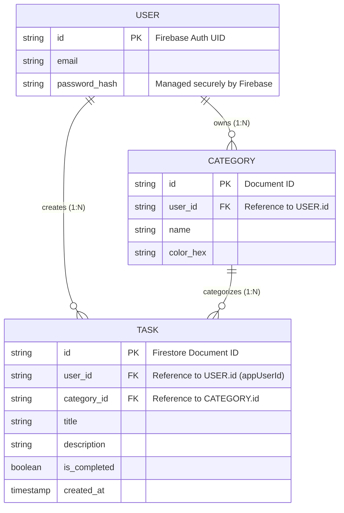

## TaskFlow: Technical Summary (Sprint 3)

### 1. Requirements Specification (Requisitos del Sistema)

El proyecto se rige por metodologías ágiles, contando con un Product Goal enfocado en una arquitectura Cloud-Native y un Product Backlog basado en User Stories que cubren el ciclo completo de vida de los datos y la identidad del usuario en la aplicación.

#### 1.1 Funcional Requirements (Requisitos Funcionales)

Definen lo que el sistema **debe hacer** y las características con las que los usuarios pueden interactuar directamente.

* **Autenticación de Usuarios (Auth):** Capacidad para crear una cuenta (Sign Up), iniciar sesión (Log In) y cerrar sesión (Log Out) utilizando credenciales de correo electrónico y contraseña.
* **Gestión de Sesiones:** Mantenimiento automático de la sesión activa del usuario para evitar solicitar credenciales cada vez que se abre la aplicación, gestionado mediante un enrutador de estado dinámico (`AuthWrapper`).
* **Operaciones CRUD en la Nube:** Capacidad completa para Crear (Create), Leer (Read), Actualizar (Update) y Eliminar (Delete) tareas. Estas operaciones están vinculadas criptográficamente al identificador único del usuario (`appUserId`).
* **Detalle de la Información:** Captura del título (obligatorio), descripción (opcional), categoría y la *fecha de creación* generada de forma automática por el sistema.
* **Gestión de Estado de Tareas:** Marcar y desmarcar tareas como "Completadas" de manera ágil y visual, actualizando el estado instantáneamente en la nube.
* **Sistema de Filtrado Dual:**
  * **Filtrado por Estado:** Navegación por pestañas (All, Pending, Completed).
  * **Filtrado por Categoría:** Selección interactiva a través de botones (Chips) dinámicos de desplazamiento horizontal.
* **Categorización Flexible:** Asignación visual de tareas a etiquetas predeterminadas (ej. Work, Personal, Motorcycles) desde el formulario de creación usando menús desplegables.
* **Recuperación de Datos (Safe-Delete):** Funcionalidad de **"Undo" (Deshacer)** para rescatar elementos recién eliminados temporalmente, reinsertando el documento intacto en la base de datos.

#### 1.2 Non-Functional Requirements (Requisitos No Funcionales)

Definen **cómo** el sistema debe comportarse, abarcando calidad, rendimiento, seguridad, usabilidad y arquitectura.

* **Persistencia y Estrategia Offline-First (Storage & Performance):**
  * Sincronización de datos en tiempo real mediante *Streams* conectados a **Firebase Cloud Firestore** (Standard Edition en modo Nativo).
  * Uso de **Índices Compuestos (Composite Indexes)** en la nube para soportar consultas complejas de alto rendimiento (combinando filtrado por `appUserId` y ordenamiento por fecha).
  * Caché local nativo gestionado por el SDK de Firebase que garantiza el funcionamiento ininterrumpido (operaciones CRUD completas) sin conexión a internet, con sincronización silenciosa en segundo plano al recuperar la conectividad.

* **Seguridad y Privacidad (Security Rules):**
  * Implementación de reglas estrictas en la base de datos NoSQL (`allow read, write: if request.auth != null`) para garantizar que ningún dato pueda ser leído o modificado sin un token de sesión válido.

* **Arquitectura y Mantenibilidad (Software Engineering):**
  * Implementación de una arquitectura **Feature-First** (módulos independientes para `auth` y `tasks`), aislando las capas de presentación, lógica y datos para maximizar la cohesión y preparar el proyecto para escalar a nivel empresarial.
  * Cumplimiento del **Single Responsibility Principle (SRP)** abstrayendo la comunicación con las APIs de Firebase en repositorios dedicados (`AuthRepository` y `CloudStorageRepository`).

* **Usabilidad y Accesibilidad (UI/UX):**
  * **Contexto Visual:** Formularios sobre **Modal Bottom Sheets** para ingreso y edición (accesible vía *long-press*), manteniendo al usuario en el contexto principal.
  * **Feedback Inmediato y Dinámico:** Uso estratégico de `SnackBars` para confirmaciones y errores. Comportamiento unificado a estilo `floating` para la pantalla de autenticación y estilo `fixed` para las pantallas con botones de acción flotante (FAB).
  * **Interacciones Táctiles:** Gestos de deslizamiento (*swipe-to-delete*) con animaciones en componentes `Dismissible` (fondo rojo e icono de peligro).
  * **Manejo de Teclado Nativo:** Ajuste de ventana (`viewInsets`) para prevenir obstrucciones en campos de texto durante la captura de datos.

* **Estándares de Diseño:** Implementación global de los lineamientos **Material 3**, uso de un esquema de colores dinámico y tableros de control intuitivos.

---

### 2. Product Backlog

Siguiendo las convenciones de diseño de Scrum, aquí están el Producto Goal y las User Stories con sus Acceptance Criteria.

```markdown
# To-Do List App: Product Backlog

## Product Goal
> "To build a secure, cloud-native, and offline-first mobile application that empowers users to capture, organize, and track their daily tasks seamlessly across multiple devices, ensuring no important commitment is overlooked regardless of internet connectivity."

---

## Epics & User Stories

### Epic 1: Identity & Cloud Infrastructure
> *Focuses on securing user access, maintaining sessions, and establishing the robust cloud database connection required for offline-first capabilities.*

#### User Story #1: User Authentication (Sign Up, Log In & Log Out)
**Description:**
*As a* user,
*I want to* securely create an account, log in, and log out of the application,
*So that* my tasks are linked exclusively to my identity, protected from unauthorized access, and I have control over my active session.

**Acceptance Criteria:**
* **Scenario 1: Successful account creation and feedback**
  * **Given** the user is on the AuthScreen,
  * **When** they enter a valid email and password and tap "Sign Up",
  * **Then** a new user account must be created in Firebase Authentication, and a success message (floating SnackBar) must confirm the registration before routing to the main screen.
* **Scenario 2: Successful user login**
  * **Given** the user has an existing account,
  * **When** they input their correct credentials and tap "Log In",
  * **Then** the system must authenticate the session and navigate to the task list, displaying a welcome message (floating SnackBar).
* **Scenario 3: Empty field prevention (Client-Side Validation)**
  * **Given** the user is on the AuthScreen,
  * **When** they attempt to log in or sign up leaving the email or password field empty,
  * **Then** the system must prevent the authentication attempt and display a warning message (floating SnackBar) stating "Please fill in all fields."
* **Scenario 4: Handling invalid login attempts**
  * **Given** the user is on the AuthScreen with filled fields,
  * **When** they attempt to log in with an unregistered email or incorrect password,
  * **Then** the system must explicitly display a red error message (floating SnackBar) informing them that authentication failed, preventing the UI from freezing.
* **Scenario 5: Authentication persistence**
  * **Given** the user has previously logged in,
  * **When** they close and reopen the application,
  * **Then** the `AuthWrapper` must bypass the login screen and route them directly to their data stream.
* **Scenario 6: User Logout**
  * **Given** the user is successfully logged in and viewing their tasks,
  * **When** they tap the "Logout" icon in the application's top app bar,
  * **Then** their Firebase session must be terminated, clearing local memory, and they must be immediately redirected back to the AuthScreen.

#### User Story #2: Cloud Data Synchronization (Firestore)
**Description:**
*As a* user,
*I want* my tasks and categories to be automatically saved to a secure cloud database,
*So that* I never lose my information if my device is lost, damaged, or replaced, and my data is instantly available on any device I log into.

**Acceptance Criteria:**
* **Scenario 1: Securing data by User ID**
  * **Given** the user creates a new task,
  * **When** the system saves it to the Firestore database,
  * **Then** the task record must contain the authenticated user's unique `appUserId` to ensure data isolation.
* **Scenario 2: Real-time UI updates (Reactive Stream)**
  * **Given** the application is connected to the Firestore data stream,
  * **When** a change occurs in the cloud database (e.g., adding or updating a task),
  * **Then** the active UI must rebuild automatically to reflect the latest state without requiring a manual pull-to-refresh.
* **Scenario 3: Fetching cross-device data**
  * **Given** the user installs the app on a new device and logs in,
  * **When** the main screen loads,
  * **Then** the system must query Firestore using a composite index (filtering by `appUserId` and ordering by `createdAt`) and display all their historical tasks.

#### User Story #3: Offline-First Reliability (Full CRUD)
**Description:**
*As a* user,
*I want to* manage my tasks normally even when I don't have internet access,
*So that* my productivity is never halted by connectivity issues, knowing my data will eventually sync.

**Acceptance Criteria:**
* **Scenario 1: Full CRUD operations offline (Create, Update, Delete)**
  * **Given** the device is completely disconnected from the internet,
  * **When** the user creates a new task, edits an existing one, or deletes a task,
  * **Then** the UI must update instantly via the reactive stream, and the exact state change must be securely stored in the local Firebase cache.
* **Scenario 2: Background synchronization upon reconnection**
  * **Given** the user has made changes (creations, edits, or deletions) while offline,
  * **When** the device reconnects to a stable internet connection,
  * **Then** the system must automatically sync all pending local actions to the Firestore cloud database in the background without user intervention.

---

### Epic 2: Task Management & UI
> *Focuses on the core functionalities that allow the user to interact with their tasks, providing a smooth, intuitive, and responsive interface.*

#### User Story #4: Create a New Task
**Description:**
*As a* user,
*I want to* add a new task to my list,
*So that* I can record what I need to do and have it instantly backed up to the cloud.

**Acceptance Criteria:**
* **Scenario 1: Successful task creation and cloud save**
  * **Given** the user inputs a title, optional description, and selects a category in the Modal Bottom Sheet,
  * **When** they tap "Save Task",
  * **Then** the `TaskProvider` must generate a new Task object bound to the user's `appUserId` and push it to the `CloudStorageRepository`.
* **Scenario 2: Real-time list rendering**
  * **Given** the new task is successfully pushed to Firestore,
  * **When** the Firestore Stream emits the updated list,
  * **Then** the new task must be rendered at the top of the To-Do list automatically, without manual UI intervention.
* **Scenario 3: Empty task prevention**
  * **Given** the task title field is empty,
  * **When** the user attempts to tap "Save",
  * **Then** the action must be prevented, and a `fixed` SnackBar warning must indicate that the title cannot be empty.

#### User Story #5: Mark a Task as Completed
**Description:**
*As a* user,
*I want to* mark a task as completed,
*So that* I can track my progress and update my status across all my synced devices.

**Acceptance Criteria:**
* **Scenario 1: Marking as done and cloud update**
  * **Given** an active task is displayed on the list,
  * **When** the user taps the checkbox next to it,
  * **Then** the task's status (`isCompleted`) must change to `true` and the update must be sent to the Firestore document.
* **Scenario 2: Visual feedback**
  * **Given** the Firestore Stream confirms the task is completed,
  * **When** it is displayed on the screen,
  * **Then** it must have a clear visual indicator (a strikethrough text style and greyed out tone) to differentiate it from pending tasks.

#### User Story #6: Delete an Existing Task
**Description:**
*As a* user,
*I want to* delete a task from my list,
*So that* I can discard items I no longer plan to do and remove them permanently from my cloud database.

**Acceptance Criteria:**
* **Scenario 1: Triggering the deletion**
  * **Given** the user is viewing their list of tasks,
  * **When** they swipe left on a specific task (`Dismissible` widget),
  * **Then** the document must be deleted from the Firestore database, and the Stream will automatically remove it from the UI.
* **Scenario 2: Grace period (Undo action)**
  * **Given** the user has just swiped to delete a task,
  * **When** the task disappears,
  * **Then** a `fixed` temporary SnackBar must appear at the bottom of the screen offering an "Undo" button.
* **Scenario 3: Recovering a deleted task**
  * **Given** the deletion SnackBar is active,
  * **When** the user taps "Undo",
  * **Then** the system must re-insert the exact same Task object back into Firestore, causing the Stream to seamlessly render it back in the list.

#### User Story #7: Edit an Existing Task
**Description:**
*As a* user,
*I want to* modify the text or category of a task I already created,
*So that* I can fix typos or update my objective, keeping my cloud records accurate.

**Acceptance Criteria:**
* **Scenario 1: Entering edit mode**
  * **Given** the user is viewing their task list,
  * **When** they tap and hold (long press) on a specific task,
  * **Then** the Modal Bottom Sheet must open, pre-filled with the current title, description, and selected category.
* **Scenario 2: Saving the modification to the cloud**
  * **Given** the user is in edit mode and has changed the text or category,
  * **When** they tap "Update Task",
  * **Then** the specific document in Firestore must be updated, and the Stream will refresh the UI to reflect the new data.

#### User Story #8: Filter Tasks by Status & Category
**Description:**
*As a* user,
*I want to* filter my tasks locally to see all, only pending, or only completed tasks, and combine this with category filters,
*So that* I can easily focus on specific areas of my life without making unnecessary queries to the database.

**Acceptance Criteria:**
* **Scenario 1: Local state filtering**
  * **Given** the `TaskProvider` has loaded all the user's tasks from the Firestore Stream,
  * **When** the user switches TabBar views (Pending/Completed) or taps a Category Chip,
  * **Then** the UI must filter the existing data strictly in the device's memory (using Dart getters) without querying the cloud again, saving bandwidth and read operations.
* **Scenario 2: Empty state handling**
  * **Given** the user applies a filter,
  * **When** there are no tasks matching that criteria locally,
  * **Then** a friendly message ("No tasks found in this section") must be displayed in the center of the screen.

---

## Future Backlog (Out of Current Scope)
> *The following items represent future iterations, scaling opportunities, and technical debt that will be addressed in upcoming sprints.*

**Feature Enhancements:**
* **Local Notifications & Reminders:** Implement local push notifications (via `flutter_local_notifications`) to alert the user about upcoming deadlines.
* **User Profile Module:** Create a new Feature module (`features/profile`) allowing users to view their authenticated email, change their password, and potentially upload a profile picture.
* **Dynamic Category Management (CRUD):** Migrate the currently static categories into a user-specific Firestore collection, allowing users to create, edit, delete, and color-code their own custom tags.
  * **UI Scalability Redesign:** Replace the horizontal filter chips on the main screen with a scalable filtering solution (e.g., a "Filter" action button opening a Modal Bottom Sheet) to accommodate an unlimited number of custom categories without cluttering the UI.

**Technical Debt & Refactoring:**
* **UI Componentization:** Break down large presentation files (like `task_bottom_sheet.dart`) into smaller, modular, and single-responsibility functional widgets to ensure maximum readability and UI reusability.
* **UI Refactoring (Auth Screen Keyboard Issue):** Investigate and fix the `SnackBar` floating behavior on the `AuthScreen` so it does not shift unexpectedly or overlap UI elements when the native keyboard pushes the screen content up (`viewInsets` handling).
* **Automated Testing:** Configure the Flutter testing environment and implement Unit Tests for the `TaskProvider` and `AuthProvider` utilizing Mockito to simulate Firestore Streams without hitting the real database.

```

---

### 3. Data Structure (Entity-Relationship Diagram)

Este diagrama ilustra la estructura de datos Cloud-Native. En el contexto de Firestore:

* Las **Entidades (Entities)** representan Colecciones (`Collections`).
* Las **Filas (Rows)** representan Documentos (`Documents`).
* Las **Relaciones (Relationships)** se mantienen mediante el almacenamiento del ID del documento padre como un atributo de tipo *String* en el documento hijo (ej. `user_id`).



#### Notas Técnicas sobre la Estructura de Datos (NoSQL)

* **Aislamiento de Datos (Data Isolation):** El atributo `user_id` en la colección `TASK` es el pilar de las reglas de seguridad. Es el campo que Firestore utiliza, a través de los índices compuestos, para garantizar que cada dispositivo descargue y modifique única y exclusivamente la información que le pertenece.
* **Flexibilidad (Schema-less):** Dado que Firestore no impone esquemas estrictos, los campos nulos (como una `description` vacía) simplemente no se guardan en el documento JSON, optimizando el ancho de banda y el almacenamiento en la nube.

---

### 4. Repository & Architecture Structure (Feature-First)

El proyecto utiliza una arquitectura **Feature-First** combinada con los principios de **Clean Architecture** dentro de cada módulo. Esta estructura garantiza que la lógica de negocio, la gestión del estado y la interfaz de usuario estén estrictamente desacopladas, facilitando la escalabilidad, el mantenimiento y la futura implementación de pruebas unitarias.

```plaintext
lib/
├── main.dart                           # App entry point & MultiProvider setup
├── firebase_options.dart               # Auto-generated by FlutterFire CLI for Firebase config
├── core/                               # Shared resources across the entire app
│   ├── constants/
│   │   └── app_colors.dart             # Global color palette (Material 3)
│   └── utils/
│       ├── color_utils.dart            # Helper methods for color conversion (e.g., Hex to Color)
│       └── formatters.dart             # Helper methods for dates, strings, etc.
│
└── features/                           # Independent business domains
    │
    ├── auth/                           # FEATURE: User Identity & Session
    │   ├── data/
    │   │   └── repositories/
    │   │       └── auth_repository.dart    # Firebase Auth abstraction layer
    │   ├── logic/
    │   │   └── providers/
    │   │       └── auth_provider.dart      # Session state management
    │   └── presentation/
    │       ├── screens/
    │       │   └── auth_screen.dart        # Login/Signup UI
    │       └── widgets/
    │           └── auth_wrapper.dart       # Reactive router based on session state
    │
    └── tasks/                          # FEATURE: Task Management (CRUD)
        ├── data/
        │   ├── models/
        │   │   ├── app_user.dart           # Custom user profile data structure
        │   │   ├── category.dart           # Category data structure
        │   │   └── task.dart               # Task data structure
        │   └── repositories/
        │       └── cloud_storage_repository.dart # Cloud Firestore abstraction layer
        ├── logic/
        │   └── task_provider.dart          # Real-time data stream & business logic
        └── presentation/
            ├── screens/
            │   └── task_list_screen.dart   # Main dashboard UI
            └── widgets/
                ├── category_filter_chips.dart  # UI component for horizontal category filtering
                ├── task_bottom_sheet.dart      # Data entry form (Modal Bottom Sheet)
                └── task_list_item.dart         # Individual list tile UI (Dismissible)

```

#### Layer Responsibilities (Responsabilidades por Capa)

Dentro de cada funcionalidad (*Feature*), el código se divide en tres capas de responsabilidad única (Single Responsibility Principle):

- **Data (`data/`)**: Es la capa más baja. Contiene los **Modelos** (clases puras de Dart que representan entidades) y los **Repositorios**. Los repositorios son los únicos que tienen permitido hablar con el exterior (en este caso, los SDKs de Firebase). Transforman los datos de la red en objetos que la aplicación entiende.
- **Logic (`logic/`)**: Es el cerebro de la funcionalidad. Aquí viven los **Providers** (ChangeNotifier), que actúan como puente. Consumen los datos de los Repositorios (ej. escuchan los *Streams* de Firestore), aplican las reglas de negocio (ej. filtrar tareas completadas o pendientes) y notifican a la interfaz gráfica cuando hay cambios.
- **Presentation (`presentation/`)**: Es la capa más alta, estrictamente visual (UI). Contiene las **Screens** (pantallas completas) y los **Widgets** (componentes reutilizables). Su única responsabilidad es dibujar en pantalla lo que el `Provider` le dicta y capturar los toques del usuario para enviar la instrucción de regreso a la lógica.


------

### 5. Dependencies

#### pubspec.yaml

```yaml
dependencies:
  # Other dependencies
  
  # LOCAL PERSISTENCE: This package allows us to save key-value data to the device's local storage.
  shared_preferences: ^2.5.4

  # APP LAUNCHER ICONS: This package allows us to generate app launcher icons for both Android and iOS.
  flutter_launcher_icons: ^0.14.4

  # STATE MANAGEMENT: This package allows us to manage application state in a predictable way.
  # Required for User Story #4 (State Management).
  provider: ^6.1.5+1

  # FIREBASE CORE: The fundamental plugin required to connect the Flutter app to the Firebase project.
  # This must be initialized before any other Firebase service is used.
  firebase_core: ^4.5.0
  
  # AUTHENTICATION: The plugin for Firebase Authentication, which handles user sign-up, sign-in, and session management.
  # Required for User Story #1 (User Authentication).
  firebase_auth: ^6.2.0
  
  # FIRESTORE: The plugin for Cloud Firestore, a NoSQL document database that stores and syncs data across devices.
  # Required for User Story #2 & #3 (Cloud Sync and Offline-First).
  cloud_firestore: ^6.1.3

```

------

### 6. Nombre de la Aplicación (Android App Name)

Se editó el archivo nativo de configuración para Android en el proyecto:

```
android / app / src / main / AndroidManifest.xml
```

Dentro de ese archivo, se buscó la etiqueta `<application>` y se cambió la propiedad `android:label`.

```XML
<manifest xmlns:android="http://schemas.android.com/apk/res/android">
    <application
        android:label="TaskFlow"
        android:name="${applicationName}"
        android:icon="@mipmap/ic_launcher">
        
        </application>
</manifest>
```

---

### 7. Source Code

#### [lib/main.dart](file:///Users/octavio/Projects/Flutter/to_do_list_app/lib/main.dart)
```dart
// ---
// MAIN ENTRY POINT (Updated for Firebase Initialization)
// ---
import 'package:flutter/material.dart';
import 'package:provider/provider.dart';
import 'package:to_do_list_app/core/constants/app_colors.dart';
import 'package:to_do_list_app/features/tasks/logic/providers/task_provider.dart';
import 'package:to_do_list_app/features/auth/logic/providers/auth_provider.dart';
import 'package:to_do_list_app/features/auth/presentation/widgets/auth_wrapper.dart';

// ---
// NEW FIREBASE IMPORTS
// ---
import 'package:firebase_core/firebase_core.dart';
import 'package:to_do_list_app/firebase_options.dart';

void main() async {
  WidgetsFlutterBinding.ensureInitialized();
  await Firebase.initializeApp(options: DefaultFirebaseOptions.currentPlatform);
  runApp(
    MultiProvider(
      providers: [
        ChangeNotifierProvider(create: (context) => AuthProvider()),
        ChangeNotifierProvider(create: (context) => TaskProvider()),
      ],
      child: const TodoApp(),
    ),
  );
}

class TodoApp extends StatelessWidget {
  const TodoApp({super.key});

  @override
  Widget build(BuildContext context) {
    return MaterialApp(
      title: 'TaskFlow',
      debugShowCheckedModeBanner: false,
      theme: ThemeData(
        colorScheme: ColorScheme.fromSeed(seedColor: AppColors.primary),
        scaffoldBackgroundColor: AppColors.background,
        appBarTheme: const AppBarTheme(
          backgroundColor: AppColors.primary,
          foregroundColor: AppColors.textLight,
          centerTitle: true,
          elevation: 0,
        ),
        useMaterial3: true,
      ),
      home: const AuthWrapper(),
    );
  }
}
```

#### [lib/firebase_options.dart](file:///Users/octavio/Projects/Flutter/to_do_list_app/lib/firebase_options.dart)
```dart
// File generated by FlutterFire CLI.
// ignore_for_file: type=lint
import 'package:firebase_core/firebase_core.dart' show FirebaseOptions;
import 'package:flutter/foundation.dart'
    show defaultTargetPlatform, kIsWeb, TargetPlatform;

class DefaultFirebaseOptions {
  static FirebaseOptions get currentPlatform {
    if (kIsWeb) {
      return web;
    }
    switch (defaultTargetPlatform) {
      case TargetPlatform.android:
        return android;
      case TargetPlatform.iOS:
        return ios;
      case TargetPlatform.macOS:
        return macos;
      case TargetPlatform.windows:
        return windows;
      case TargetPlatform.linux:
        throw UnsupportedError(
          'DefaultFirebaseOptions have not been configured for linux - '
          'you can reconfigure this by running the FlutterFire CLI again.',
        );
      default:
        throw UnsupportedError(
          'DefaultFirebaseOptions are not supported for this platform.',
        );
    }
  }

  static const FirebaseOptions web = FirebaseOptions(
    apiKey: '',
    appId: '',
    messagingSenderId: '',
    projectId: '',
    authDomain: '',
    databaseURL: '',
    storageBucket: '',
  );

  static const FirebaseOptions android = FirebaseOptions(
    apiKey: '',
    appId: '',
    messagingSenderId: '',
    projectId: '',
    databaseURL: '',
    storageBucket: '',
  );

  static const FirebaseOptions ios = FirebaseOptions(
    apiKey: '',
    appId: '',
    messagingSenderId: '',
    projectId: '',
    databaseURL: '',
    storageBucket: '',
    iosBundleId: '',
  );

  static const FirebaseOptions macos = FirebaseOptions(
    apiKey: '',
    appId: '',
    messagingSenderId: '',
    projectId: '',
    databaseURL: '',
    storageBucket: '',
    iosBundleId: '',
  );

  static const FirebaseOptions windows = FirebaseOptions(
    apiKey: '',
    appId: '',
    messagingSenderId: '',
    projectId: '',
    authDomain: '',
    databaseURL: '',
    storageBucket: '',
  );
}
```

#### [lib/core/constants/app_colors.dart](file:///Users/octavio/Projects/Flutter/to_do_list_app/lib/core/constants/app_colors.dart)
```dart
// ---
// CONSTANTS: app_colors.dart
// ---
import 'package:flutter/material.dart';

class AppColors {
  AppColors._();

  static const Color primary = Colors.blueAccent;
  static const Color primaryDark = Color(0xFF1E3A8A);

  static const Color background = Color(0xFFF3F4F6);
  static const Color surface = Colors.white;

  static const Color textPrimary = Color(0xFF1F2937);
  static const Color textSecondary = Color(0xFF6B7280);
  static const Color textLight = Colors.white;

  static const Color error = Color(0xFFEF4444);
  static const Color success = Color(0xFF10B981);
  static const Color divider = Color(0xFFE5E7EB);
}
```

#### [lib/core/utils/color_utils.dart](file:///Users/octavio/Projects/Flutter/to_do_list_app/lib/core/utils/color_utils.dart)
```dart
// ---
// UTILITY: color_utils.dart
// ---
import 'package:flutter/material.dart';

class ColorUtils {
  static Color fromHex(String hexString) {
    final buffer = StringBuffer();
    if (hexString.length == 6 || hexString.length == 7) {
      buffer.write('ff');
    }
    buffer.write(hexString.replaceFirst('#', ''));
    return Color(int.parse(buffer.toString(), radix: 16));
  }
}
```

#### [lib/core/utils/formatters.dart](file:///Users/octavio/Projects/Flutter/to_do_list_app/lib/core/utils/formatters.dart)
```dart
// ---
// UTILITY: formatters.dart
// ---
class Formatters {
  static String formatDate(DateTime date) {
    const List<String> months = [
      'Jan', 'Feb', 'Mar', 'Apr', 'May', 'Jun',
      'Jul', 'Aug', 'Sep', 'Oct', 'Nov', 'Dec',
    ];

    final String monthName = months[date.month - 1];
    final String day = date.day.toString();
    final String year = date.year.toString();

    return '$monthName $day, $year';
  }
}
```

#### [lib/features/auth/data/repositories/auth_repository.dart](file:///Users/octavio/Projects/Flutter/to_do_list_app/lib/features/auth/data/repositories/auth_repository.dart)
```dart
// ---
// REPOSITORY: auth_repository.dart
// ---
import 'package:firebase_auth/firebase_auth.dart';

class AuthRepository {
  final FirebaseAuth _firebaseAuth = FirebaseAuth.instance;

  Stream<User?> get authStateChanges => _firebaseAuth.authStateChanges();
  User? get currentUser => _firebaseAuth.currentUser;

  Future<UserCredential> signUpWithEmailAndPassword({
    required String email,
    required String password,
  }) async {
    try {
      return await _firebaseAuth.createUserWithEmailAndPassword(
        email: email,
        password: password,
      );
    } catch (e) {
      rethrow;
    }
  }

  Future<UserCredential> signInWithEmailAndPassword({
    required String email,
    required String password,
  }) async {
    try {
      return await _firebaseAuth.signInWithEmailAndPassword(
        email: email,
        password: password,
      );
    } catch (e) {
      rethrow;
    }
  }

  Future<void> signOut() async {
    await _firebaseAuth.signOut();
  }
}
```

#### [lib/features/auth/logic/providers/auth_provider.dart](file:///Users/octavio/Projects/Flutter/to_do_list_app/lib/features/auth/logic/providers/auth_provider.dart)
```dart
// ---
// STATE MANAGEMENT: auth_provider.dart
// ---
import 'package:flutter/material.dart';
import 'package:firebase_auth/firebase_auth.dart';
import 'package:to_do_list_app/features/auth/data/repositories/auth_repository.dart';

class AuthProvider extends ChangeNotifier {
  final AuthRepository _authRepository = AuthRepository();

  User? _user;
  bool _isCheckingSession = true;
  bool _isLoading = false;
  String? _errorMessage;

  User? get user => _user;
  bool get isAuthenticated => _user != null;
  bool get isCheckingSession => _isCheckingSession;
  bool get isLoading => _isLoading;
  String? get errorMessage => _errorMessage;

  AuthProvider() {
    _initializeAuthListener();
  }

  void _initializeAuthListener() {
    _authRepository.authStateChanges.listen((User? firebaseUser) {
      _user = firebaseUser;
      _isCheckingSession = false;
      notifyListeners();
    });
  }

  Future<bool> login(String email, String password) async {
    _setLoading(true);
    try {
      await _authRepository.signInWithEmailAndPassword(
        email: email,
        password: password,
      );
      _setLoading(false);
      return true;
    } on FirebaseAuthException catch (e) {
      _errorMessage = e.message ?? 'An unknown authentication error occurred.';
      _setLoading(false);
      return false;
    }
  }

  Future<bool> register(String email, String password) async {
    _setLoading(true);
    try {
      await _authRepository.signUpWithEmailAndPassword(
        email: email,
        password: password,
      );
      _setLoading(false);
      return true;
    } on FirebaseAuthException catch (e) {
      _errorMessage = e.message ?? 'Failed to create an account.';
      _setLoading(false);
      return false;
    }
  }

  Future<void> logout() async {
    _setLoading(true);
    await _authRepository.signOut();
    _setLoading(false);
  }

  void _setLoading(bool value) {
    _isLoading = value;
    notifyListeners();
  }

  void clearError() {
    _errorMessage = null;
    notifyListeners();
  }
}
```

#### [lib/features/auth/presentation/screens/auth_screen.dart](file:///Users/octavio/Projects/Flutter/to_do_list_app/lib/features/auth/presentation/screens/auth_screen.dart)
```dart
// ---
// SCREEN: auth_screen.dart
// PATH: lib/features/auth/presentation/screens/auth_screen.dart
// ---
import 'package:flutter/material.dart';
import 'package:provider/provider.dart';
import 'package:to_do_list_app/core/constants/app_colors.dart';
import 'package:to_do_list_app/features/auth/logic/providers/auth_provider.dart';

class AuthScreen extends StatefulWidget {
  const AuthScreen({super.key});

  @override
  State<AuthScreen> createState() => _AuthScreenState();
}

class _AuthScreenState extends State<AuthScreen> {
  final TextEditingController _emailController = TextEditingController();
  final TextEditingController _passwordController = TextEditingController();

  bool _isLogin = true;

  @override
  void dispose() {
    _emailController.dispose();
    _passwordController.dispose();
    super.dispose();
  }

  Future<void> _submit() async {
    final authProvider = context.read<AuthProvider>();
    final messenger = ScaffoldMessenger.of(context);

    authProvider.clearError();

    final email = _emailController.text.trim();
    final password = _passwordController.text.trim();

    if (email.isEmpty || password.isEmpty) {
      messenger.showSnackBar(
        const SnackBar(
          content: Text('Please fill in all fields.'),
          backgroundColor: AppColors.error,
          behavior: SnackBarBehavior.floating,
        ),
      );
      return;
    }

    bool success;
    if (_isLogin) {
      success = await authProvider.login(email, password);
    } else {
      success = await authProvider.register(email, password);
    }

    if (success) {
      messenger.showSnackBar(
        SnackBar(
          content: Text(
            _isLogin ? 'Welcome back!' : 'Account created successfully!',
          ),
          backgroundColor: AppColors.success,
        ),
      );
    } else {
      final errorMessage =
          authProvider.errorMessage ?? 'Authentication failed.';
      messenger.showSnackBar(
        SnackBar(
          content: Text(errorMessage),
          backgroundColor: AppColors.error,
          duration: const Duration(seconds: 4),
          behavior: SnackBarBehavior.floating,
        ),
      );
    }
  }

  @override
  Widget build(BuildContext context) {
    final authProvider = context.watch<AuthProvider>();

    return Scaffold(
      body: Center(
        child: SingleChildScrollView(
          padding: const EdgeInsets.all(24.0),
          child: Column(
            mainAxisAlignment: MainAxisAlignment.center,
            crossAxisAlignment: CrossAxisAlignment.stretch,
            children: [
              const Icon(Icons.task_alt, size: 80, color: AppColors.primary),
              const SizedBox(height: 16),
              const Text(
                'TaskFlow',
                textAlign: TextAlign.center,
                style: TextStyle(
                  fontSize: 32,
                  fontWeight: FontWeight.bold,
                  color: AppColors.primaryDark,
                ),
              ),
              const SizedBox(height: 8),
              Text(
                _isLogin ? 'Welcome back!' : 'Create an account',
                textAlign: TextAlign.center,
                style: const TextStyle(
                  fontSize: 18,
                  color: AppColors.textSecondary,
                ),
              ),
              const SizedBox(height: 32),

              TextField(
                controller: _emailController,
                keyboardType: TextInputType.emailAddress,
                decoration: const InputDecoration(
                  labelText: 'Email',
                  border: OutlineInputBorder(),
                  prefixIcon: Icon(Icons.email_outlined),
                ),
              ),
              const SizedBox(height: 16),
              TextField(
                controller: _passwordController,
                obscureText: true,
                decoration: const InputDecoration(
                  labelText: 'Password',
                  border: OutlineInputBorder(),
                  prefixIcon: Icon(Icons.lock_outline),
                ),
              ),
              const SizedBox(height: 24),

              SizedBox(
                height: 50,
                child: ElevatedButton(
                  style: ElevatedButton.styleFrom(
                    backgroundColor: AppColors.primary,
                    foregroundColor: AppColors.textLight,
                  ),
                  onPressed: authProvider.isLoading ? null : _submit,
                  child: authProvider.isLoading
                      ? const SizedBox(
                          height: 24,
                          width: 24,
                          child: CircularProgressIndicator(
                            color: AppColors.textLight,
                            strokeWidth: 2.5,
                          ),
                        )
                      : Text(
                          _isLogin ? 'Log In' : 'Sign Up',
                          style: const TextStyle(
                            fontSize: 16,
                            fontWeight: FontWeight.bold,
                          ),
                        ),
                ),
              ),
              const SizedBox(height: 16),

              TextButton(
                onPressed: () {
                  setState(() {
                    _isLogin = !_isLogin;
                  });
                  context.read<AuthProvider>().clearError();
                },
                child: Text(
                  _isLogin
                      ? "Don't have an account? Sign Up"
                      : 'Already have an account? Log In',
                  style: const TextStyle(color: AppColors.primaryDark),
                ),
              ),
            ],
          ),
        ),
      ),
    );
  }
}
```

#### [lib/features/auth/presentation/widgets/auth_wrapper.dart](file:///Users/octavio/Projects/Flutter/to_do_list_app/lib/features/auth/presentation/widgets/auth_wrapper.dart)
```dart
// ---
// WIDGET: auth_wrapper.dart
// PATH: lib/features/auth/presentation/widgets/auth_wrapper.dart
// ---
import 'package:flutter/material.dart';
import 'package:provider/provider.dart';
import 'package:to_do_list_app/features/auth/logic/providers/auth_provider.dart';
import 'package:to_do_list_app/features/auth/presentation/screens/auth_screen.dart';
import 'package:to_do_list_app/features/tasks/presentation/screens/task_list_screen.dart';

class AuthWrapper extends StatelessWidget {
  const AuthWrapper({super.key});

  @override
  Widget build(BuildContext context) {
    final authProvider = context.watch<AuthProvider>();

    if (authProvider.isCheckingSession) {
      return const Scaffold(body: Center(child: CircularProgressIndicator()));
    }

    if (authProvider.isAuthenticated) {
      return const TaskListScreen();
    }

    return const AuthScreen();
  }
}
```

#### [lib/features/tasks/data/mock_data.dart](file:///Users/octavio/Projects/Flutter/to_do_list_app/lib/features/tasks/data/mock_data.dart)
```dart
// ---
// MOCK DATA FILE: mock_data.dart
// ---
import 'package:to_do_list_app/features/tasks/data/models/app_user.dart';
import 'package:to_do_list_app/features/tasks/data/models/category.dart';
import 'package:to_do_list_app/features/tasks/data/models/task.dart';

class MockData {
  static AppUser currentUser = AppUser(
    id: 'user_001',
    name: 'Octavio Sanchez',
    email: 'octavio@example.com',
  );

  static List<Category> categories = [
    Category(id: 'cat_1', name: 'Work', colorHex: '#FF5733'),
    Category(id: 'cat_2', name: 'Personal', colorHex: '#33FF57'),
    Category(id: 'cat_3', name: 'Motorcycles', colorHex: '#3357FF'),
  ];

  static List<Task> myTasks = [
    Task(
      id: 'task_001',
      title: 'Prepare Flutter Class',
      description: 'Review OOP and classes for the students at CBTis 47.',
      isCompleted: false,
      createdAt: DateTime.now(),
      appUserId: 'user_001',
      categoryId: 'cat_1',
    ),
    Task(
      id: 'task_002',
      title: 'Study Session',
      description:
          'Help my son review math for his secondary school entrance exam.',
      isCompleted: true,
      createdAt: DateTime.now().subtract(
        const Duration(days: 2),
      ),
      appUserId: 'user_001',
      categoryId: 'cat_2',
    ),
    Task(
      id: 'task_003',
      title: 'Sell old motorcycle',
      description:
          'Take high-quality photos of the Italika Blackbird 250 and post them online.',
      isCompleted: false,
      createdAt: DateTime.now(),
      appUserId: 'user_001',
      categoryId: 'cat_3',
    ),
    Task(
      id: 'task_004',
      title: 'Motorcycle maintenance',
      description:
          'Check the tire pressure and brakes on the Pulsar N250 UG before commuting to Orizaba.',
      isCompleted: false,
      createdAt: DateTime.now(),
      appUserId: 'user_001',
      categoryId: 'cat_3',
    ),
  ];
}
```

#### [lib/features/tasks/data/models/app_user.dart](file:///Users/octavio/Projects/Flutter/to_do_list_app/lib/features/tasks/data/models/app_user.dart)
```dart
// ---
// CORE ENTITY: APP_USER
// ---
class AppUser {
  String id;
  String name;
  String email;

  AppUser({
    required this.id,
    required this.name,
    required this.email,
  });
}
```

#### [lib/features/tasks/data/models/category.dart](file:///Users/octavio/Projects/Flutter/to_do_list_app/lib/features/tasks/data/models/category.dart)
```dart
// ---
// CORE ENTITY: CATEGORY
// ---
class Category {
  String id;
  String name;
  String colorHex;

  Category({
    required this.id,
    required this.name,
    required this.colorHex,
  });
}
```

#### [lib/features/tasks/data/models/task.dart](file:///Users/octavio/Projects/Flutter/to_do_list_app/lib/features/tasks/data/models/task.dart)
```dart
// ---
// CORE ENTITY: TASK
// ---
class Task {
  String id;
  String title;
  String description;
  bool isCompleted;
  DateTime createdAt;
  String appUserId;
  String categoryId;

  Task({
    required this.id,
    required this.title,
    required this.description,
    this.isCompleted = false,
    required this.createdAt,
    required this.appUserId,
    required this.categoryId,
  });

  Map<String, dynamic> toJson() {
    return {
      'id': id,
      'title': title,
      'description': description,
      'isCompleted': isCompleted,
      'createdAt': createdAt.toIso8601String(),
      'appUserId': appUserId,
      'categoryId': categoryId,
    };
  }

  factory Task.fromJson(Map<String, dynamic> json) {
    return Task(
      id: json['id'],
      title: json['title'],
      description: json['description'],
      isCompleted: json['isCompleted'],
      createdAt: DateTime.parse(json['createdAt']),
      appUserId: json['appUserId'],
      categoryId: json['categoryId'],
    );
  }
}
```

#### [lib/features/tasks/data/repositories/cloud_storage_repository.dart](file:///Users/octavio/Projects/Flutter/to_do_list_app/lib/features/tasks/data/repositories/cloud_storage_repository.dart)
```dart
// ---
// REPOSITORY: cloud_storage_repository.dart
// PATH: lib/features/tasks/data/repositories/cloud_storage_repository.dart
// ---
import 'package:cloud_firestore/cloud_firestore.dart';
import 'package:to_do_list_app/features/tasks/data/models/task.dart';

class CloudStorageRepository {
  final FirebaseFirestore _firestore = FirebaseFirestore.instance;

  static const String _collectionPath = 'tasks';

  Stream<List<Task>> getTasksStream(String userId) {
    return _firestore
        .collection(_collectionPath)
        .where('appUserId', isEqualTo: userId)
        .orderBy('createdAt', descending: true)
        .snapshots()
        .map((snapshot) {
          return snapshot.docs.map((doc) {
            final data = doc.data();
            data['id'] = doc.id;
            return Task.fromJson(data);
          }).toList();
        });
  }

  Future<void> addTask(Task task) async {
    await _firestore
        .collection(_collectionPath)
        .doc(task.id)
        .set(task.toJson());
  }

  Future<void> updateTask(Task task) async {
    await _firestore
        .collection(_collectionPath)
        .doc(task.id)
        .update(task.toJson());
  }

  Future<void> deleteTask(String taskId) async {
    await _firestore.collection(_collectionPath).doc(taskId).delete();
  }
}
```

#### [lib/features/tasks/data/repositories/local_storage_repository.dart](file:///Users/octavio/Projects/Flutter/to_do_list_app/lib/features/tasks/data/repositories/local_storage_repository.dart)
```dart
// ---
// REPOSITORY: local_storage_repository.dart
// ---
import 'dart:convert';
import 'package:shared_preferences/shared_preferences.dart';
import 'package:to_do_list_app/features/tasks/data/models/task.dart';

class LocalStorageRepository {
  static const String _storageKey = 'cbtis47_tasks_key';

  Future<List<Task>> loadTasks() async {
    final prefs = await SharedPreferences.getInstance();
    final String? tasksJsonString = prefs.getString(_storageKey);

    if (tasksJsonString != null) {
      List<dynamic> decodedJsonList = jsonDecode(tasksJsonString);
      return decodedJsonList
          .map((jsonItem) => Task.fromJson(jsonItem))
          .toList();
    }

    return [];
  }

  Future<void> saveTasks(List<Task> tasks) async {
    final prefs = await SharedPreferences.getInstance();
    List<Map<String, dynamic>> jsonList = tasks
        .map((task) => task.toJson())
        .toList();

    String tasksString = jsonEncode(jsonList);
    await prefs.setString(_storageKey, tasksString);
  }
}
```

#### [lib/features/tasks/logic/providers/task_provider.dart](file:///Users/octavio/Projects/Flutter/to_do_list_app/lib/features/tasks/logic/providers/task_provider.dart)
```dart
// ---
// STATE MANAGEMENT: task_provider.dart
// PATH: lib/features/tasks/logic/providers/task_provider.dart
// ---
import 'dart:async';
import 'package:flutter/material.dart';
import 'package:firebase_auth/firebase_auth.dart';
import 'package:to_do_list_app/features/tasks/data/models/task.dart';
import 'package:to_do_list_app/features/tasks/data/models/category.dart';
import 'package:to_do_list_app/features/tasks/data/repositories/cloud_storage_repository.dart';

class TaskProvider extends ChangeNotifier {
  final CloudStorageRepository _repository = CloudStorageRepository();

  List<Task> _tasks = [];
  StreamSubscription<List<Task>>? _tasksSubscription;

  final List<Category> _categories = [
    Category(id: 'cat_1', name: 'Work', colorHex: '#FF5733'),
    Category(id: 'cat_2', name: 'Personal', colorHex: '#33FF57'),
    Category(id: 'cat_3', name: 'Motorcycles', colorHex: '#3357FF'),
  ];

  String? _selectedFilterCategoryId;

  String? get selectedFilterCategoryId => _selectedFilterCategoryId;
  List<Category> get categories => _categories;

  void setFilterCategory(String? categoryId) {
    _selectedFilterCategoryId = categoryId;
    notifyListeners();
  }

  Category getCategoryById(String categoryId) {
    return _categories.firstWhere(
      (cat) => cat.id == categoryId,
      orElse: () => _categories.first,
    );
  }

  List<Task> get _filteredByCategory {
    if (_selectedFilterCategoryId == null) {
      return _tasks;
    }
    return _tasks
        .where((task) => task.categoryId == _selectedFilterCategoryId)
        .toList();
  }

  List<Task> get allTasks => _filteredByCategory;
  List<Task> get pendingTasks =>
      _filteredByCategory.where((task) => !task.isCompleted).toList();
  List<Task> get completedTasks =>
      _filteredByCategory.where((task) => task.isCompleted).toList();

  TaskProvider() {
    FirebaseAuth.instance.authStateChanges().listen((User? user) {
      if (user != null) {
        _listenToCloudTasks(user.uid);
      } else {
        _tasks = [];
        _tasksSubscription?.cancel();
        notifyListeners();
      }
    });
  }

  void _listenToCloudTasks(String userId) {
    _tasksSubscription?.cancel();

    _tasksSubscription = _repository
        .getTasksStream(userId)
        .listen(
          (tasksList) {
            _tasks = tasksList;
            notifyListeners();
          },
          onError: (error) {
            debugPrint('🔥 FIRESTORE STREAM ERROR: $error');
          },
        );
  }

  @override
  void dispose() {
    _tasksSubscription?.cancel();
    super.dispose();
  }

  Future<void> addTask(Task task) async {
    await _repository.addTask(task);
  }

  Future<void> updateTask(Task task) async {
    await _repository.updateTask(task);
  }

  Future<void> toggleTaskCompletion(Task task) async {
    task.isCompleted = !task.isCompleted;
    await _repository.updateTask(task);
  }

  int deleteTask(Task task) {
    final index = _tasks.indexOf(task);
    _repository.deleteTask(task.id);
    return index;
  }

  void undoDelete(int index, Task task) {
    _repository.addTask(task);
  }
}
```

#### [lib/features/tasks/presentation/screens/task_list_screen.dart](file:///Users/octavio/Projects/Flutter/to_do_list_app/lib/features/tasks/presentation/screens/task_list_screen.dart)
```dart
// ---
// SCREEN: task_list_screen.dart
// ---
import 'package:flutter/material.dart';
import 'package:provider/provider.dart';
import 'package:to_do_list_app/core/constants/app_colors.dart';
import 'package:to_do_list_app/features/auth/logic/providers/auth_provider.dart';
import 'package:to_do_list_app/features/tasks/data/models/task.dart';
import 'package:to_do_list_app/features/tasks/logic/providers/task_provider.dart';
import 'package:to_do_list_app/features/tasks/presentation/widgets/category_filter_chips.dart';
import 'package:to_do_list_app/features/tasks/presentation/widgets/task_bottom_sheet.dart';
import 'package:to_do_list_app/features/tasks/presentation/widgets/task_list_item.dart';

class TaskListScreen extends StatelessWidget {
  const TaskListScreen({super.key});

  void _openTaskModal(BuildContext context, [Task? task]) {
    showModalBottomSheet(
      context: context,
      isScrollControlled: true,
      builder: (context) => TaskBottomSheet(existingTask: task),
    );
  }

  Widget _buildTaskList(List<Task> tasks) {
    if (tasks.isEmpty) {
      return const Center(
        child: Text(
          'No tasks found in this section.',
          style: TextStyle(fontSize: 18, color: Colors.grey),
        ),
      );
    }

    return ListView.builder(
      itemCount: tasks.length,
      itemBuilder: (context, index) {
        final task = tasks[index];
        return TaskListItem(
          task: task,
          onEdit: () => _openTaskModal(context, task),
        );
      },
    );
  }

  @override
  Widget build(BuildContext context) {
    final taskProvider = context.watch<TaskProvider>();

    return DefaultTabController(
      length: 3,
      child: Scaffold(
        appBar: AppBar(
          title: const Text('TaskFlow'),
          actions: [
            IconButton(
              icon: const Icon(Icons.logout),
              tooltip: 'Log Out',
              onPressed: () {
                context.read<AuthProvider>().logout();
              },
            ),
          ],
          bottom: const TabBar(
            labelColor: AppColors.textLight,
            unselectedLabelColor: Colors.white70,
            indicatorColor: AppColors.textLight,
            tabs: [
              Tab(text: 'All'),
              Tab(text: 'Pending'),
              Tab(text: 'Completed'),
            ],
          ),
        ),

        body: Column(
          children: [
            const CategoryFilterChips(),
            Expanded(
              child: TabBarView(
                children: [
                  _buildTaskList(taskProvider.allTasks),
                  _buildTaskList(taskProvider.pendingTasks),
                  _buildTaskList(taskProvider.completedTasks),
                ],
              ),
            ),
          ],
        ),

        floatingActionButton: FloatingActionButton(
          onPressed: () => _openTaskModal(context),
          backgroundColor: AppColors.primary,
          child: const Icon(Icons.add, color: AppColors.textLight),
        ),
      ),
    );
  }
}
```

#### [lib/features/tasks/presentation/widgets/category_filter_chips.dart](file:///Users/octavio/Projects/Flutter/to_do_list_app/lib/features/tasks/presentation/widgets/category_filter_chips.dart)
```dart
// ---
// WIDGET: category_filter_chips.dart
// ---
import 'package:flutter/material.dart';
import 'package:provider/provider.dart';
import 'package:to_do_list_app/features/tasks/logic/providers/task_provider.dart';
import 'package:to_do_list_app/core/constants/app_colors.dart';
import 'package:to_do_list_app/core/utils/color_utils.dart';

class CategoryFilterChips extends StatelessWidget {
  const CategoryFilterChips({super.key});

  @override
  Widget build(BuildContext context) {
    final provider = context.watch<TaskProvider>();
    final categories = provider.categories;
    final selectedId = provider.selectedFilterCategoryId;

    return SingleChildScrollView(
      scrollDirection: Axis.horizontal,
      padding: const EdgeInsets.symmetric(horizontal: 16.0, vertical: 12.0),
      child: Row(
        children: [
          Padding(
            padding: const EdgeInsets.only(right: 8.0),
            child: ChoiceChip(
              label: const Text('All'),
              selected: selectedId == null,
              selectedColor: AppColors.primary.withOpacity(0.2),
              onSelected: (bool selected) {
                if (selected) provider.setFilterCategory(null);
              },
            ),
          ),
          ...categories.map((category) {
            final isSelected = selectedId == category.id;
            final catColor = ColorUtils.fromHex(category.colorHex);

            return Padding(
              padding: const EdgeInsets.only(right: 8.0),
              child: ChoiceChip(
                label: Text(category.name),
                selected: isSelected,
                selectedColor: catColor.withOpacity(0.3),
                avatar: CircleAvatar(backgroundColor: catColor, radius: 10),
                onSelected: (bool selected) {
                  provider.setFilterCategory(selected ? category.id : null);
                },
              ),
            );
          }).toList(),
        ],
      ),
    );
  }
}
```

#### [lib/features/tasks/presentation/widgets/task_bottom_sheet.dart](file:///Users/octavio/Projects/Flutter/to_do_list_app/lib/features/tasks/presentation/widgets/task_bottom_sheet.dart)
```dart
// ---
// WIDGET: task_bottom_sheet.dart
// PATH: lib/features/tasks/presentation/widgets/task_bottom_sheet.dart
// ---
import 'package:flutter/material.dart';
import 'package:provider/provider.dart';
import 'package:to_do_list_app/features/tasks/data/models/task.dart';
import 'package:to_do_list_app/features/tasks/logic/providers/task_provider.dart';
import 'package:to_do_list_app/features/auth/logic/providers/auth_provider.dart';
import 'package:to_do_list_app/core/constants/app_colors.dart';

class TaskBottomSheet extends StatefulWidget {
  final Task? existingTask;

  const TaskBottomSheet({super.key, this.existingTask});

  @override
  State<TaskBottomSheet> createState() => _TaskBottomSheetState();
}

class _TaskBottomSheetState extends State<TaskBottomSheet> {
  late final TextEditingController _titleController;
  late final TextEditingController _descriptionController;

  late String _selectedCategoryId;

  @override
  void initState() {
    super.initState();
    _titleController = TextEditingController(
      text: widget.existingTask?.title ?? '',
    );
    _descriptionController = TextEditingController(
      text: widget.existingTask?.description ?? '',
    );

    final provider = context.read<TaskProvider>();
    _selectedCategoryId =
        widget.existingTask?.categoryId ?? provider.categories.first.id;
  }

  @override
  void dispose() {
    _titleController.dispose();
    _descriptionController.dispose();
    super.dispose();
  }

  void _saveTask() {
    if (_titleController.text.trim().isEmpty) {
      ScaffoldMessenger.of(context).showSnackBar(
        const SnackBar(content: Text('Task title cannot be empty!')),
      );
      return;
    }

    final taskProvider = context.read<TaskProvider>();
    final authProvider = context.read<AuthProvider>();
    final currentUser = authProvider.user;

    if (currentUser == null) {
      ScaffoldMessenger.of(context).showSnackBar(
        const SnackBar(
          content: Text('Error: No active user session found.'),
          backgroundColor: AppColors.error,
        ),
      );
      return;
    }

    if (widget.existingTask != null) {
      widget.existingTask!.title = _titleController.text.trim();
      widget.existingTask!.description = _descriptionController.text.trim();
      widget.existingTask!.categoryId = _selectedCategoryId;

      taskProvider.updateTask(widget.existingTask!);
    } else {
      final newTask = Task(
        id: DateTime.now().millisecondsSinceEpoch.toString(),
        title: _titleController.text.trim(),
        description: _descriptionController.text.trim(),
        createdAt: DateTime.now(),
        appUserId: currentUser.uid,
        categoryId: _selectedCategoryId,
      );
      taskProvider.addTask(newTask);
    }

    Navigator.pop(context);
  }

  @override
  Widget build(BuildContext context) {
    final availableCategories = context.read<TaskProvider>().categories;

    return Padding(
      padding: EdgeInsets.only(
        bottom: MediaQuery.of(context).viewInsets.bottom,
      ),
      child: SingleChildScrollView(
        child: Padding(
          padding: const EdgeInsets.all(16.0),
          child: Column(
            mainAxisSize: MainAxisSize.min,
            crossAxisAlignment: CrossAxisAlignment.start,
            children: [
              Text(
                widget.existingTask != null ? 'Edit Task' : 'Add New Task',
                style: const TextStyle(
                  fontSize: 20,
                  fontWeight: FontWeight.bold,
                ),
              ),
              TextField(
                controller: _titleController,
                decoration: const InputDecoration(labelText: 'Task Title'),
                autofocus: true,
              ),
              TextField(
                controller: _descriptionController,
                decoration: const InputDecoration(
                  labelText: 'Description (Optional)',
                ),
              ),
              const SizedBox(height: 16),
              DropdownButtonFormField<String>(
                initialValue: _selectedCategoryId,
                decoration: const InputDecoration(
                  labelText: 'Category',
                  border: OutlineInputBorder(),
                  contentPadding: EdgeInsets.symmetric(
                    horizontal: 12,
                    vertical: 8,
                  ),
                ),
                items: availableCategories.map((category) {
                  return DropdownMenuItem<String>(
                    value: category.id,
                    child: Text(category.name),
                  );
                }).toList(),
                onChanged: (String? newValue) {
                  if (newValue != null) {
                    setState(() {
                      _selectedCategoryId = newValue;
                    });
                  }
                },
              ),
              const SizedBox(height: 24),
              SizedBox(
                width: double.infinity,
                child: ElevatedButton(
                  style: ElevatedButton.styleFrom(
                    backgroundColor: AppColors.primary,
                    foregroundColor: AppColors.textLight,
                  ),
                  onPressed: _saveTask,
                  child: Text(
                    widget.existingTask != null ? 'Update Task' : 'Save Task',
                  ),
                ),
              ),
              const SizedBox(height: 16),
            ],
          ),
        ),
      ),
    );
  }
}
```

#### [lib/features/tasks/presentation/widgets/task_list_item.dart](file:///Users/octavio/Projects/Flutter/to_do_list_app/lib/features/tasks/presentation/widgets/task_list_item.dart)
```dart
// ---
// WIDGET: task_list_item.dart
// ---
import 'package:flutter/material.dart';
import 'package:provider/provider.dart';
import 'package:to_do_list_app/features/tasks/data/models/task.dart';
import 'package:to_do_list_app/features/tasks/logic/providers/task_provider.dart';
import 'package:to_do_list_app/core/utils/color_utils.dart';
import 'package:to_do_list_app/core/constants/app_colors.dart';
import 'package:to_do_list_app/core/utils/formatters.dart';

class TaskListItem extends StatelessWidget {
  final Task task;
  final VoidCallback onEdit;

  const TaskListItem({super.key, required this.task, required this.onEdit});

  @override
  Widget build(BuildContext context) {
    final provider = context.read<TaskProvider>();
    final taskCategory = provider.getCategoryById(task.categoryId);

    return Dismissible(
      key: ValueKey(task.id),
      direction: DismissDirection.endToStart,
      background: Container(
        color: AppColors.error,
        alignment: Alignment.centerRight,
        padding: const EdgeInsets.only(right: 20.0),
        child: const Icon(Icons.delete, color: AppColors.surface),
      ),
      onDismissed: (direction) {
        final originalIndex = provider.deleteTask(task);
        ScaffoldMessenger.of(context).clearSnackBars();
        ScaffoldMessenger.of(context).showSnackBar(
          SnackBar(
            content: Text('Task "${task.title}" deleted.'),
            duration: const Duration(seconds: 4),
            action: SnackBarAction(
              label: 'Undo',
              onPressed: () => provider.undoDelete(originalIndex, task),
            ),
          ),
        );
      },
      child: ListTile(
        onLongPress: onEdit,
        leading: Checkbox(
          value: task.isCompleted,
          activeColor: AppColors.primary,
          onChanged: (bool? newValue) {
            provider.toggleTaskCompletion(task);
          },
        ),
        title: Text(
          task.title,
          style: TextStyle(
            fontWeight: FontWeight.bold,
            decoration: task.isCompleted
                ? TextDecoration.lineThrough
                : TextDecoration.none,
            color: task.isCompleted
                ? AppColors.textSecondary
                : AppColors.textPrimary,
          ),
        ),
        subtitle: Column(
          crossAxisAlignment: CrossAxisAlignment.start,
          children: [
            if (task.description.isNotEmpty) ...[
              Text(
                task.description,
                style: const TextStyle(color: AppColors.textSecondary),
              ),
              const SizedBox(height: 4),
            ],
            Row(
              children: [
                const Icon(
                  Icons.calendar_today,
                  size: 12,
                  color: AppColors.textSecondary,
                ),
                const SizedBox(width: 4),
                Text(
                  Formatters.formatDate(task.createdAt),
                  style: const TextStyle(
                    fontSize: 12,
                    color: AppColors.textSecondary,
                  ),
                ),
              ],
            ),
          ],
        ),
        trailing: Container(
          width: 16,
          height: 16,
          decoration: BoxDecoration(
            shape: BoxShape.circle,
            color: ColorUtils.fromHex(taskCategory.colorHex),
            border: Border.all(color: Colors.black26, width: 1),
          ),
        ),
      ),
    );
  }
}
```

---

### 8. Current Objective / Next Steps

**Status:** El proyecto base está plenamente funcional en su capa local. La lógica de persistencia de datos ya ha sido extraída exitosamente de la UI mediante `LocalStorageRepository` y el estado se gestiona eficientemente con `TaskProvider`.

**Immediate Goals (Próximos Pasos Técnicos para el Curso):**
El siguiente hito arquitectónico es migrar de una aplicación 100% aislada a una aplicación conectada a la nube (Cloud-Native), manteniendo la robustez offline.

1. **Integración de Backend as a Service (BaaS):**
   * **Objetivo:** Conectar la aplicación Flutter a un proyecto de base de datos en la nube (ej. Firebase Cloud Firestore).
   * **Acción:** Reestructurar la capa `data/repositories` para implementar un nuevo repositorio en la nube (`cloud_storage_repository.dart`) que se comunique con la API de Firebase.

2. **Estrategia Offline-First (Sincronización Inteligente):**
   * **Objetivo:** Garantizar que la aplicación siga siendo útil sin conexión a Internet, utilizando el almacenamiento local (Shared Preferences/SQLite) y las capacidades nativas del SDK de Firebase para gestionar estados de desconexión sin pérdida de información, tal como lo hacen las apps de nivel empresarial.
