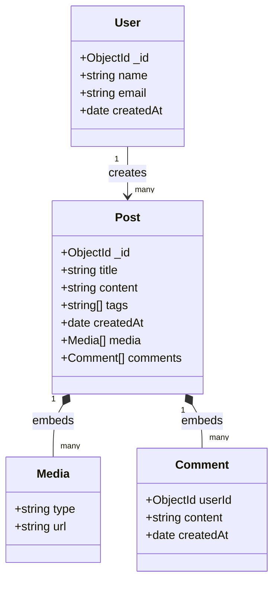

# Multimedia CMS - Database Schema

Este esquema representa el modelo documental del sistema (NoSQL).

```mermaid
classDiagram

class Post {
  +ObjectId _id
  +string title
  +string content
  +string[] tags
  +date createdAt
  +Media[] media
  +Comment[] comments
}

class Media {
  +string type
  +string url
}

class Comment {
  +ObjectId userId
  +string content
  +date createdAt
}

class User {
  +ObjectId _id
  +string name
  +string email
  +date createdAt
}

User "1" --> "many" Post : creates
Post "1" *-- "many" Media : embeds
Post "1" *-- "many" Comment : embeds
```
