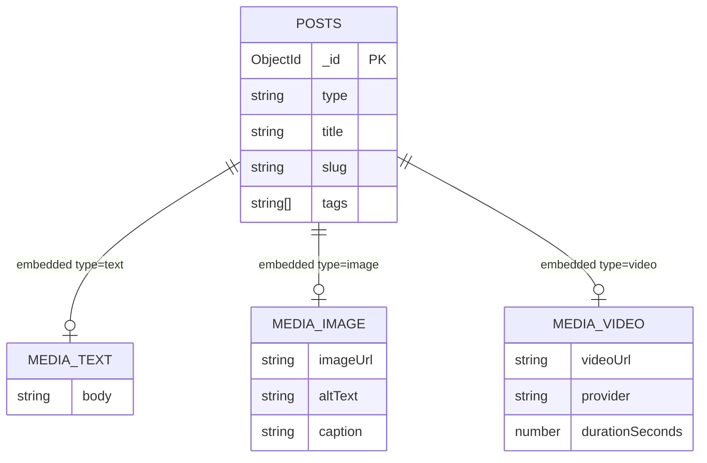

# CMS Multimedia - NoSQL Data Model

## Collections Design

```mermaid
erDiagram
POSTS {
    ObjectId _id PK
    string type
    string title
    string slug
    string[] tags
    
}
MEDIA_TEXT {
    string body
}
MEDIA_IMAGE {
    string imageUrl
    string altText
    string caption
}
MEDIA_VIDEO {
    string videoUrl
    string provider
    number durationSeconds
}
POSTS ||--o| MEDIA_TEXT : "embedded type=text"
POSTS ||--o| MEDIA_IMAGE : "embedded type=image"
POSTS ||--o| MEDIA_VIDEO : "embedded type=video"
```

