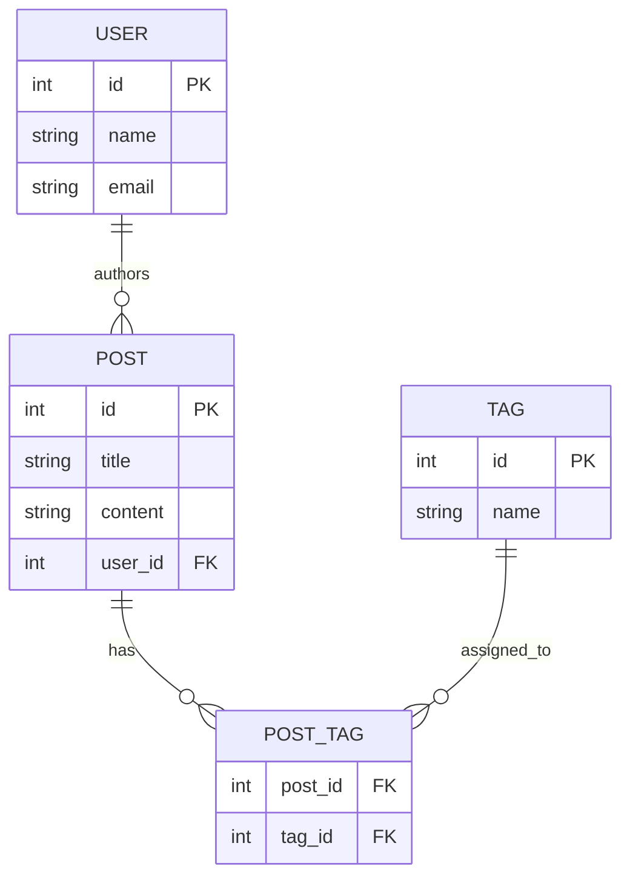
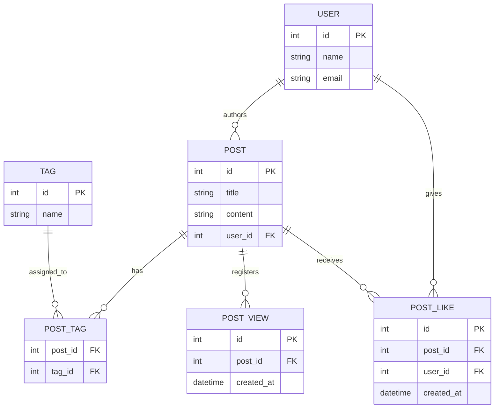

# Guía de Diseño NoSQL para Sistemas de Información

## Introducción: ¿Por qué necesitamos una guía diferente?

A lo largo de su formación, están aprendiendo a estructurar información utilizando el modelo relacional (SQL), un estándar indispensable en la industria. Sin embargo, al adentrarnos simultáneamente en el mundo de las bases de datos NoSQL, nos enfrentamos a un reto que va mucho más allá de memorizar nuevos comandos: necesitamos cambiar por completo nuestra forma de pensar.

Esta guía nace de una necesidad fundamental: evitar que arrastren los hábitos del diseño relacional hacia entornos documentales y de la nube, como MongoDB o Google Firestore. Mientras que en SQL buscamos la normalización y evitar a toda costa repetir datos, en NoSQL las reglas cambian; nuestra máxima prioridad es la velocidad, la escalabilidad y la forma en que la aplicación consumirá esa información.

El propósito de este documento es servirles como un mapa de ruta definitivo durante nuestro curso. Aquí entenderán no solo *cómo* guardar un dato, sino *por qué* decisiones arquitectónicas que parecen "incorrectas" en un entorno, son en realidad la clave del éxito para construir sistemas de información modernos y eficientes.

## 1. De lo Relacional a NoSQL: El Cambio de Paradigma

Cuando venimos de aprender bases de datos relacionales (SQL), nuestro cerebro está programado para la **Normalización**: evitar a toda costa que la información se repita. Separamos todo en múltiples tablas y las unimos mediante llaves.

En el mundo NoSQL, las reglas del juego cambian por completo. Ya no diseñamos pensando en cómo estructurar los datos para ahorrar espacio, sino que **diseñamos pensando en las consultas que hará nuestra aplicación (Patrones de Acceso)**. En NoSQL, el almacenamiento es barato, pero el tiempo de procesamiento es caro. Por lo tanto, agrupar datos relacionados y permitir cierta redundancia (Desnormalización) es una excelente práctica si eso hace que nuestra aplicación sea más rápida.

### 1.1 El Diccionario de Traducción (SQL vs NoSQL)

Para no perdernos, primero debemos entender cómo se llaman las cosas en este nuevo entorno. Aquí tienen la equivalencia directa:

| Mundo Relacional (SQL) | Mundo Documental (NoSQL) | Descripción |
| --- | --- | --- |
| **Tabla** (*Table*) | **Colección** (*Collection*) | Es la "caja" que agrupa registros del mismo tipo (ej. la colección de usuarios). |
| **Fila** (*Row*) | **Documento** (*Document*) | Es el registro individual (un usuario específico). Se guarda en formato JSON/BSON. |
| **Columna** (*Column*) | **Campo o Clave** (*Field*) | El atributo específico dentro del documento (ej. el nombre o el correo). |

### 1.2 El uso del Diagrama Entidad-Relación (ERD)

En SQL, el Diagrama Entidad-Relación es la herramienta definitiva. Mapea exactamente cómo se construirán las tablas físicas. Por ejemplo, en un sistema donde un usuario crea publicaciones (Posts) y les asigna etiquetas (Tags), un diseño relacional puro nos obliga a separar todo matemáticamente:



**La diferencia clave:** En NoSQL, este diagrama tradicional solo nos sirve en la **fase conceptual** (para entender de qué trata el negocio). Sin embargo, **NO** nos sirve para el diseño físico final. En NoSQL, rara vez crearemos todas esas colecciones por separado y mucho menos usaremos "Tablas Puente" (*Junction Tables* como `POST_TAG`), ya que los datos que se consultan juntos, se guardan juntos dentro de un mismo Documento.

---

## 2. El Documento, el Límite de Tamaño y el Peligro de los Arreglos Infinitos

En la parte anterior vimos que en NoSQL guardamos la información en "Documentos" (que viven dentro de Colecciones). Pero, ¿qué es exactamente un documento en la vida real de una base de datos?

Un **Documento** no es más que un archivo en formato JSON (o su versión binaria, BSON) que contiene toda la información agrupada con sus llaves y valores.

Cuando trabajamos con bases de datos documentales como **MongoDB**, existe una regla estricta que jamás debemos olvidar: **Un solo documento no puede pesar más de 16 Megabytes (16 MB) en el disco duro.**

### 2.1 ¿Por qué existe este límite? ¿16 MB es mucho o poco?

En términos de texto plano (que es lo que guardamos en formato JSON), 16 MB es una cantidad **masiva** de información. Para ponerlo en perspectiva, el libro completo de "Don Quijote de la Mancha" en texto puro pesa alrededor de 2 MB. ¡Un solo documento de MongoDB podría almacenar 8 veces ese libro!

Si un documento de usuario solo guarda su `id`, `name`, `email` y `password`, pesará apenas unos cuantos *bytes*. Entonces, si 16 MB es tanto espacio, ¿cómo es posible que un documento alcance ese límite y rompa nuestra aplicación?

La respuesta está en el mayor enemigo del diseño NoSQL: **Los Arreglos sin límite (*Unbounded Arrays*).**

### 2.2 El error de anidar todo (Embeber mal)

Imaginemos que diseñamos una red social y decidimos guardar todos los posts, comentarios y *likes* de un usuario famoso directamente **dentro** de su propio documento, usando arreglos:

```json
{
  "id": "usr_001",
  "name": "Usuario Famoso",
  "posts": [
    // ... 10,000 posts anidados aquí adentro ...
    // ... y cada post tiene 5,000 comentarios anidados ...
  ]
}

```

A medida que este usuario publique más contenido y reciba más comentarios, el peso de este único archivo JSON irá subiendo: 1 MB, 5 MB, 10 MB... Hasta que un día intente publicar un nuevo post, el documento intente superar los 16 MB, y la base de datos simplemente colapse arrojando un error.

**Los motores NoSQL exigen este límite por dos razones técnicas vitales:**

1. **Consumo de Memoria RAM:** Para leer o actualizar un documento, el servidor tiene que cargarlo *completo* en la memoria RAM. Si permitiéramos documentos gigantes, el servidor se quedaría sin memoria inmediatamente al recibir múltiples consultas simultáneas.
2. **Ancho de Banda:** Transferir un documento gigantesco desde la base de datos hasta nuestra aplicación saturaría la conexión de red, haciendo que el sistema sea extremadamente lento para todos.

### 2.3 La Analogía del Archivero Médico

Para que nunca se les olvide este concepto, imaginen un archivero físico en un consultorio médico. Un "Documento" NoSQL es como el **folder (expediente)** de un paciente:

* **Lo correcto:** Meter en el folder su nombre, su tipo de sangre y su historial de alergias. Son pocas hojas. El doctor saca el folder rápidamente con una mano.
* **El error (Arreglo infinito):** Meter en el folder todas las radiografías físicas que se ha tomado en los últimos 20 años. El folder ahora pesa 40 kilos (superó el "límite de 16 MB") y es imposible de manejar.
* **La solución:** En el folder principal, el doctor solo pone una nota que dice: *"Las radiografías de este paciente están en el estante 5, caja 2"*. El folder vuelve a ser ligero y rápido de leer, y las radiografías solo se buscan cuando realmente se necesitan. A esa "nota" le llamamos **Referencia**.

---

## 3. ¿Cuándo Embeber y Cuándo Referenciar? (La Solución Práctica)

Visto el peligro de los arreglos infinitos, la pregunta del millón al diseñar en NoSQL es: **¿Cómo decido si guardo los datos adentro (Embeber) o los separo y los vinculo (Referenciar)?**

La regla de oro en bases de datos no relacionales es diseñar en base a las preguntas que hará la aplicación (los Patrones de Acceso), no en la estructura perfecta de los datos.

### 3.1 Cuándo Embeber (Nesting / Embedding)

Embeber significa anidar un documento dentro de otro, usualmente como un arreglo de objetos. Lo usamos para ganar velocidad, ya que la aplicación obtiene toda la información en una sola lectura.

**Debes embeber cuando:**

1. **Relaciones "Uno a Pocos" (One-to-Few):** La cantidad de elementos hijos es pequeña y no crecerá indefinidamente. Por ejemplo, las direcciones de envío de un usuario (casa, trabajo) o las etiquetas (*Tags*) de una publicación.
2. **Datos de acceso conjunto:** Si la aplicación *siempre* necesita los datos del hijo cuando consulta al padre. Si muestras un Post en pantalla, casi siempre necesitas mostrar sus Etiquetas al mismo tiempo.
3. **Datos estáticos:** Si la información anidada rara vez cambia.

### 3.2 Cuándo Referenciar (Linking / Referencing)

Referenciar significa guardar el dato en su propia colección y dejar solo el `id` (la llave foránea) como una "pista" para encontrarlo después. Lo usamos para proteger la integridad de la base de datos y evitar que nuestros documentos exploten en tamaño.

**Debes referenciar cuando:**

1. **Relaciones "Uno a Muchos" o "Uno a Millones" (One-to-Many):** Como en el caso de los usuarios y sus publicaciones. Un usuario puede generar miles de posts a lo largo de los años.
2. **Documentos muy grandes:** Si el contenido del hijo es muy extenso (como el cuerpo de un artículo completo de un blog).
3. **Actualizaciones asíncronas:** Si el hijo se actualiza constantemente de forma independiente al padre (por ejemplo, el contador de *likes* o visualizaciones de un post).

### 3.3 El Diseño en Acción

Aplicando estas reglas, nuestro sistema de Usuarios, Publicaciones y Etiquetas no se vería como tres tablas separadas, sino como dos colecciones optimizadas. Aquí tienen cómo se vería el diseño físico final usando formato JSON.

Noten cómo las colecciones principales (Entidades) están separadas, pero los datos pequeños y dependientes se quedan adentro:

```json
// ---
// Core Entity: USER
// ---
// Relationship: One-to-Many (1:N) between USER and POST.
// Since a user can have an unlimited number of posts, we DO NOT embed them.
// We only keep the core user data here to keep the document lightweight.
{
  "id": "usr_001",
  "name": "Alex",
  "email": "alex.4cv@cbtis47.edu.mx",
  "role": "student"
}

// ---
// Core Entity: POST
// ---
// Relationship: The POST references its author via user_id.
// Tags are embedded because they are few (One-to-Few) and always queried with the post.
{
  "id": "post_101",
  "title": "Understanding Relational vs NoSQL",
  "content": "In this article, we explore the differences... (could be a very long text)",
  "user_id": "usr_001", 
  "created_at": "2026-03-15T15:30:00Z",
  "tags": [
    { "id": "tag_50", "name": "Databases" },
    { "id": "tag_51", "name": "Architecture" }
  ]
}

```

En este diseño, tenemos **lo mejor de ambos mundos**: Embebemos las etiquetas (`tags`) para velocidad de lectura y referenciamos al autor (`user_id`) para evitar que el documento del usuario crezca sin control.

---

## 4. Firestore vs MongoDB (Subcolecciones y Referencias en Código)

Ya sabemos en la teoría cómo separar o anidar nuestros datos, pero ¿cómo se ve esto en la práctica cuando nos sentamos a programar?

La forma en que ingresamos esta información cambia drásticamente dependiendo del motor de base de datos que elijamos. Vamos a comparar los dos gigantes del mercado: **MongoDB** (que utiliza su propio lenguaje de consultas) y **Google Firestore** (que se manipula directamente desde el código de nuestra aplicación).

### 4.1 MongoDB y las Referencias Manuales (MQL)

En MongoDB, utilizamos MQL (*MongoDB Query Language*). Algo fundamental que deben entender es el concepto de **"Base de datos tonta, Aplicación inteligente"**.

¿A qué me refiero con esto? Si nosotros guardamos un `user_id` dentro de una publicación, **MongoDB no tiene la menor idea de que ese ID pertenece a la colección `USERS**`. No existe una restricción de "Llave Foránea" (*Foreign Key*) que bloquee la base de datos como en SQL. La responsabilidad de buscar primero el Post y luego buscar al Usuario recae 100% en el código de nuestra aplicación (las **Referencias Manuales**).

Así es como insertaríamos a nuestro usuario y su publicación en MongoDB usando dos comandos separados:

```javascript
// ---
// Core Entity: USERS
// ---
// We use insertOne to create the user document in the USERS collection.
db.USERS.insertOne({
  "_id": "usr_001",
  "name": "Alex",
  "email": "alex.4cv@cbtis47.edu.mx",
  "role": "student"
});

// ---
// Core Entity: POSTS
// ---
// We insert the post into a separate POSTS collection.
// The relationship is maintained via the user_id manual reference.
// Tags are embedded directly as an array of objects (One-to-Few).
db.POSTS.insertOne({
  "_id": "post_101",
  "title": "Implementando bases de datos no relacionales",
  "content": "En este proyecto del cuarto semestre, estamos diseñando un sistema...",
  "user_id": "usr_001", 
  "created_at": new ISODate("2026-03-15T15:30:00Z"),
  "tags": [
    { "id": "tag_1", "name": "Firestore" },
    { "id": "tag_2", "name": "NoSQL" }
  ]
});

```

### 4.2 Google Firestore y las Subcolecciones (El límite de 1 MiB)

Con Firestore, las reglas son mucho más estrictas. Si MongoDB nos daba un límite de 16 MB por documento, **Firestore nos da un límite minúsculo de solo 1 MiB (1 Megabyte)**.

Además, Firestore cobra por **Operación (Lectura/Escritura)**. Si anidamos miles de comentarios en un post y solo queremos mostrar el título, Firestore descargará el documento gigante completo, consumiendo los datos del usuario y nuestro presupuesto.

Para solucionar esto de manera elegante, Firestore introdujo **Las Subcolecciones**: permite que un Documento contenga otra Colección entera dentro de él. La magia de esto es que las consultas en Firestore son **superficiales** (*shallow queries*). Si consultas a un usuario, Firestore **no** descarga los documentos de su subcolección de Posts a menos que se lo pidas explícitamente.

A diferencia de MongoDB, en Firestore no usamos una consola, sino un SDK directamente en nuestro lenguaje de programación (como Dart/Flutter para aplicaciones móviles). Observen cómo la inserción navega por la "ruta" lógica (`USERS -> documento -> POSTS -> documento`):

```dart
// ---
// Import the necessary Firestore package
// ---
import 'package:cloud_firestore/cloud_firestore.dart';

// ---
// Initialize Firestore instance
// ---
final FirebaseFirestore db = FirebaseFirestore.instance;

Future<void> createStudentAndPost() async {
  // ---
  // Core Entity: USERS
  // ---
  // We use .set() to explicitly assign the document ID 'usr_001'.
  await db.collection('USERS').doc('usr_001').set({
    'name': 'Alex',
    'email': 'alex.4cv@cbtis47.edu.mx',
    'role': 'student',
  });

  // ---
  // Subcollection: POSTS
  // ---
  // We chain the collections and documents to build the path: 
  // /USERS/usr_001/POSTS/post_101
  await db
      .collection('USERS')
      .doc('usr_001')
      .collection('POSTS') // Creating the subcollection explicitly inside the user
      .doc('post_101')
      .set({
    'title': 'Implementando bases de datos no relacionales',
    'content': 'En este proyecto del cuarto semestre, estamos diseñando un sistema...',
    // Firestore provides a server timestamp to ensure accurate times
    'created_at': FieldValue.serverTimestamp(),
    // Tags are safely embedded (One-to-Few relationship)
    'tags': [
      {'id': 'tag_1', 'name': 'Firestore'},
      {'id': 'tag_2', 'name': 'NoSQL'}
    ]
  });
  
  print('User and Post successfully created in Firestore!');
}

```

En resumen: En MongoDB usamos referencias manuales (`user_id`) como una cuerda imaginaria entre dos colecciones flotantes. En Firestore, la propia estructura de "carpetas" (la ruta o *path*) crea esa dependencia física y lógica.

### 4.3 El Cuello de Botella de las Escrituras en Firestore (1 por segundo)

Además del límite de tamaño de 1 MiB, Firestore tiene otra limitación técnica vital que dicta cómo debemos estructurar nuestros datos: **Un solo documento no debe actualizarse más de 1 vez por segundo.**

¿Por qué esto representa un desafío de diseño? Imaginen que deciden guardar los *Likes* (Me gusta) de una publicación simplemente sumando un número dentro del documento principal del `POST`. De pronto, la publicación de un usuario se vuelve viral y tienen a 50 personas intentando darle *like* exactamente en el mismo segundo.

Firestore, para asegurar que los datos no se corrompan o se sobreescriban por error, bloqueará esas escrituras concurrentes. A este problema técnico se le conoce como **Contención (*Contention*)**. Si esto pasa, la aplicación móvil se congelaría o le arrojaría un error al usuario al intentar guardar su *like*.

**La Solución Estructural:** Si saben que un dato se va a actualizar masivamente y en fracciones de segundo (como *likes*, votos de una encuesta o contadores de visitas), la regla de oro es **no embeberlo**.

Esos datos altamente dinámicos deben aislarse en su propia **Subcolección**. Por ejemplo, crearían una subcolección llamada `LIKES` dentro del documento del `POST`. En lugar de actualizar un solo documento 50 veces por segundo (lo cual causa el cuello de botella), Firestore simplemente creará 50 documentos nuevos por segundo (uno por cada *like* de cada usuario), una tarea que el motor maneja sin ningún esfuerzo.

### 4.4 Resolviendo el Cuello de Botella: Likes y Visitas en Acción

Para entender cómo solucionar la alta demanda de escrituras (como publicaciones virales), primero debemos ver cómo se modelaría esto desde la fase conceptual usando nuestro Diagrama Entidad-Relación (ERD).

Observen cómo separamos lógicamente las acciones: `POST_LIKE` guarda quién dio me gusta y cuándo. `POST_VIEW` guarda cada vez que alguien abre la publicación.



Ahora, ¿cómo pasamos este diseño físico a nuestras dos bases de datos NoSQL considerando sus limitaciones técnicas?

#### A) Solución en MongoDB (Aprovechando su motor)

En MongoDB, los *Likes* se van a su propia colección (para no crear un arreglo infinito). Pero, como MongoDB es excelentemente rápido actualizando números, las *Visitas* las podemos dejar como un simple contador de número entero (`views_count`) dentro del documento del Post, usando el operador `$inc` para sumarle 1 cada vez que alguien lo abre.

```javascript
// ---
// Core Entity: POST (with a simple integer for views)
// ---
// MongoDB can handle thousands of increments per second on this document.
db.POSTS.insertOne({
  "_id": "post_101",
  "title": "Implementando bases de datos no relacionales",
  "content": "En este proyecto...",
  "user_id": "usr_001",
  "views_count": 0, // A simple number, no need for a separate collection
  "tags": [ { "id": "tag_1", "name": "NoSQL" } ]
});

// ---
// Core Entity: POST_LIKE
// ---
// Likes go to a separate collection because they track WHO liked it.
// If we embedded them, a viral post would hit the 16 MB limit.
db.POST_LIKES.insertOne({
  "_id": "like_992",
  "post_id": "post_101",
  "user_id": "usr_005", // The user who clicked 'Like'
  "created_at": new ISODate("2026-03-16T08:00:00Z")
});

```

#### B) Solución en Google Firestore (Evitando el límite de 1 seg)

En Firestore, no podemos darnos el lujo de tener un `views_count` y sumarle 1 en el documento principal, porque si el post se vuelve viral, superaremos el límite de 1 escritura por segundo y Firestore bloqueará la app.

Aquí, **tanto los Likes como las Visitas se convierten en Subcolecciones**. Cada vez que alguien ve el post, en lugar de actualizar un número, **insertamos un documento nuevo** en la subcolección `VIEWS`. A Firestore le cuesta mucho actualizar el mismo documento al mismo tiempo, pero no le cuesta nada crear 1,000 documentos nuevos por segundo.

```dart
// ---
// Subcollection: LIKES
// Path: /USERS/usr_001/POSTS/post_101/LIKES/like_992
// ---
await db
    .collection('USERS').doc('usr_001')
    .collection('POSTS').doc('post_101')
    .collection('LIKES') // New Subcollection for Likes
    .doc('like_992')
    .set({
  // We save who liked it and when
  'user_id': 'usr_005',
  'created_at': FieldValue.serverTimestamp(),
});

// ---
// Subcollection: VIEWS
// Path: /USERS/usr_001/POSTS/post_101/VIEWS/view_8834
// ---
// Instead of updating a counter, we log an event. 
// Later, to know total views, we just ask Firestore: "Count the documents in this subcollection"
await db
    .collection('USERS').doc('usr_001')
    .collection('POSTS').doc('post_101')
    .collection('VIEWS') // New Subcollection for Views (Event Logging)
    .doc() // Leaving this empty generates an automatic random ID
    .set({
  'created_at': FieldValue.serverTimestamp(),
});

```

### 4.5 El Contexto de los Nombres: ¿Por qué cambian según la base de datos?

Al diseñar bases de datos, debemos pensar en dónde "viven" nuestras tablas o colecciones. Dependiendo de si la base de datos es plana (global) o jerárquica (anidada), la forma de nombrar las cosas cambia por completo.

**1. El Diagrama E-R (Modelo Relacional) - Ámbito Global**
En una base de datos SQL, todas las tablas "flotan" en un mismo nivel global. Si nombramos a una tabla simplemente `LIKE` o `VIEW`, estamos creando una bomba de tiempo por ambigüedad.

* Si mañana nuestra aplicación permite darle *like* a un Comentario o a una Foto de Perfil, ¿dónde guardamos esos likes? ¿En la misma tabla `LIKE` mezclados con los de los Posts?
* Para mantener el orden y saber exactamente a qué Entidad le pertenece la acción en un espacio global, prefijamos el nombre: `POST_LIKE`, `COMMENT_LIKE`, `PHOTO_LIKE`.

**2. MongoDB - Ámbito Global y Eficiencia de Motor**
MongoDB funciona igual que SQL en cuanto a la organización: sus colecciones son globales. Por lo tanto, aplicamos la misma regla y la llamamos `POST_LIKES` para evitar colisiones en el futuro.

* **¿Y por qué `views_count` como atributo en lugar de colección?** Porque aquí brilla el motor técnico de MongoDB. Como MongoDB puede actualizar un número entero dentro de un documento miles de veces por segundo sin bloquearse, crear una colección entera de `POST_VIEWS` solo para contar visitas sería un desperdicio de espacio y procesamiento. Un simple atributo numérico `views_count` es la solución más elegante y rápida.

**3. Google Firestore - Ámbito Jerárquico (El contexto lo da la ruta)**
Aquí las reglas cambian porque Firestore usa **Subcolecciones**. Las colecciones no flotan en un espacio global, sino que viven *dentro* de un documento específico.

* La ruta física nos da el contexto exacto: `/USERS/usr_001/POSTS/post_101/LIKES`.
* Si la llamáramos `POST_LIKES` dentro de Firestore, seríamos redundantes, leyendo la ruta como: *"Entra a los Posts, entra al post 101, y dame sus Posts_Likes"*. Como la subcolección `LIKES` ya vive adentro del Post, el nombre corto es perfecto, limpio y autoexplicativo.
* Y como en Firestore no podemos usar un simple `views_count` por el límite de 1 escritura por segundo (Contención), nos vemos obligados a crear la subcolección `VIEWS` y registrar cada visita como un documento nuevo.

---

### Resumen de la Lección de Nombrado

* **Si el espacio es plano y global (SQL / MongoDB):** El nombre de la tabla/colección debe ser descriptivo por sí solo (`POST_LIKES`).
* **Si el espacio es jerárquico (Firestore):** El contexto te lo da la "carpeta" padre, así que el nombre puede ser corto y directo (`LIKES`).

---

## 5. El impacto en el Desarrollo de Software (BaaS vs MQL)

Hasta ahora hemos hablado de cómo estructurar los datos por dentro, pero hay una diferencia monumental en **cómo nos comunicamos** con estas bases de datos desde nuestras aplicaciones.

Al comparar MongoDB y Google Firestore, no solo estamos comparando dos marcas de bases de datos NoSQL; estamos comparando dos arquitecturas de software completamente distintas.

### 5.1 El Enfoque Tradicional: MongoDB y MQL

MongoDB es un "Motor de Base de Datos" puro. Tiene su propio lenguaje integrado llamado **MQL** (*MongoDB Query Language*), que usamos para hacerle preguntas y darle órdenes (como los `db.collection.insertOne()` que vimos antes).

En la arquitectura tradicional (Arquitectura de 3 Capas), nuestra aplicación móvil o página web (el **Frontend**) **nunca** se comunica directamente con MongoDB por razones de seguridad. El flujo es el siguiente:

1. El Frontend (ej. una app en Flutter o una web) envía una petición HTTP.
2. Un Servidor intermedio que nosotros debemos programar (el **Backend**, hecho en Node.js, Python, Java, etc.) recibe la petición.
3. Ese Backend valida quién es el usuario y, si todo está bien, **traduce** la petición a comandos **MQL** y se los envía a MongoDB.
4. MongoDB responde al Backend, y el Backend le responde al Frontend.

**¿Qué significa esto para el programador?** Que tienes que escribir y mantener mucho código en el medio. Tienes que configurar servidores, crear APIs (endpoints), gestionar la seguridad y traducir los datos de un lado a otro.

### 5.2 El Cambio de Paradigma: Firestore como BaaS (Backend as a Service)

Google Firestore no es solo una base de datos; pertenece a una categoría de servicios llamada **BaaS** (*Backend as a Service* o "Backend como Servicio").

Cuando usamos un BaaS, empresas como Google, Amazon o Apple nos dicen: *"No te preocupes por programar el servidor intermedio, nosotros te prestamos uno ya hecho y asegurado"*.

En este modelo, el intermediario desaparece. Nuestra aplicación (el Frontend) se conecta **directamente** a la base de datos a través de un SDK (Software Development Kit), que es una librería de código instalada en nuestro proyecto.

**¿Cómo cambia esto nuestra forma de desarrollar software?**

1. **Velocidad de desarrollo acelerada:** Como programadores, nos saltamos por completo la creación del Backend. En un proyecto escolar o en una startup, un desarrollador Frontend (usando Dart/Flutter, por ejemplo) puede crear una aplicación completa, funcional y conectada a la nube en cuestión de días, sin necesidad de un equipo de servidores.
2. **Tiempo Real por Defecto:** En bases de datos tradicionales, si alguien comenta tu post, tienes que recargar la página para verlo. Como Firestore usa un SDK conectado directamente, mantiene un "túnel" abierto (WebSockets). Si alguien da un *Like*, la base de datos le avisa directamente a la app de todos los usuarios conectados y la pantalla se actualiza sola en milisegundos.
3. **La Seguridad cambia de lugar:** Si la app se conecta directo a la base de datos, ¿qué impide que un usuario malicioso borre toda la colección `USERS`? Como no tenemos un Backend propio para detenerlo, la seguridad en un BaaS se maneja mediante **Reglas de Seguridad** (*Security Rules*). Escribimos reglas directamente en la consola de Firebase (ej. *"Solo permite escribir en la colección POSTS si el `user_id` coincide con el ID del usuario que inició sesión"*).
4. **Ausencia de un lenguaje de consultas complejo:** No hay MQL ni SQL. Consultamos los datos encadenando funciones propias del lenguaje en el que estamos programando (ej. `.collection().where().limit()`), haciendo que el código sea más natural de leer para el desarrollador de la interfaz.

---

### Resumen de la Comparativa

* **MongoDB:** Te da control total. Tú construyes el edificio, tú pones a los guardias de seguridad (Backend) y tú hablas el idioma del motor (MQL). Ideal para sistemas empresariales complejos donde la lógica del servidor es gigantesca.
* **Firestore (BaaS):** Te da un departamento amueblado y listo para usar. Usas su SDK para hablar directamente con los datos. Excelente para lanzar aplicaciones móviles y web a una velocidad increíble, confiando la infraestructura a la nube.

---

## 6. Conclusiones y Mejores Prácticas

Hemos recorrido un largo camino desde las rígidas reglas de las bases de datos relacionales hasta la enorme flexibilidad (y responsabilidad) que nos exige el mundo NoSQL. Ya sea que en el futuro trabajen construyendo el Backend para un clúster de **MongoDB** o conectando una aplicación móvil directamente a la nube con **Google Firestore (BaaS)**, el éxito de su sistema dependerá de cómo estructuren su información.

Para cerrar con broche de oro, aquí tienen las **5 Reglas de Oro (Mejores Prácticas)** que deben aplicar en todos sus proyectos a partir de hoy:

### 1. Diseñen de la pantalla hacia atrás (Patrones de Acceso)

En SQL primero hacíamos el diagrama con las tablas perfectas y luego veíamos cómo consultarlas. En NoSQL es al revés: **Nunca creen una colección sin saber primero cómo se va a ver la pantalla de su aplicación.**
Si la pantalla de "Perfil" muestra los datos del usuario y sus últimas 3 fotos, entonces el documento del usuario debería tener esas 3 fotos embebidas para que la pantalla cargue instantáneamente. Diseñen para las preguntas que hará el sistema.

### 2. Pierdan el miedo a repetir datos (Desnormalización)

En el modelo relacional, duplicar datos es un pecado. En NoSQL, es una herramienta. El espacio en disco es extremadamente barato, pero el tiempo de procesamiento (buscar en varias colecciones al mismo tiempo) es caro.

* Si necesitan mostrar el nombre y la foto del autor en cada comentario de un Post, guarden una copia de ese nombre y esa foto *dentro* del documento del comentario.
* Es preferible actualizar la foto en 100 lugares distintos cuando el usuario la cambie (una acción rara), que obligar a la base de datos a hacer 100 consultas separadas cada vez que alguien abre la publicación (una acción constante).

### 3. Huyan de los Arreglos Infinitos (*Unbounded Arrays*)

Recuerden los límites físicos: 16 MB en MongoDB y 1 MiB en Firestore.

* Usen arreglos (Embeber) **solo** para listas pequeñas y estáticas (ej. roles de usuario, categorías, etiquetas).
* Usen Colecciones separadas o Subcolecciones (Referenciar) para cualquier lista que pueda crecer con el tiempo (ej. comentarios, historial de compras, publicaciones, *likes*).

### 4. Prevean los Cuellos de Botella (Escrituras Concurrentes)

Especialmente si usan servicios BaaS como Firestore, recuerden la regla de **1 escritura por segundo por documento**. No guarden contadores de alta frecuencia (como visitas o *likes* virales) como un simple número dentro de un documento principal. Conviertan esos eventos de alta velocidad en la creación de **nuevos documentos** dentro de una subcolección separada. Es mejor contar muchos documentos pequeños después, que bloquear la aplicación hoy.

### 5. Base de Datos Tonta, Aplicación Inteligente

Dado que motores como MongoDB no fuerzan la integridad de las llaves foráneas y no hacen *Joins* mágicos por ustedes, la lógica debe vivir en su código.
Acostúmbrense a que una sola acción en la pantalla a veces requerirá hacer dos o tres consultas rápidas a la base de datos de forma secuencial. Su código (en Dart, JavaScript, Python, etc.) es el responsable de mantener unidos los hilos de la información.

---

## Palabras Finales

Entender y dominar NoSQL les dará una ventaja gigantesca como desarrolladores de software. Les permitirá construir aplicaciones que respondan en tiempo real, que escalen para soportar a miles de usuarios simultáneos y que se integren de manera ágil con las tecnologías en la nube más modernas.

Guarden este documento, repasen las diferencias entre Embeber y Referenciar, y sobre todo, aplíquenlo con confianza en el diseño de los Sistemas de Información que estamos construyendo en este semestre. ¡El límite de lo que pueden crear ahora está en su imaginación (y en cuidar ese límite de 1 MiB)!

**¡Mucho éxito en su desarrollo!**
