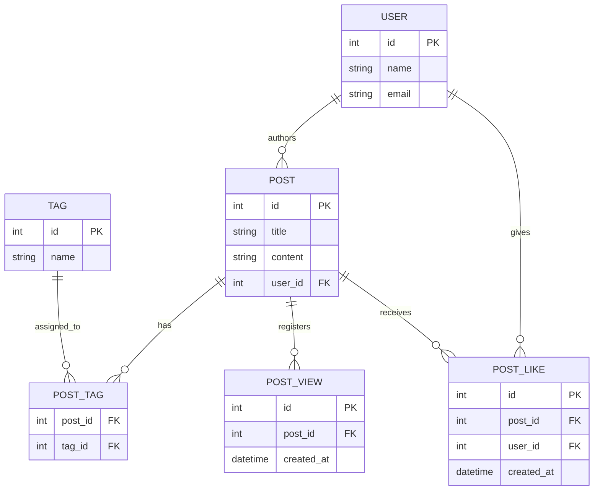

```mermaid
erDiagram
%% ---
%% Core Entity: USER
%% ---
%% Relationship: One-to-Many (1:N) between USER and POST.
%% Relationship: One-to-Many (1:N) between USER and POST_LIKE.
%% A user can author multiple posts and can like multiple posts.
USER ||--o{ POST : "authors"
USER ||--o{ POST_LIKE : "gives"

USER {
    int id PK
    string name
    string email
}

%% ---
%% Core Entity: POST
%% ---
%% Relationship: Many-to-Many (M:N) between POST and TAG via POST_TAG.
%% Relationship: One-to-Many (1:N) between POST and POST_LIKE.
%% Relationship: One-to-Many (1:N) between POST and POST_VIEW.
%% A post can have many likes and many views over time.
POST ||--o{ POST_TAG : "has"
POST ||--o{ POST_LIKE : "receives"
POST ||--o{ POST_VIEW : "registers"

POST {
    int id PK
    string title
    string content
    int user_id FK
}

%% ---
%% Core Entity: TAG
%% ---
TAG ||--o{ POST_TAG : "assigned_to"

TAG {
    int id PK
    string name
}

%% ---
%% Junction Table: POST_TAG
%% ---
%% Resolves the M:N relationship linking POST and TAG.
POST_TAG {
    int post_id FK
    int tag_id FK
}

%% ---
%% Core Entity: POST_LIKE
%% ---
%% Represents a user liking a specific post.
%% It is separated to prevent the post document from growing infinitely.
POST_LIKE {
    int id PK
    int post_id FK
    int user_id FK
    datetime created_at
}

%% ---
%% Core Entity: POST_VIEW
%% ---
%% Represents a single view event for a post.
%% Separated as an event log to handle high-frequency inserts.
POST_VIEW {
    int id PK
    int post_id FK
    datetime created_at
}
```
